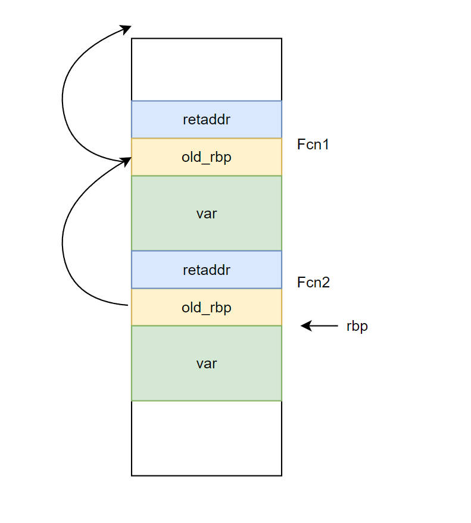
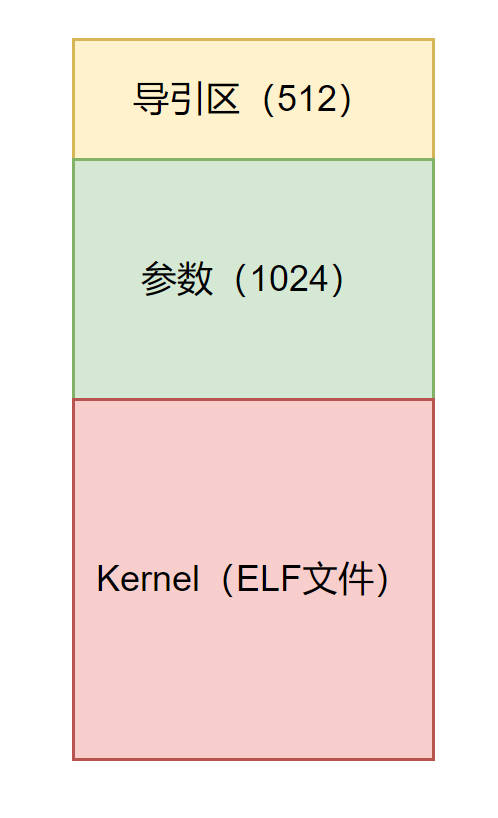
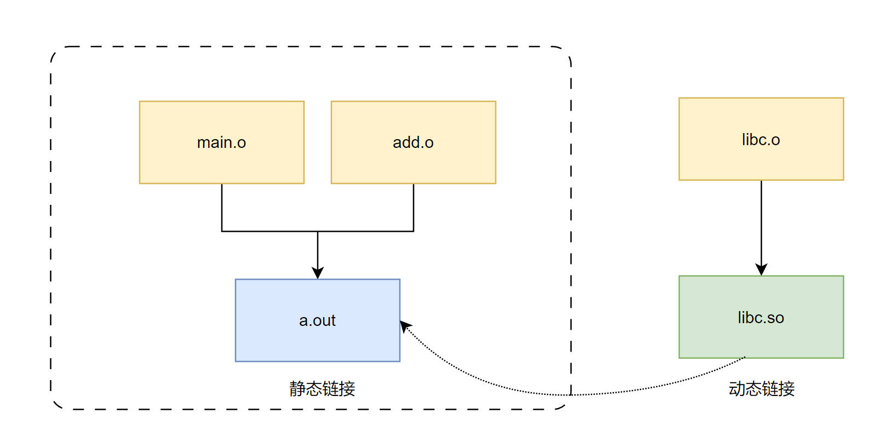

# 可执行文件管理

# 可执行文件

> [!note]
> 进程在操作系统中是一个状态机，而可执行文件就是描述这个状态机的「数据结构」，包含状态机的初始状态、状态机转移流程。

## 执行

- execve

可执行文件是描述进程状态机的一个数据结构，那么 `execve` 则是将可执行文件加载到机器运行的加载器, 且 `execve` 会对可执行文件进行校验。

```term
triangle@LEARN:~$ strace ./main.cpp
execve("./main.cpp", ["./main.cpp"], 0x7ffe3c2bdf50 /* 29 vars */) = -1 ENOEXEC (Exec format error)
strace: exec: Exec format error
+++ exited with 1 +++
```

- she-bang

```txt
#!/bin/user/python3
....
```

给一个文本文件添加可执行权限，且在第一行写上 `#!/binPath`。在控制台执行该文本文件时，就会首先解析出 `binPath` ，然后将文本路径作为参数传递给 `binPath` 对应的二进制。

```cpp
#include <iostream>
int main(int argv, char* args[]){
    for(int i=0; i < argv; i++){
        printf("[%d] %s\n",i ,args[i]);
    }
}
```

```term
triangle@LEARN:~$  tree
.
├── a.out
├── test.cpp
└── test.txt
triangle@LEARN:~$  cat test.txt
#!/mnt/e/workspace/temp/a.out
triangle@LEARN:~$ ./test.txt
[0] /mnt/e/workspace/temp/a.out
[1] ./test.txt
```

## 查看工具

- readelf

```term
triangle@LEARN:~$ readelf -h a.out // 查看可执行文件结构信息
ELF Header:
  Magic:   7f 45 4c 46 02 01 01 00 00 00 00 00 00 00 00 00
  Class:                             ELF64
  Data:                              2's complement, little endian
  Version:                           1 (current)
  OS/ABI:                            UNIX - System V
  ABI Version:                       0
  Type:                              DYN (Shared object file)
  Machine:                           Advanced Micro Devices X86-64
  Version:                           0x1
  Entry point address:               0x10a0
  Start of program headers:          64 (bytes into file)
  Start of section headers:          15088 (bytes into file)
  Flags:                             0x0
  Size of this header:               64 (bytes)
  Size of program headers:           56 (bytes)
  Number of program headers:         13
  Size of section headers:           64 (bytes)
  Number of section headers:         31
  Section header string table index: 30
```

- nm

```term
triangle@LEARN:~$ nm a.out // 查看符号
0000000000003da0 d _DYNAMIC
0000000000003fa0 d _GLOBAL_OFFSET_TABLE_
0000000000001232 t _GLOBAL__sub_I_main
0000000000002000 R _IO_stdin_used
                 w _ITM_deregisterTMCloneTable
                 w _ITM_registerTMCloneTable
00000000000011e5 t _Z41__static_initialization_and_destruction_0ii
                 U _ZNSt8ios_base4InitC1Ev@@GLIBCXX_3.4
                 U _ZNSt8ios_base4InitD1Ev@@GLIBCXX_3.4
0000000000002004 r _ZStL19piecewise_construct
0000000000004011 b _ZStL8__ioinit
00000000000021ac r __FRAME_END__
0000000000002010 r __GNU_EH_FRAME_HDR
0000000000004010 D __TMC_END__
...
```

- addr2line

```term
triangle@LEARN:~$ addr2line 0x1189 a.out // 将可执行文件中的二进制地址翻译成源文件行号
/mnt/e/workspace/temp/test.cpp:3
```


- objdump : 将二进制结构翻译成汇编

- objcopy : 拷贝程序

# 调试与栈帧

## 调试信息

```term
triangle@LEARN:~$  g++ -g test.cpp -S
triangle@LEARN:~$  vim test.s
....
.Ldebug_abbrev0:
        .uleb128 0x1
        .uleb128 0x11
        .byte   0x1
        .uleb128 0x25
        .uleb128 0xe
        .uleb128 0x13
        .uleb128 0xb
....
```

可执行文件中还会储存额外调试信息，用于之后的 debug 调试。同样 `addr2line` 就是利用了这些信息。

## 栈帧回溯



- rbp : 该寄存器存储函数的内存基地址，用于函数的偏移量计算    [内存中的地址]
- retaddr: 函数被调用时地址的下一行，即 `call` 命令的下一行  [可执行文件中的地址]

进程状态机在真正运行时，在栈中就会以上述结构管理函数调用。**通过 retaddr 、old_rbp 就能组建起一块内存栈帧，并利用 old_rbp 链接起来，形成一个函数调用栈链表。**

```cpp
#include <stdio.h>
#include <stdlib.h>

struct frame {
  struct frame *next; // push %rbp
  void *addr;         // call f (pushed retaddr)
};

void backtrace() {
  struct frame *f;
  extern char end;

  // 获取当前栈帧首地址
  asm volatile ("movq %%rbp, %0" : "=g"(f));

  // 遍历栈帧
  for (; f->addr < (void *)&end; f = f->next) {
    printf("0x%016lx\n", (long)f->addr);
  }
}

void Fcn2() {
  backtrace();
}

void Fcn1() {
  Fcn2();
}

int main(int argc, char *argv[]) {
  Fcn1();
}
```

```term
triangle@LEARN:~$  g++ unwind.c  -g -O0 -static -fno-omit-frame-pointer // static: 静态链接；fno-omit-frame-pointer 生成栈帧
triangle@LEARN:~$ ./a.out  | xargs addr2line a.out 
/mnt/e/workspace/temp/unwind.c:24
/mnt/e/workspace/temp/unwind.c:28
/mnt/e/workspace/temp/unwind.c:32
```

# 链接重定向


```cpp
extern void hello();

int main(int argc, char const *argv[])
{
    hello();
    return 0;
}
```

```term
triangle@LEARN:~$  g++ main.cpp -O2 -c
triangle@LEARN:~$  objdump -D main.o

main.o:     file format elf64-x86-64


Disassembly of section .text.startup:

0000000000000000 <main>:
   0:	f3 0f 1e fa          	endbr64 
   4:	48 83 ec 08          	sub    $0x8,%rsp
   8:	e8 00 00 00 00       	callq  d <main+0xd>
   d:	31 c0                	xor    %eax,%eax
   f:	48 83 c4 08          	add    $0x8,%rsp
  13:	c3                   	retq   
```

由于编译 `main.cpp` 时，并不知道 `void hello()` 的具体位置，编译编译器就将这部分的空着，等链接时再来补全。 

```console
8:	e8 00 00 00 00       	callq  d <main+0xd>
```

为了能够在「链接」时，能正确填入 `void hello()` 的函数地址，就需要对 `main.o` 的数据格式进行约束，规定了「重定向」的格式要求

```term
triangle@LEARN:~$ readelf -a main.o
...
Relocation section '.rela.text.startup' at offset 0x238 contains 1 entry:
  Offset          Info           Type           Sym. Value    Sym. Name + Addend
000000000009  000c00000004 R_X86_64_PLT32    0000000000000000 _Z5hellov - 4
...
```

重定向公式为：

```txt
Relocation = Symbol + Addend - P
```

想要重填 `callq` 指令，时期跳转到 `void hello()` ：
- Symbol : `_Z5hellov` 所表示的地址
- Addend : -4
- P : 需要重填的位置，`main + 0x9`
  
  ```console
  8:  e8 00 00 00 00       	callq  d <main+0xd>
         ↑
  ```

带入 `callq` 指令进行反算

```txt
  Relocation + (main + 0xd)
= Symbol + Addend - P + main + 0xd
= _Z5hellov - 4 - main - 0x9 + main + 0xd
= _Z5hellov
```

```term
triangle@LEARN:~$ gcc main.o hello.cpp -O2
triangle@LEARN:~$ objdump a.out
...
Disassembly of section .text:

0000000000001040 <main>:
    1040:	f3 0f 1e fa          	endbr64 
    1044:	48 83 ec 08          	sub    $0x8,%rsp
    1048:	e8 03 01 00 00       	callq  1150 <_Z5hellov>
    104d:	31 c0                	xor    %eax,%eax
    104f:	48 83 c4 08          	add    $0x8,%rsp
    1053:	c3                   	retq   
    1054:	66 2e 0f 1f 84 00 00 	nopw   %cs:0x0(%rax,%rax,1)
    105b:	00 00 00 
    105e:	66 90                	xchg   %ax,%ax
...
triangle@LEARN:~$ bc
1150 - 4 - 1040 - 9
103 # 103 利用二进制进行表示就是 03 01 00 00
```

# ELF加载器

## ELF文件

在 Linux 中，可执行文件的数据结构为 ELF 文件格式。

```term
triangle@LEARN:~$ man elf
```

## 静态链接加载

### 程序加载

```cpp
#include <stdint.h>
#include <stdio.h>
#include <string.h>
#include <stdlib.h>
#include <unistd.h>
#include <assert.h>
#include <elf.h>
#include <fcntl.h>
#include <sys/mman.h>

#define STK_SZ           (1 << 20)
#define ROUND(x, align)  (void *)(((uintptr_t)x) & ~(align - 1))
#define MOD(x, align)    (((uintptr_t)x) & (align - 1))

// 往一个栈塞入任何类型的数据
#define push(sp, T, ...) ({ *((T*)sp) = (T)__VA_ARGS__; sp = (void *)((uintptr_t)(sp) + sizeof(T)); })

void execve_(const char *file, char *argv[], char *envp[]) {
  // WARNING: This execve_ does not free process resources.

  /* 1. 打开文件 */
  int fd = open(file, O_RDONLY);
  assert(fd > 0);

  /* 2. 将elf文件映射到内存 */
  // 映射 elf 文件头
  Elf64_Ehdr *h = mmap(NULL, 4096, PROT_READ, MAP_PRIVATE, fd, 0);
  assert(h != (void *)-1);
  assert(h->e_type == ET_EXEC && h->e_machine == EM_X86_64);

  // 遍历页，将程序搬到内存
  Elf64_Phdr *pht = (Elf64_Phdr *)((char *)h + h->e_phoff);
  for (int i = 0; i < h->e_phnum; i++) {

    // 当前页
    Elf64_Phdr *p = &pht[i];
    if (p->p_type == PT_LOAD) {
      
      // 权限
      int prot = 0;
      if (p->p_flags & PF_R) prot |= PROT_READ;
      if (p->p_flags & PF_W) prot |= PROT_WRITE;
      if (p->p_flags & PF_X) prot |= PROT_EXEC;

      // 将本地可执行文件映射到内存
      void *ret = mmap(
        ROUND(p->p_vaddr, p->p_align),              // addr, rounded to ALIGN
        p->p_memsz + MOD(p->p_vaddr, p->p_align),   // length
        prot,                                       // protection
        MAP_PRIVATE | MAP_FIXED,                    // flags, private & strict
        fd,                                         // file descriptor
        (uintptr_t)ROUND(p->p_offset, p->p_align)); // offset
      assert(ret != (void *)-1);
      memset((void *)(p->p_vaddr + p->p_filesz), 0, p->p_memsz - p->p_filesz);
    }
  }
  close(fd);

  /* 3. 创建进程堆栈 */
  // 创建堆栈
  static char stack[STK_SZ], rnd[16];
  void *sp = ROUND(stack + sizeof(stack) - 4096, 16);
  void *sp_exec = sp;
  int argc = 0;

  // 根据手册初始化进程堆栈
  // argc
  while (argv[argc]) argc++;
  push(sp, intptr_t, argc);
  // argv[], NULL-terminate
  for (int i = 0; i <= argc; i++)
    push(sp, intptr_t, argv[i]);
  // envp[], NULL-terminate
  for (; *envp; envp++) {
    if (!strchr(*envp, '_')) // remove some verbose ones
      push(sp, intptr_t, *envp);
  }
  // auxv[], AT_NULL-terminate
  push(sp, intptr_t, 0);
  push(sp, Elf64_auxv_t, { .a_type = AT_RANDOM, .a_un.a_val = (uintptr_t)rnd } );
  push(sp, Elf64_auxv_t, { .a_type = AT_NULL } );

  /* 4. 跳转到进程入口 */
  asm volatile(
    "mov $0, %%rdx;" // required by ABI
    "mov %0, %%rsp;"
    "jmp *%1" : : "a"(sp_exec), "b"(h->e_entry));
}

int main(int argc, char *argv[], char *envp[]) {
  if (argc < 2) {
    fprintf(stderr, "Usage: %s file [args...]\n", argv[0]);
    exit(1);
  }
  execve_(argv[1], argv + 1, envp);
}
```

### 操作系统加载




操作系统也可以看作是一个大型的 ELF 文件，在磁盘上的存储结构如图所示。操作系统的加载便是由固件加载导引区里面的 `boot loader`，然后通过 `boot loader` 来加载操作系统的 `kernel`，具体流程和上面的静态加载器一样。

- [bootloader.c](https://jyywiki.cn/pages/OS/2022/demos/bootmain.c)


## 动态链接加载

### 动态链接

- 起因

由于如今的 `c/c++` 程序均会依赖标准运行时库，例如 `libc`。如果每加载一次可执行程序，就搬运 `libc` 到内存，这对内存是很大浪费。为了进行优化，就可以实现可执行程序对于 `libc` 动态链接，实现只加载一次，然后与其他进程共用。此外，将所有的模块全部静态编译到一个可执行文件中对于大项目也是不太合理的，这些模块进行小修改，就要对项目进行重新编译，特别浪费时间。更好实现项目管理，可将模块以动态库形式实现。

- 目标

要想实现一个动态库流程，就要实现:
1. 导出动态库提供给外部程序能调用的符号，例如函数名、类名等
2. 外部程序能导入动态库的符号
3. 外部程序能加载动态库内容
4. 外部程序能调用动态库提供的符号


### 自定义动态链接

**实现上述目标宏的定义**

- [dl.h](https://jyywiki.cn/pages/OS/2022/demos/dl/dl.h)
- [备份 dl.h](../../example/operateSystem/dl.h)

```cpp
  /* 文件头 */
  #define DL_HEAD     __hdr: \
                      /* magic */    .ascii DL_MAGIC; \
                      /* file_sz */  .4byte (__end - __hdr); \
                      /* code_off */ .4byte (__code - __hdr)

  /* 代码段 */
  #define DL_CODE     .fill REC_SZ - 1, 1, 0; \
                      .align REC_SZ, 0; \
                      __code:
  #define DL_END      __end:

  /**
   * 标签汇编代码生成
   * .align REC_SZ, 0: 字节对齐方式
   * sym: 标签
   *     .8byte (off); 标签偏移量
   *     .ascii name  类型 + 标签名
  */
  #define RECORD(sym, off, name) \
    .align REC_SZ, 0; \ 
    sym \
        .8byte (off); \
        .ascii name


  /**
   * 初始化导入符号表
   *  offset: 0 
   *  type: ? ，表示当前不知道
   *  name: sym
  */
  #define IMPORT(sym) RECORD(sym:,           0, "?" #sym "\0")

  /**
   * 定义导出符号表
   *  offset: sym - __hdr，相对于头部标签的偏移量
   *  type: # ，需要导出
   *  name: sym
  */
  #define EXPORT(sym) RECORD(    , sym - __hdr, "#" #sym "\0")

  /**
   * 加载动态库
   *  offset: 0
   *  type: + ，动态库
   *  name: lib
  */
  #define LOAD(lib)   RECORD(    ,           0, "+" lib  "\0")

  /**
   * 调用符号，采用 call 间接跳转的方式
  */
  #define DSYM(sym)   *sym(%rip)
```

**源码的结构定义**

- [main.S](https://jyywiki.cn/pages/OS/2022/demos/dl/main.S)
- [libc.S](https://jyywiki.cn/pages/OS/2022/demos/dl/libc.S)
- [libhello.S](https://jyywiki.cn/pages/OS/2022/demos/dl/libhello.S)

```cpp
#include "dl.h"

// 文件定义
DL_HEAD

// 加载动态库依赖
LOAD("libc.dl")
LOAD("libhello.dl")

// 定义符号
IMPORT(hello)
EXPORT(main)

// 代码段
DL_CODE

main:
  call DSYM(hello)
  movq $0, %rax
  ret

DL_END
```

**加载器的定义**

- [dlbox.c](https://jyywiki.cn/pages/OS/2022/demos/dl/dlbox.c)
- [备份 dlbox.c](../../example/operateSystem/dlbox.c)

```cpp

struct dlib {
  struct dl_hdr hdr; // 动态库的头
  struct symbol *symtab; // 符号表数组
  const char *path;
};

// 全局的符号表和动态库
static struct symbol *libs[16], syms[128];

// 符号表加载器
static struct dlib *dlopen(const char *path) {
  struct dl_hdr hdr; // 文件头
  struct dlib *h;

  int fd = open(path, O_RDONLY);
  if (fd < 0) goto bad;

  // 解析文件头
  if (read(fd, &hdr, sizeof(hdr)) < sizeof(hdr)) goto bad;

  // 校验
  if (strncmp(hdr.magic, DL_MAGIC, strlen(DL_MAGIC)) != 0) goto bad;

  // 将文件映射到内存
  h = mmap(NULL, hdr.file_sz, PROT_READ | PROT_WRITE | PROT_EXEC, MAP_PRIVATE, fd, 0);
  if (h == (void *)-1) goto bad;

  // NOTE - 符号表是紧凑挨着存放，就直接当数组读取
  h->symtab = (struct symbol *)((char *)h + REC_SZ);
  h->path = path;

  // 遍历符号表
  for (struct symbol *sym = h->symtab; sym->type; sym++) {
    switch (sym->type) {
      case '+': dlload(sym); break; // (recursively) load
      // NOTE - 动态链接时，重定向符号
      case '?': sym->offset = (uintptr_t)dlsym(sym->name); break; // resolve
      case '#': dlexport(sym->name, (char *)h + sym->offset); break; // export
    }
  }

  return h;

bad:
  if (fd > 0) close(fd);
  return NULL;
}
```


```term
triangle@LEARN:~$ gcc dlbox.c -o dlbox // 编译自定义工具链
triangle@LEARN:~$ ./dlbox gcc libhello.S // 编译动态库
triangle@LEARN:~$ ./dlbox gcc libc.S // 编译动态库
triangle@LEARN:~$ ./dlbox gcc main.S // 主程序
triangle@LEARN:~$ ./dlbox interp main.dl  // 执行主程序
Hello 1
```

### 函数跳转



在上述自定的工具链中，调用第三方库都是采用「间接跳转」直接实现，且动态库的符号是在可执行文件加载时，进行解析。符号的区分是采用以下形式
- 区分动态链接函数：` call DSYM(hello)`
- 动态函数具体跳转位置：`static struct symbol syms[128];`


在实际的`c/c++`源码层面，根本无法区分哪个一个函数是静态编译、哪个需要动态加载，因此，编译器也要实现上面两个机制

- 动态链接函数

为了统一调用形式，编译器会在动态链接的函数名后面添加 `@plt` 进行标记。这个就被称之为「PLT（Procedure Linkage Table）过程链接表」。**然后通过 plt 去查询真正的动态函数**。

```nasm
# 静态链接的函数
0000000000001149 <_Z3Fcnv>:
    1149:	f3 0f 1e fa          	endbr64 
    114d:	55                   	push   %rbp
    114e:	48 89 e5             	mov    %rsp,%rbp
    1151:	90                   	nop
    1152:	5d                   	pop    %rbp
    1153:	c3                   	retq   

# 动态链接的函数
0000000000001050 <_Z3dynamicFcn@plt>:
    1050:	f3 0f 1e fa          	endbr64 
    1054:	f2 ff 25 75 2f 00 00 	bnd jmpq *0x2f75(%rip)        # 3fd0 <_Z3dynamicFcn>
    105b:	0f 1f 44 00 00       	nopl   0x0(%rax,%rax,1)

0000000000001154 <main>:
    ...
    117f:	e8 cc fe ff ff       	callq  1050 <_Z3dynamicFcn@plt>
    1184:	e8 c0 ff ff ff       	callq  1149 <_Z3Fcnv>
    ...
```

- 动态函数跳转

动态库的函数符号信息会通过加载器，记录到一个全局的符号表中，即 「GOT（Global Offset Table）全局偏移表」。当要调用函数时，**通过 GOT 表去查找具体的函数位置，然后完成函数跳转**。

> [!note]
> 加载器保证了 GOT 表数据的操作系统全局唯一，此外还有 stdout、stdin、environ 等。

## 动态库重定义

```cpp
// 全局的符号表和动态库
static struct symbol *libs[16], syms[128];

/**
 * 将动态库符号表存储到 syms 中，供 dlsym 查询
*/
static void dlexport(const char *name, void *addr) {
  for (int i = 0; i < LENGTH(syms); i++)
    if (!syms[i].name[0]) {
      syms[i].offset = (uintptr_t)addr; // load-time offset
      strcpy(syms[i].name, name);
      return;
    }
  assert(0);
}
```

上文自定义加载器的实现中，会用一个全局符号表数组 `syms` 来存储所有动态库的符号。加载器加载动态库时，便会往这个全局的符号表中添加符号，用于可执行问卷的动态库重定向。

> [!tip]
> **若两个动态库中，都有一个相同名称的符号表，那又如何处理？**

```cpp
/* add.h */
extern int add(int a, int b);

/* add1.c */
#include "add.h"
#include <stdio.h>
int add(int a, int b)
{
    printf("add1\n");
    return a+b;
}

/* add2.c */
#include "add.h"
#include <stdio.h>
int add(int a, int b)
{
    printf("add2\n");
    return a+b;
}

/* main.c */
#include "add.h"
int main(int argc, char const *argv[])
{
    add(101,11);
    return 0;
}
```

```term
triangle@LEARN:~$ tree
.
├── add.h
├── add1.c
├── add2.c
└── main.c
triangle@LEARN:~$ gcc add1.c -I. -shared -fPIC  -o libadd1.so
triangle@LEARN:~$ gcc add2.c -I. -shared -fPIC  -o libadd2.so
triangle@LEARN:~$ gcc main.c -L. -ladd1 -ladd2 -Wl,-rpath=./
triangle@LEARN:~$ ./a.out
add1
triangle@LEARN:~$ gcc main.c -L. -ladd2 -ladd1 -Wl,-rpath=./
triangle@LEARN:~$ ./a.out
add2
```

通过实际案列测试，已经很清楚了：**先链接的动态库符号，优先被采纳。且同样名称的函数并不会报重定义。**  `gcc` 与 `msvc` 均存在这样的情况。通过这样特性，就能去自定义 `libc` 中的基础函数，例如谷歌的 `tcmalloc`。

##  特殊环境变量

- `LD_LIBRARY_PATH`: **临时**提供动态库查找路径。
- `LD_PRELOAD`：加载可执行文件时，优先搜索该环境变量下的动态库。主要用于程序测试，重定向 `libc`。
- `LD_DEBUG`：打印加载器日志
  - files，显示整个装载过程；
  - libs，显示共享库查找过程；
  - symbols，显示符号的查找过程；
  - bindings，显示动态链接的符号绑定过程；
  - versions，显示符号的版本依赖关系；
  - reloc，显示重定位信息

```term
triangle@LEARN:~$ ldd a.out 
libadd1.so => not found 
triangle@LEARN:~$ export LD_LIBRARY_PATH=./
triangle@LEARN:~$ ldd a.out 
libadd1.so => ./libadd1.so (0x00007fdc07e90000)
triangle@LEARN:~$ LD_DEBUG=libs ./a.out 
      3576:     find library=libadd1.so [0]; searching
      3576:      search path=./tls/haswell/x86_64:./tls/haswell:./tls/x86_64:./tls:./haswell/x86_64:./haswell:./x86_64:.                (LD_LIBRARY_PATH)
      3576:       trying file=./tls/haswell/x86_64/libadd1.so
      3576:       trying file=./tls/haswell/libadd1.so
      3576:       trying file=./tls/x86_64/libadd1.so
      3576:       trying file=./tls/libadd1.so
      3576:       trying file=./haswell/x86_64/libadd1.so
      3576:       trying file=./haswell/libadd1.so
      3576:       trying file=./x86_64/libadd1.so
      3576:       trying file=./libadd1.so

      ...
```

