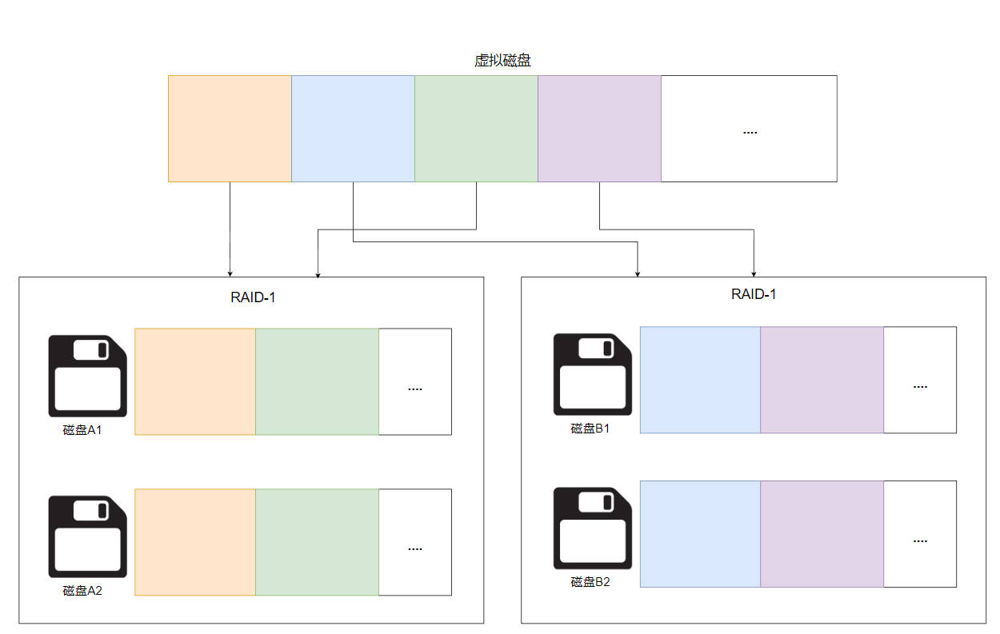

# 文件系统

# 概念

## 文件

> [!note]
> 磁盘是操作系统最频繁接触的设备，每时每刻都有不同的程序需要读写磁盘的中的文件。这就不能简单的通过驱动来控制进程的并发，实现磁盘的在不同进程中访问。

为了解决该问题，操作系统就为进程提供「虚拟磁盘」，进程对磁盘数据的读写就不再是磁盘驱动，而是抽象出来的「文件系统」中的「文件」
- 提供合理的 API 实现多个应用程序共享磁盘中的数据
- 数据隔离，防止一部分数据异常导致整个磁盘数据异常

在程序的视角，「文件」就是操作系统的虚拟磁盘
- 命名管理：可以通过文件路径查找到对应磁盘数据
- 数据管理：对于文件的读写操作，就是随机读写 `std::vector<char>`

## 文件系统

**文件系统：** 操作系统用于管理「虚拟磁盘」的管理器。每一个文件都在文件系统中进行了的登记，操作系统通过文件系统能对文件进行增删改查。文件系统管理文件采用的是树状结构
- windows: 每一个设备驱动就是一棵目录树
- linux: 只有一个根目录 `/`，其他设备可以被「挂载」到某一个目录上

```term
triangle@LEARN:~$ tree .
.
├── Videos
│   └── bilibili
│       └── load_log
├── Workspace
│   └── driver
│       ├── Makefile
│       └── hello.c
└── test.h
```

## 文件挂载

操作系统在添加新磁盘设备 (例如u盘、移动硬盘) 和加载 `.img、.iso` 镜像文件时
- windows: 单独虚拟出一个盘符来进行管理
- linux: 将设备或者镜像文件挂载到一个文件夹

```term
triangle@LEARN:~$ sudo mount game.img /mnt // 将 game.img 挂载到 /mnt 文件目录
```
对于镜像文件的挂载而言，直观结果就是使用了一个虚拟磁盘去挂载了另外一个虚拟磁盘。
- `game.img` 是一个虚拟磁盘
- `/mnt` 也是一个虚拟磁盘

这种利用一个假的去表示另外一个假的，在逻辑上就有点毛病。linux 的处理方案则是进行了一次套壳，为 `game.img` 创建一个 `loop` 设备，`/mnt` 直接访问的是 `loop` 设备，然后通过 `loop` 把数据读写转发到 `game.img` 

```term
triangle@LEARN:~$ lsblk
NAME MAJ:MIN RM   SIZE RO TYPE MOUNTPOINT
sda    8:0    0 363.3M  1 disk
sdb    8:16   0     2G  0 disk [SWAP]
sdc    8:32   0     1T  0 disk /mnt/wslg/distro
# loop 设备
loop0  7:1    0     1M  0 loop /mnt
```

## 链接

```term
triangle@LEARN:~$ ln a.txt b.txt // 硬链接，不能链接目录，不能跨文件系统
triangle@LEARN:~$ ln -s a.txt b.txt // 软链接
triangle@LEARN:~$ ll
-rw-r--r--  2 triangle triangle     0 Oct 14 15:17 a.txt
-rw-r--r--  2 triangle triangle     0 Oct 14 15:17 b.txt
lrwxrwxrwx  1 triangle triangle     5 Oct 14 15:17 c.txt -> a.txt
```

## 文件系统API

### 管理API

- `mkdir` : 创建目录
- `rmdir` : 删除目录，且是空文件夹
- `unlink` : 删除链接
- `getdents/readdir` : 读取文件夹信息
- `link` : 链接
- `chdir`: 修改进程工作目录

### 文件API

- `fd`: 文件描述符，指向一个虚拟磁盘
- `open`
- `mmap`
- `dup`
- `read`
- `write`

# 文件系统的实现

## 基础接口

真正的磁盘是块设备，那么最基本的磁盘驱动接口就只有了
- 读： `bread(int id, char * buf)`
- 写： `bwrite(int id, const char * buf)`


> [!note]
> 这就导致 cpu 访问磁盘不能对字节进行随机访问，只能一块一块的获取数据

所有的文件系统 API 都是基于这个两个接口实现，对这两个接口进行进一步的封装


## FAT

### 块管理

**方案一**: 将同一文件相关的块串联成一个链表。一个块分为数据和指针两个区域，指针会指向下一个块用来链接链表，也当作用于区分当前块是否空闲的标记位
- **不能以块为单位随机访问**


**方案二**：将块划分为两种类型，一种用于存储文件相关的块指针，一种用于存储数据。
- 数据块指针存放集中，数据指针块完蛋，文件就完蛋 


### FAT 实现

FAT 文件系统采用了第二种设计方案，且为了防止存放指针的数据块损坏，会对这些数据块进行备份

- [RTFM](https://jyywiki.cn/pages/OS/manuals/MSFAT-spec.pdf)


FAT-12/16/32 : 数字指的是指针的长度，而 `FAT (File Allocation Table)` 指的就是存放指针的块

```cpp
if (CountofClusters < 4085) {
  // Volume is FAT12 (2 MiB for 512B cluster)
} else if (CountofCluster < 65525) {
  // Volume is FAT16 (32 MiB for 512B cluster)
} else {
  // Volume is FAT32
}
```
通过数据块指针 (FAT Entry) 的值来标记文件的开始、结束、数据块是否损坏等


**「目录」在文件系统则是一个特殊的文件**。在 FAT 中，目录文件存放的是一组 Directory Entry (描述了文件名，文件权限等)


### 实操

```term
triangle@LEARN:~$ yes | head -c 104857600 > fs.img // 先创建 100m 文件
triangle@LEARN:~$ mkfs.fat -f 4 -s 8 -S 512 -v fs.img // 格式化文件为 FAT 文件系统

# -f 4:  FAT 表有四份
# -S 512: 一个 sector (扇区) 的长度
# -s 8:  一个 cluster (簇) 中有 8 个 sector

mkfs.fat 4.1 (2017-01-24)
fs.img has 64 heads and 32 sectors per track,
hidden sectors 0x0000;
logical sector size is 512, 
using 0xf8 media descriptor, with 204800 sectors;
drive number 0x80;
filesystem has 4 16-bit FATs and 8 sectors per cluster.
FAT size is 104 sectors, and provides 25543 clusters.
There are 8 reserved sectors.
Root directory contains 512 slots and uses 32 sectors.
Volume ID is 7a0e5078, no volume label.
triangle@LEARN:~$ file fs.img
fs.img: DOS/MBR boot sector, code offset 0x3c+2, OEM-ID "mkfs.fat", sectors/cluster 8, reserved sectors 8, FATs 4, root entries 512, Media descriptor 0xf8, sectors/FAT 104, sectors/track 32, heads 64, sectors 204800 (volumes > 32 MB), serial number 0x7a0e5078, unlabeled, FAT (16 bit)
triangle@LEARN:~$ sudo mount fs.img /mnt/img // 将虚拟文件系统挂载到操作系统
triangle@LEARN:~$ sudo touch /mnt/img/test.txt // 往文件系统添加内容
```

## ext2/UNIX文件系统

FAT 特性
- 文件元数据都存储在目录文件中，无法实现链接
- 小文件不错，但大文件的数据块随机访问不行，因为文件的存储结构本质是一个链表

针对上述两个主要问题，ext2/UNIX文件系统进行了改进: 单独划分一个磁盘区域，用于存储所有文件的元数据，即 `inode`，建立数据结构管理 `inode`。并且根据 `inode` 重新设计了一套管理数据块的数据结构


- 小文件直接在 `inode` 中存放数据块索引，方便快速查询
- 大文件则创建一级、二级、三级索引

目录文件则存储 `inode` 的索引


# 持久化数据

## RAID 


对于大型服务会追求性能和可靠性，这样就会产生一个矛盾，要想性能高，一台机器就得尽可能多的配置磁盘，然而磁盘越多，磁盘损坏的可能性就增加，数据持久化的可靠性就降低。
- 性能：将磁盘尽可能多的查到一台机器上，就能将磁盘性能发挥到极致
- 可靠：磁盘中的数据不会轻易丢失，例如断电、某个磁盘坏了

**Redundant Array of Inexpensive Disks (RAID)** 技术则可以在兼顾性能的同时也能保证磁盘可靠性。**RAID** 基本假设：
- 磁盘不可靠，可能会突然损坏
- 磁盘能反馈自身发生故障

基于上述假设， **`RAID` 的核心思想就是将所有的物理磁盘都抽象成一个大的虚拟磁盘** 。 

## RAID-1

操作系统操作虚拟磁盘完成数据的读写，且虚拟磁盘会将数据在物理磁盘上存储多份，提升可靠性。


这样数据存储结构还能大大提升大数据读取速度，例如操作系统需要读取 10G 的数据，可以在磁盘镜像A组中读 5G , 磁盘镜像 B 组中读 5G，直接实现物理层面的数据读取并发。此外写的性能保持不变。

## RAID-0


在 `RAID-1` 设计中，可以把磁盘读的速度加倍，借助这个思路可以对性能进一步优化：**若只要性能，不考虑可靠性，则可以把虚拟磁盘上的连续数据块交叉的存放到不同的磁盘上。** 这样就能实现虚拟磁盘上的数据在能在不同磁盘上并发读写。

## RAID-10



将 `RAID-0` 的磁盘也进行虚拟化，使用 `RAID-1` 进行代替，这样就即提升性能，又保证了可靠性。 

## RAID-4


用三个盘组成一个`RAID-0`，然后再使用一个作校验盘，用于数据恢复。这样就能使得其中任意一块磁盘损毁也不造成数据丢失
- 数据盘损坏：通过校验盘与剩余数据盘就能恢复损坏盘
- 校验盘损坏：数据又没丢失，重新做一个就行

> [!tip]
> [校验盘恢复原理](https://www.jianshu.com/p/0027bb0cfdec): 基本思想是比特进行异或计算。

`RAID-4` 对随机写具有很大性能瓶颈：**当随机写入一块区域，就要对该区域对应的校验区进行更新（先读取校验区、重新计算校验区、再写校验区）**

## RAID-5


`RAID-5` 则是将校验盘分散到各个盘里面，这能使得并发的随机写性能得到一定提升。


# 崩溃一致性

- **问题**

操作系统往磁盘里面更新文件，对于FAT文件系统而言，会更新数据块、`inode`、目录文件等。若在写入某一块数据时，系统崩溃或者断电，想写入的文件并未完全写完，同时磁盘数据写入乱序，可能会先更新部分文件信息，这就会造成文件系统结构错误，即未保证这些操作的原子性。

- **File System Checking**

电脑重启后对文件系统系统进行检测，修复错误文件

- **append-only 日志**

文件系统就是一个数据结构，储存的是一个状态机的结果。对文件系统的操作就是状态机中状态的转移，那么只记录「操作流程」也能储存一个文件系统（只要跟着流程走，就能得到状态结果）。按照这个思路储存文件系统操作的 「append-only 日志」便能更容易的实现崩溃一致性。


- `start`: 标记一个操作的起始
- `OP` : 记录每个操作的操作流程
- `end`: 操作结束标记，只有当 `end` 写入日志，系统才开始真正的执行操作。
- 操作完成，就能删除日志

这样就能保证系统崩溃后，可以通过日志恢复操作流程（`redo log`）或者根据日志回退操作（`undo log`）
