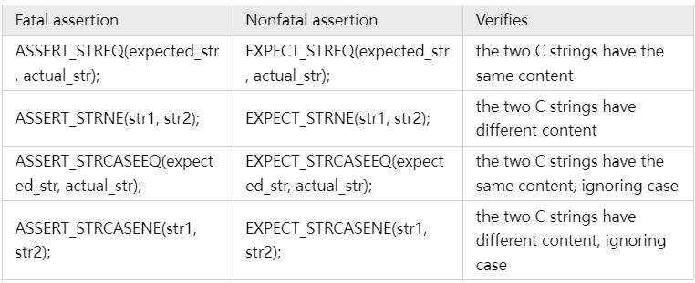

# gTest

- [玩转Google开源C++单元测试框架Google Test系列(gtest)](https://www.cnblogs.com/coderzh/archive/2009/04/06/1426758.html)
- [单元测试其一：gtest](https://zhuanlan.zhihu.com/p/522916368)
# 断言

##　断言类型

在 gtest 中，是通过断言 assertion 来测试代码实现的功能是否符合预期，断言结果有三类：
- `success`：测试结果符合预期
- `fatal failure`：测试结果不符合预期，程序直接崩溃
- `non-fatal failure`：测试结果不符合预期，但是不会崩溃

## 断言函数

gtest 又提供了两类断言宏函数：
- `EXPECT_XXX(expected, actual)`：会产生 non-fatal failure 结果
- `ASSERT_XXX(expected, actual)`：会产生 fatal failure 结果

> [!tip]
> 由于 `ASSERT_XXX` 会直接退出程序，这就可能会导致之后的资源清理代码未执行。

断言函数还能打印错误信息

```cpp
EXPECT_XXX(expected, actual) << "error message";
```

**`bool` 条件检测**
<p style="text-align:center;"></p>

**数值比较**
<p style="text-align:center;"></p>

**字符串比较**
<p style="text-align:center;"></p>

**浮点数比较**
<p style="text-align:center;"></p>

## 案例

```cpp
#include <gtest/gtest.h>

int add(int lhs, int rhs) { return lhs + rhs; }

int main(int argc, char const *argv[]) {

    // 测试案例1
    EXPECT_EQ(add(1,1), 2); // PASS

    // 测试案例2
    EXPECT_EQ(add(1,1), 1) << "FAILED: EXPECT: 2, but given 1";; // FAILDED

    return 0;
}
```

# 测试宏

## TEST

对于简单数量的测试案例，只需罗列断言函数`EXPECT_XXX`就行了，但是如果测试案例太多，全部都罗列在一起，看着就很蛋痛

```cpp
int main(int argc, char const *argv[]) {
    EXPECT_EQ(add(1,1), 2); 
    EXPECT_EQ(add(1,1), 3); 
    EXPECT_EQ(add(1,1), 1); 
    EXPECT_EQ(add(1,1), 4); 
    EXPECT_EQ(add(2,1), 3); 
    EXPECT_EQ(add(1,1), 4); 
    EXPECT_EQ(add(1,2), 2); 
    EXPECT_EQ(add(2,1), 0); 
    EXPECT_EQ(add(1,1), 5);
    ...
    return 0;
}
```

**为了更好的管理测试案例，可以利用测试宏对测试断言函数进行分组**

```cpp
TEST(TestSuiteName1, TestName1) {
    EXPECT_EQ(add(1,1), 2); 
}

TEST(TestSuiteName2, TestName2) {
    EXPECT_EQ(add(1,1), 1); 
}
```
- `TestSuiteName`：单元测试名
- `TestName`：测试案例分类名
- **测试宏中也是可以定义变量的**


## TEST_F 

`TEST_F` 中的 `F` 为 `fixture` ，即固定设施。由于 `TEST` 的功能仅仅只是对测试用例（断言函数）进行分类，如果需要对一个类实例进行测试时，利用 `TEST` 就需要在每一个分组中创建待检测的实例对象

```cpp
TEST(TestSuiteName1, TestName1) {
    CMath m;
    EXPECT_EQ(m.add(1,1), 2); 
}

TEST(TestSuiteName2, TestName2) {
    CMath m;
    EXPECT_EQ(m.add(1,1), 1); 
}
```
**当类对象的创建复杂时，利用`TEST`进行测试就十分繁琐了，`TEST_F`的作用就是实现类对象的复用。**

```cpp
class TestObject::public testing::Test
{
public:
    // 单个 TEST_F 测试开始前运行
    virtual void SetUp();

    // 单个 TEST_F 测试结束后运行
    virtual void TearDown();

    // 在第一个 TEST_F 之前运行
    static void SetUpTestSuite();

    // 在最后一个 TEST_F 之后运行
    static void TearDownTestSuite();

    int objVar;
    int objFunction();
}

TEST_F(TestObject, TestName) {
    // 直接使用变量和方法
    objVar = 1;
    objFunction();
}
```
- `TestObject`：待检测的类实例对象
- `TestName`：测试案例分类名
- **在`TEST_F`中可以直接使用`TestObject`的成员变量和成员函数**

> [!tip]
> 也可以利用 `TestObject` 来管理公共资源，实现对公共资源的测试

## TEST_P

```cpp
TEST(IsPrimeTest, HandleTrueReturn)  
{  
    // 这些测试案例具体流程都是重复的，只是参数不同
    EXPECT_TRUE(IsPrime(3));  
    EXPECT_TRUE(IsPrime(5));  
    EXPECT_TRUE(IsPrime(11));  
    EXPECT_TRUE(IsPrime(23));  
    EXPECT_TRUE(IsPrime(17));  
}  
```
`TEST_P` 用于实现参数化测试，即将`TEST`中的测试过程视为一个函数，然后再外部传入测试参数，实现参数化测试。


```cpp

// 1. 定义测试类
class IsPrimeTest :: public testing::TestWithParam<int>
{
public:
    // 单个 TEST_F 测试开始前运行
    virtual void SetUp()
    {
        // 获取外部传入的参数
        int a = GetParam();
    }

}

// 2. 抽象测试案例
TEST_P(IsPrimeTest, TestName)
{
    // 获取参数
    int a = GetParam();
    EXPECT_TRUE(IsPrime(a));
}

// 3. 给定参数
INSTANTIATE_TEST_CASE_P(
        InstantiationName,                  // 测试案例的前缀，可以任意取
        IsPrimeTest,                        // 测试类名 
        testing::Values(3, 5, 11, 23, 17)   // 参数生成器
        );  
```

**参数生成器**
<p style="text-align:center;"></p>

## TYPED_TEST

`TYPED_TEST` 实现像泛型一样来测试各种各样的参数。

**方式一：**

```cpp
// 1. 定义测试模版类
template <typename T>
class FooTest : public testing::Test {
public:
    typedef std::list<T> List;
    static T shared_;
    T value_;
};

// 2. 指定模版的参数类型
typedef testing::Types<char, int, unsigned int> MyTypes;
TYPED_TEST_CASE(FooTest, MyTypes);

// 3. 测试宏
TYPED_TEST(FooTest, TestName)
{
    // 利用 TypeParam 来声明 T 类型数据
    // 需要通过 this 来获取 FooTest 的类成员
    TypeParam n = this->value_;

    // 访问静态变量利用前缀，TestFixture::
    n += TestFixture::shared_;

    // 使用 typedef 时，需要使用 typename
    typename TestFixture::List list;
}
```

**方式二：**
```cpp
// 1. 定义测试模版类
template <typename T>
class FooTest : public testing::Test {
public:
    typedef std::list<T> List;
    static T shared_;
    T value_;
};

// 2. 现在不给具体类型
TYPED_TEST_CASE_P(FooTest);

// 3. 测试宏
TYPED_TEST_P(FooTest, DoesBlah) {
    TypeParam n = 0;
}
TYPED_TEST_P(FooTest, HasPropertyA) { }

// 4. 注册测试案例
// 参数一：测试类
// 参数二：TestName
REGISTER_TYPED_TEST_CASE_P(FooTest, DoesBlah, HasPropertyA);

// 5. 指定需要的类型列表
typedef testing::Types<char, int, unsigned int> MyTypes;
INSTANTIATE_TYPED_TEST_CASE_P(My, FooTest, MyTypes);
```

## 启用测试宏

```cpp
int main(int argc, char **argv) {
  testing::InitGoogleTest(&argc, argv);
  return RUN_ALL_TESTS();   
}
```

# 事件

## 全局事件

所有的测试宏前后都会执行

```cpp
class FooEnvironment : public testing::Environment
{
public:
    virtual void SetUp()
    {
        std::cout << "Foo FooEnvironment SetUP" << std::endl;
    }
    virtual void TearDown()
    {
        std::cout << "Foo FooEnvironment TearDown" << std::endl;
    }
};

int main(int argc, _TCHAR* argv[])
{
    // 注册全局事件
    testing::AddGlobalTestEnvironment(new FooEnvironment);
    testing::InitGoogleTest(&argc, argv);
    return RUN_ALL_TESTS();
}
```

## TestSuite事件

继承`testing::Test`的所有测试类都能使用

```cpp
class TestObject::public testing::Test
{
public:

    // 在第一个 TEST_F 之前运行
    static void SetUpTestSuite();

    // 在最后一个 TEST_F 之后运行
    static void TearDownTestSuite();

}

TEST_F(TestObject, TestName) {

}
```

## TestCase事件

继承`testing::Test`的所有测试类都能使用


```cpp
class TestObject::public testing::Test
{
public:

    // 单个 TEST_F 测试开始前运行
    virtual void SetUp();

    // 单个 TEST_F 测试结束后运行
    virtual void TearDown();
}

TEST_F(TestObject, TestName) {

}
```

# 测试私有函数

```cpp

class Student
{
private:
    int GetAge()
    {
        return m_nAge;
    }
    int m_nAge;

    // 允许与 (TestObject, TestName) 命名相同的测试宏访问私有属性和方法
    FRIEND_TEST(TestObject, TestName);
}

class TestObject::public testing::Test
{
public:
    // 单个 TEST_F 测试开始前运行
    virtual void SetUp()
    {
        st = new Student();
    }

    // 单个 TEST_F 测试结束后运行
    virtual void TearDown()
    {
        delete st;
    }

    Student* st;
}

TEST_F(TestObject, TestName) {
    st->GetAge();
}
```