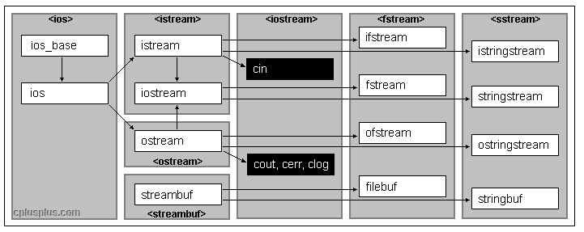

# 序列化

# 概念

**定义：** 在程序运行时，序列化与反序列化就是为了将对象属性值进行保存或者加载。
- **序列化 (Serialization)**：将对象转化成字节序列的过程。
- **反序列化 (Deserialization)**：将字节序列转化成对象的过程。

**作用：**
- 持久化：将程序运行中的对象信息保存到本地，等需要的时候又能从本地进行对象数据恢复。
- 网络传输：网络直接传输数据，但是无法直接传输对象。这样就可以想把对的序列化保存到本地，然后将本地序列化数据传输出去。
- 数据结构转化：对于数据结构相近的两个结构体，就可以通过序列化与反序列化实现两个结构体对象的数据拷贝赋值，就不用去写拷贝构造与拷贝赋值了。

# cereal

## 介绍

[cereal](http://uscilab.github.io/cereal/index.html) 是一个开源的（BSD License）、轻量级的、支持C++11特性的、仅仅包含头文件实现的、跨平台的C++序列化库。它可以将任意的数据类型序列化成不同的表现形式，比如二进制、XML格式或JSON。
- 库文件：全部为 `.hpp` 文件
- 环境：`c++11`

## 结构体定义

对于需要序列化与反序列化的结构体需要实现 `void serialize(Archive &archive)` 模板函数，并且要在 `archive` 指定需要进行序列化的数据。

```cpp
// 二进制序列
#include "cereal/archives/binary.hpp"

// NOTE - 当使用非基础类型，都需要指定一下
#include "cereal/types/string.hpp"

#include <string>

struct Tag
{
    std::string TagName;
    int id;

    template <class Archive>
    void serialize(Archive &archive)
    {
        archive(TagConfidence, id);
    }
};
```

而对于自定义嵌套结构体，也都需要给出序列化操作

```cpp
#include <list>
#include <string>

#include "cereal/archives/binary.hpp"

// 使用到的特殊类型
#include "cereal/types/string.hpp"
#include "cereal/types/list.hpp"

struct Tag
{
    std::string TagName;
    int id;

    // 子结构体的序列化
    template <class Archive>
    void serialize(Archive &archive)
    {
        archive(TagConfidence, id);
    }
};

struct TagGroup
{
    std::string TagGroupName;
    int id;

    // NOTE - 自定义的子结构体 Tag 也必须实现 void serialize(Archive &archive)
    std::list<Tag> Tags;

    template <class Archive>
    void serialize(Archive &archive)
    {
        // NOTE - 数据的传递顺序与 archive 的定义顺序一样
        archive(TagGroupName, id, Tags);
    }
};
```

> [!note]
> cereal 支持几乎所有的标准库类型，但是不支持「原始指针对象」与「引用对象」。**原始指针不能用，但是智能指针是可以。**

## 序列化类型

- **二进制**：序列化将数据放入了 `ss` 流中，反序列化则从 `ss` 流中将数据读取出来
   ```cpp
    // 二进制
    #include "cereal/archives/binary.hpp"

    #include <iostream>
    #include <sstream>

    int main(int argc, char const *argv[])
    {
        // 流
        std::stringstream ss; 

        // 序列化数据
        int a = 10;
        {
            // 创建序列化对象
            cereal::BinaryOutputArchive archive(ss);

            // 序列化数据
            archive(a);
        }

        // 反序列化
        int b;
        {
            // 创建反序列化对象
            cereal::BinaryInputArchive archive(ss);

            // 反序列化数据
            archive(b);
        }

        std::cout << "a : " << a << "\n";
        std::cout << "b : " << b << "\n";
        return 0;
    }
   ```
   ```term
   triangle@LEARN:~$ ./a.exe
   a : 10
   b : 10
   ```
- **xml**：序列化是将数据保存到 `test.xml` 文件中，而反序列化则是从 `test.xml` 中读取数据
   ```cpp
    #include "cereal/archives/xml.hpp"
    #include "cereal/types/string.hpp"

    #include <iostream>
    #include <fstream>

    int main(int argc, char const *argv[])
    {

        {
            // 文件输出流
            std::ofstream os("test.xml");

            // 序列化数据
            int oa = 10;
            std::string ostr = "fuck"; 

            // 创建序列化对象
            cereal::XMLOutputArchive oarchive(os);

            // 序列化数据
            // cereal::make_nvp 可以用来指定 xml 中数据的标签名称
            oarchive & cereal::make_nvp("int", oa);
            oarchive & cereal::make_nvp("str", ostr);
        }

        {
            // 文件输入流
            std::ifstream is("test.xml");

            // 序列化数据
            int ia = 0;
            std::string istr = ""; 

            // 创建反序列化对象
            cereal::XMLInputArchive iarchive(is);

            // 反序列化数据
            iarchive(ia, istr);

            std::cout << "ia : " << ia << "\n";
            std::cout << "istr : " << istr << "\n";
        }
        return 0;
    }
   ```
- **json**：与 xml 类似，序列化是将数据保存到 `test.json` 文件中，而反序列化则是从 `test.json` 中读取数据
   ```cpp
    #include "cereal/archives/json.hpp"
    #include "cereal/types/string.hpp"

    #include <iostream>
    #include <fstream>

    int main(int argc, char const *argv[])
    {

        {
            // 输出流
            std::ofstream os("test.json");

            // 序列化数据
            int oa = 10;
            std::string ostr = "fuck"; 

            // 创建序列化对象
            cereal::JSONOutputArchive oarchive(os);

            // 序列化数据
            // cereal::make_nvp 可以用来指定 json 中数据的属性名称
            oarchive & cereal::make_nvp("int", oa);
            oarchive & cereal::make_nvp("str", ostr);
        }

        {
            // 输入流
            std::ifstream is("test.json");

            // 序列化数据
            int ia = 0;
            std::string istr = ""; 

            // 创建反序列化对象
            cereal::JSONInputArchive iarchive(is);

            // 反序列化数据
            iarchive(ia, istr);

            std::cout << "ia : " << ia << "\n";
            std::cout << "istr : " << istr << "\n";
        }

        return 0;
    }
   ```

## RAII 模式

`cereal::JSONOutputArchive` 与 `cereal::XMLOutputArchive` 均采用 RAII 模式进行设计，这就导致只有 RAII 对象调用构造函数时，才会真正的保存数据文件。

```cpp
#include "cereal/archives/json.hpp"
#include "cereal/types/string.hpp"

#include <iostream>
#include <fstream>

int main(int argc, char const *argv[])
{

    // {
        // 输出流
        std::ofstream os("test.json");

        // 序列化数据
        int oa = 10;
        std::string ostr = "fuck"; 

        // 创建序列化对象
        cereal::JSONOutputArchive oarchive(os);

        // 序列化数据
        oarchive & cereal::make_nvp("int", oa);
        oarchive & cereal::make_nvp("str", ostr);
    // }

    // {
        // 输入流
        std::ifstream is("test.json");

        // 序列化数据
        int ia = 0;
        std::string istr = ""; 

        // 创建反序列化对象
        cereal::JSONInputArchive iarchive(is);

        // 反序列化数据
        iarchive(ia, istr);

        std::cout << "ia : " << ia << "\n";
        std::cout << "istr : " << istr << "\n";
    // }

    return 0;
}
```

```term
triangle@LEARN:~$ ./a.exe
terminate called after throwing an instance of 'cereal::RapidJSONException'
  what():  rapidjson internal assertion failure: IsObject()
```

当一次运行上述程序时，就会抛出异常。**因为序列化执行完毕后，`oarchive` 并没有马上被释放，那么 `test.json` 也根本没有生成。这就导致反序列化操作读取 `test.json` 失败（因为根本就没这个文件）。**

## 序列化本质

```cpp
#include "cereal/archives/binary.hpp"
#include "cereal/types/string.hpp"
#include <sstream>

struct TestA
{
    int a1;
    int a2;
    std::string str;

    template <class Archive>
    void serialize(Archive &archive)
    {
        archive(a1,a2,str);
    }
};

struct TestB
{
    int b1;
    int b2;
    std::string str;

    template <class Archive>
    void serialize(Archive &archive)
    {
        archive(b1,b2,str);
    }
};
```

对两个结构相似的结构体进行序列化与反序列化

```cpp
int main(int argc, char const *argv[])
{
    // 输出流
    std::stringstream ss;

    {
        TestA test;
        test.a1 = 10;
        test.a2 = 20;
        test.str = "fuck";

        // 创建序列化对象
        cereal::BinaryOutputArchive oarchive(ss);

        oarchive(test);
    }

    {
        TestB test;

        // 创建序列化对象
        cereal::BinaryInputArchive oarchive(ss);

        oarchive(test);

        std::cout << "b1 " << test.b1 << "\n";
        std::cout << "b2 " << test.b2 << "\n";
        std::cout << "str " << test.str << "\n";
    }

    return 0;
}
```
结果为

```term
triangle@LEARN:~$ ./a.exe
b1 10
b2 20
str fuck
```

**修改结构体`TestB`中序列化函数中变量顺序**

```cpp
struct TestB
{
    int b1;
    int b2;
    std::string str;

    template <class Archive>
    void serialize(Archive &archive)
    {
        // archive(b1,b2,str);
        archive(b2);
        archive(b1);
        archive(str);
    }
};
```

```term
triangle@LEARN:~$ ./a.exe
b1 20
b2 10
str fuck
```
> [!note]
> TestB 接收 TestA 数据的顺序发生了变化，这是因为 TestB 中 `serialize` 定义的变量序列化顺序发生了改变。**序列化与反序列化的本质就是根据用户在 `serialize` 中定义的变量顺序进行单纯的 `memorycpy`**。

## 序列化函数

- `serialize` 函数：可以用于序列化与返序列化
   ```cpp
    // ================ 结构体内部 ======================
    struct MyClass 
    {
        int x, y, z;

        template<class Archive>
        void serialize(Archive & archive)
        {
            archive( x, y, z ); 
        }
    };

    // ================ 结构体外部 ======================
    struct MyClass 
    {
        int x, y, z; 
    };

    template<class Archive>
    void serialize(Archive & archive, MyClass & m)
    {
        archive( m.x, m.y, m.z );
    }
   ```
- `save/load` 函数：save 负责序列化；load 负责反序列化
    ```cpp
    // ================ 结构体内部 ======================
    struct MyClass 
    {
        int x, y, z;

        // NOTE - const 函数
        template<class Archive>
        void save(Archive & archive) const
        {
            archive( x, y, z ); 
        }

        template<class Archive>
        void load(Archive & archive)
        {
            archive( x, y, z ); 
        }
    };

    // ================ 结构体外部 ======================
    struct MyClass 
    {
        int x, y, z;
    };

    // NOTE - 参数类型必须是 const 的
    template<class Archive>
    void save(Archive & archive, const MyClass & m)
    { 
        archive( m.x, m.y, m.z ); 
    }

    template<class Archive>
    void load(Archive & archive, MyClass & m)
    {
        archive( m.x, m.y, m.z ); 
    } 
    ```

- 最小化序列函数
   ```cpp
    struct MyData
    {
        double d;

        template <class Archive>
        double save_minimal(Archive const & ) const
        {
            return d;
        }

        template <class Archive>
        void load_minimal( Archive const &, double const & value )
        {
            d = value;
        }
    };
   ```

- 定义私有的序列化函数
   ```cpp
    // 添加头文件
    #include <cereal/access.hpp>

    class MyCoolClass
    {
    private:
        int secretX;

        // 给访问权限
        friend class cereal::access;

        template <class Archive>
        void serialize( Archive & ar )
        {
        ar( secretX );
        }
    };
   ```
- 版本控制
   ```cpp
    struct Tag
    {
        std::string TagName;
        std::string TagDescript;
    };

    // 注册版本号
    CEREAL_CLASS_VERSION(Tag, CUR_VERSION);

    // 在序列化函数中获取版本号
    template<class Archive>
    void serialize(Archive &ar, Tag& cls, const unsigned int version)
    {
        ar & make_nvp("TagName", cls.TagName);
        // 新版本添加的字段
        if (version >= 0x22)
        {
            ar & make_nvp("TagDescript", cls.TagDescript);
        }
    }
   ```

## 流

<p style="text-align:center;"></p>

- **设备**
    - **istream**：常用于接收从键盘输入的数据，例如 `std::cin`；
    - **ostream**：常用于将数据输出到屏幕上，例如 `std::cout`；
    - **iostream**：继承自 istream 和 ostream 类，因为该类的功能兼两者于一身，既能用于输入，也能用于输出；
- **文件**
    - **ifstream**：用于读取文件中的数据；
    - **ofstream**：用于向文件中写入数据；
    - **fstream**：兼 ifstream 和 ofstream 类功能于一身，既能读取文件中的数据，又能向文件中写入数据。
- **类型转换**
  - **istringstream**：输入
  - **ostringstream**：输出
  - **stringstream**：两者


