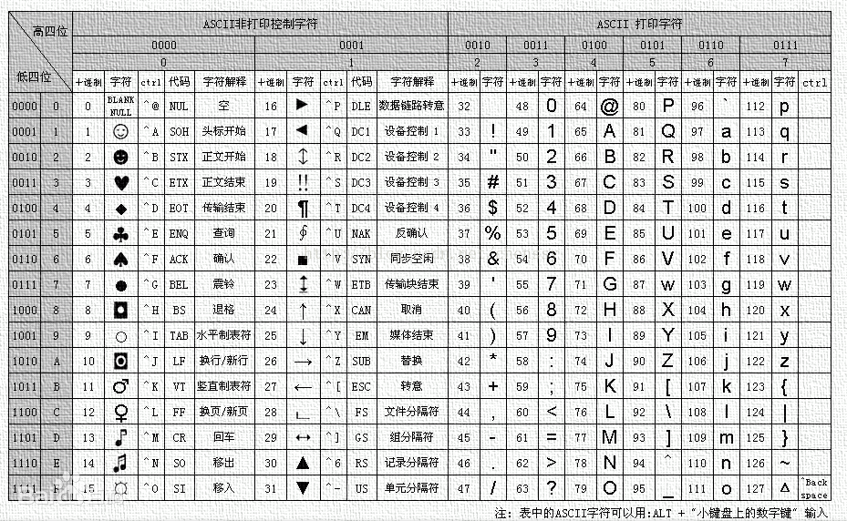
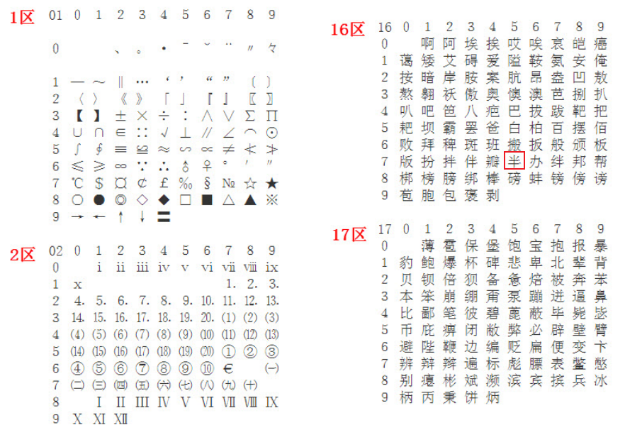
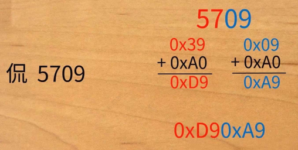
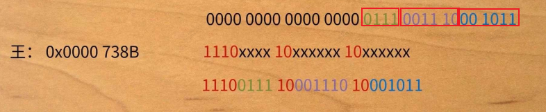

# 字符集

# ASCII

**ASCII 码**：利用一个字节长度 `0000 0000 ~ 0111 1111` 储存 128 个字符
- 可见字符：数字，字母，共 95 个
- 控制字符：控制打印输出的，例如换行 `\n`，共 33 个

<p style="text-align:center;"></p>

**扩展 ASCII 码**：后来发现 128 个不够用，又把剩下的 `1000 0000 ~ 1111 1111` 都给使用上 

**码位**：用来编号一个字符的数字

**编码**：码位在计算机中，如何表示。对于 ASCII 码，码位与编码大小一样，取值范围 `0 ~ 255`

# ANSI

## 定义

**ANSI**：由于 ASCII 码只能表示英文，像中文、日文、韩文等，一个字节的 ASCII 码就不够用，这样不同国家和地区就对 ASCII 码的字节数进行拓展，利用多个字节来表示编写适用于自己国家或者地区的语言字符集，例如简中 GB2312，繁中 Big5等。**这些使用多个字节来代表一个字符的延伸编码方式，全部统称为 ANSI 编码**。 <span style="color:blue;font-weight:bold"> ANSI 编码之间互不兼容，各自管各自的。 </span>


windows 操作系统系统会根据地区切换 ANSI 编码，以适应各个地区的语言：在简体中文Windows操作系统中，ANSI 编码代表 GBK (CP 936)编码；在繁体中文Windows操作系统中，ANSI编码代表Big5；在日文Windows操作系统中，ANSI 编码代表 Shift_JIS 编码
- [字符集](https://blog.csdn.net/x356982611/article/details/80285930)

```term
triangle@LEARN:~$ chcp <.CPID> // 切换 powershell 的显示字符集
```

> [!tip]
> `fopen` 识别什么样的字符编码，其实是和操作系统底层实现相关的，简体中文 windows 需要 GB2312 编码，linux 操作系统则需要 UTF-8 编码

## GB2312

**GB2312**：使用分区管理，设计了 94 个区，每个区有 94 个码位，共 8836 个码位
- 01 - 09 区：除汉字以外的 682 个字符
- 10 - 15 区：空白区
- 16 - 55 区：3755 个一级汉字，按拼音排序
- 56 - 87 区：3008 个二级汉字，按照部首/笔画排序
- 88 - 94 区：空白区 

<p style="text-align:center;"></p>

**码位：** 区号 + 行号 + 列号。例如 16 区的「半」，行号为 7，列号为 5，则码位为 `1675`

**编码：** 将区号与行列号拆分开，分别加上 `0xA0` (高字节、低字节均大于 `127`，用来兼容原版ASCII编码)， 然后再拼接到一起。
<p style="text-align:center;"></p>

## GBK

GB2312 表示的字符还不够用，继续扩充
- **GBK**：去掉 GB2312 中低字节大于 `127` 的限制，又扩展了两万多个汉字和符号
- **GB18030**：继续扩充 GBK，新增少数民族的字符

# Unicode

## 定义

**Unicode：** 一套编码准则，目标是囊括世界上所有的字符。ASCII 只能表示英文字符，GBK 拓展了中文字符，但是世界上还有俄文，日文等，大家都定义一套字节的字符编码，用起来就太乱了，Unicode 就想统一所有的字符编码。

Unicode 只是一套准则，还是需要通过具体的字符集进行实现：
- **UCS-2**：码位与编码一样，字节大小为两个字节，可以表示 65536 个字符
- **UCS-4**：码位与编码一样，字节大小为四个字节，可以表示 43 亿个字符
- **UTF-8**：为变长度编码，比上面两个节约空间，被广泛引用

## UTF-8


<div style="margin: 0 auto;padding:1rem;width: 42rem;">

| UCS-4 码位                | UTF-8 编码                          | 字节  |
| ------------------------- | ----------------------------------- | :---: |
| 0x0000 0000 ~ 0x0000 007F | xxxxxxxx                            |   1   |
| 0x0000 0080 ~ 0x0000 07FF | 110xxxxx 10xxxxxx                   |   2   |
| 0x0000 0800 ~ 0x0000 FFFF | 1110xxxx 10xxxxxx 10xxxxxx          |   3   |
| 0x0001 0000 ~ 0x0010 FFFF | 11110xxx 10xxxxxx 10xxxxxx 10xxxxxx |   4   |

</div>

首先获取到字符在 UCS-4 中的码位，然后根据上面的表，将码位二进制填入到对应位置，形成 UTF-8 编码

<p style="text-align:center;"></p>

## DOM

**DOM**：byte order mark，字节顺序标记。利用多字节来编码一个字符，这就需要字符解码与编码时，明确字节的读写顺序，即区分大端、小端。**DOM 的作用就是标记出字节的大小端顺序**。

- **UCS**：UCS的编码是固定大小的多字符集，且直接二进制编号表示字符，因此就需要区别大小端。UCS 利用字符「零宽无间断间隔 (Zero Width No-Break Space)」来区分大小端：`0xFEFF` 表示大端；`0xFFFE` 表示小端
- **UTF-8 with DOM**：UTF-8 的编码方式不用标记大小端，就能根据其结构正确解析多字节。UTF-8的「零宽无间断间隔 (Zero Width No-Break Space)」字符就被用来标识 UTF-8 这种编码: `0xEFBBBF` 。**只有 windows 才这么玩，linux 不支持**。


# c++宽字符

## char 到 wchar_t

- locale (本地化策略集) : 将字符与计算机储存的二进制数值对应起来的规则
- 硬编码 : C/C++编译策略
    - 编译器直接将源文件字符集对应的编码，赋值给字符串，生成程序文件
    - 字符（串）在程序文件（可执行文件，非源文件）中的表示，与在程序执行中在内存中的表示一致。

char 与 wchar_t 并没有标准的大小限定，只是 char 一般默认是 8 位，且规定 sizeof(char) 是 1；同样在 win32 中，wchar_t为16位，Linux中是32位。**标准规定 wchar_t 可以表示任何系统所能认识的字符**

```cpp
const wchar_t* ws = L"中文abc";
0x4E2D       0x6587        0x0061       0x0062       0x0063         //win32，UCS-2BE
0x00004E2D   0x00006587    0x00000061   0x00000062   0x00000063     //Linux，UTF-32BE

const char* s = "中文abc";
0xD6   0xD0   0xCE   0xC4   0x61   0x62   0x63                      // gb2312
0xE4   0xB8   0xAD   0xE6   0x96   0x87   0x61   0x62   0x63        // utf-8
```

- char : 硬编码
- wchar_t : 硬编码后，又进行本地化策略。编译器根据locale来进行翻译的。
    - Windows中，从 GB2312 到 UCS-2BE
    - Linux中，从 UTF-8 到 UTF-32BE

> [!tip]
> MinGW运行win32下，所以只有 GB2312 系统才认；而MinGW却用gcc编写，所以自己只认 UTF-8，所以结果就是，MinGW的宽字符被废掉了

**内部编码与外部编码**
- 外部编码：源文件中，字符串的编码
- 内部编码：二进制程序中，字符串的编码。char 和外部编码一样；wchar_t 会将外部编码通过 locale 转化为程序内的编码

## 字符集

- Unicode 与 UCS
    可以认为这两套标准能够等价互换
- UTF-x 与 UCS-y
    在C语言中，0x00的字节就是 `\0`，表示的是一个字符串（char字符串，非wchar_t）的结束，换句话说，C风格的char字符串无法表示Unicode。为Unicode在计算机中的编码方法出现了，就是UTF。对于UCS也有自己的编码规则，即UCS。
    - UTF-x : 一个单位编码至少占用x位
    - UCS-y : 一个单位编码就占用y个字节
- UTF-8 与 GB2312
    - UTF-8 的设计规则除了 `\0`，就不会出现 0 字节，可以直接使用 char，因此可以成为系统码
    - GB2312 除了 `\0`，就不会出现 0 字节，可以直接使用 char，因此可以作为中文系统码
- UTF-16 与 UCS-2
    - UTF- 16用2个字节或者4个字节表示。在2个字节大小的时候，跟UCS-2是一样的，没有自我同步机制，需要区分大小端，UTF-16BE 大端，UTF-16LE 小端
    - Windows中的wchar_t就是采用UCS-2BE编码，虽然wchar_t的要求是要能表示所有系统能识别的字符，但是两个字节不能支持 unicode，因此windows的宽字节还是有点瑕疵
- UTF-32 与 UCS-4：
    - UTF- 32在目前阶段等价于UCS-4，都用定长的4个字节表示。UTF-32同样存在BE和LE的问题。Linux的wchar_t编码就是UTF- 32BE
    - 在16位以内的时候，UTF-32BE的后两位（前两位是0x00 0x00）等价于UTF-16BE也就等价于UCS-2BE
- BOM
    在文件最开始的部分，表明文件的编码格式，0xFE 0xFF表示UTF-16BE，0xFF 0xFE 0x00 0x00表示UTF-32LE。UTF-8 可以不要DOM，但是为了一致性，还是可以加上


## c库函数转换

字符与宽字符的之间的转换，依赖于本地化策略(locale)，程序在运行之前并不知道系统的本地化策略集是什么，程序只有在运行之后才通过locale获得当时的本地化策略集。

```cpp
// 获取本地策略化集
std::locale app_loc;
std::locale app_loc = std::locale(); // c++
std::locale C_loc = std::locale::classic(); // c

/* 通过名字获取 */
// 获取系统的 locale
std::locale sys_loc(""); 
// 获取 c 语言版本的
std::locale C_loc("C");

//将new_loc设置为当前全局locale，并将原来的locale返回给old_loc
std::locale old_loc = std::locale::global(new_loc);
```

- 通过 c 接口实现 char 与 wchar_t 之间的相互转换

```cpp
const std::wstring s2ws(const std::string& s)
{
    // 全局locale设置为系统locale，并保存原来的全局locale在old_loc中
    std::locale old_loc = std::locale::global(std::locale(""));
    const char* src_str = s.c_str();
    const size_t buffer_size = s.size() + 1;
    wchar_t* dst_wstr = new wchar_t[buffer_size];
    wmemset(dst_wstr, 0, buffer_size);
    // char 转 wchar_t
    mbstowcs(dst_wstr, src_str, buffer_size);
    std::wstring result = dst_wstr;
    delete []dst_wstr;
    std::locale::global(old_loc);
    return result;
}

const std::string ws2s(const std::wstring& ws)
{
    std::locale old_loc = std::locale::global(std::locale(""));
    const wchar_t* src_wstr = ws.c_str();
    // 一个 wchar_t 最大就占用 4 个字节
    size_t buffer_size = ws.size() * 4 + 1;
    char* dst_str = new char[buffer_size];
    memset(dst_str, 0, buffer_size);
    // wchar_t 转 char
    wcstombs(dst_str ,src_wstr, buffer_size);
    std::string result = dst_str;
    delete []dst_str;
    std::locale::global(old_loc);
    return result;
}
```
char是用1个或多个对象，也就是1个或者多个字节来表示各种符号；wchar_t是用1个对象（2字节或者4字节）来表示各种符号；因此，表示同样的字符串，宽字符串的大小（也就是wchar_t对象的数量）总是小于或者等于窄字符串大小（char对象数量）的。+1 是为了在最后预留一个值为0的对象

## c++ 库函数转换

c++ 除了笼统的 locale ，还可以修改 locale 的具体实现模块 facet，因此，可以通过 facet 定制 locale 或者直接使用 facet 进行宽窄字符的转换。

```cpp
// 通过指定具体的 facet 将 old_loc 改造成 new_loc
std::locale new_loc(old_loc, new facet);

// 把 locale 中的 facet 取出来
const Facet& facet = use_facet<Facet>(locale);

// 标准 facet 模版
template <class I,      // 内部编码
          class E,      // 外部编码 
          class State>  // 不同转换方式的标识
class std::codecvt : public locale, public codecvt_base
{
    // 将外部编码转换为内部编码
    result in(State& s,
              const E* from,        // 字符首地址
              const E* from_end,    // 字符尾地址 
              const E*& from_next,  // 出现错误时候的停点
              I* to,
              I* to_end,
              I*& to_next) const;
              
    // 将内部编码转换为外部编码
    result out(State& s,
               const I* from,
               const I* from_end,
               const I*& from_next,
               E* to,
               E* to_end,
               E*& to_next) const;
};
```

对于 `std::codecvt::in` 与 `std::codecvt::out` 都会使用到转换标识 `State`，用于保存转换位移状态信息，但具体操作是在运行时库中进行的，其执行可能是异步的，为了保证转换的正常执行，需要将 `State` 定义为全局变量

```cpp
#include <string>
#include <iostream>

mbstate_t in_cvt_state;
mbstate_t out_cvt_state;

const std::wstring s2ws(const std::string& s)
{
    std::locale sys_loc("");

    const char* src_str = s.c_str();
    const size_t BUFFER_SIZE = s.size() + 1;

    wchar_t* intern_buffer = new wchar_t[BUFFER_SIZE];
    wmemset(intern_buffer, 0, BUFFER_SIZE);

    const char* extern_from = src_str;
    const char* extern_from_end = extern_from + s.size();
    const char* extern_from_next = 0;
    wchar_t* intern_to = intern_buffer;
    wchar_t* intern_to_end = intern_to + BUFFER_SIZE;
    wchar_t* intern_to_next = 0;

    // 定义 facet
    typedef std::codecvt<wchar_t, char, mbstate_t> CodecvtFacet;

    CodecvtFacet::result cvt_rst =
        std::use_facet<CodecvtFacet>(sys_loc).in(
            in_cvt_state,
            extern_from, extern_from_end, extern_from_next,
            intern_to, intern_to_end, intern_to_next);
    if (cvt_rst != CodecvtFacet::ok) {
        switch(cvt_rst) {
            case CodecvtFacet::partial:
                std::cerr << "partial";
                break;
            case CodecvtFacet::error:
                std::cerr << "error";
                break;
            case CodecvtFacet::noconv:
                std::cerr << "noconv";
                break;
            default:
                std::cerr << "unknown";
        }
        std::cerr    << ", please check in_cvt_state."
                    << std::endl;
    }
    std::wstring result = intern_buffer;

    delete []intern_buffer;

    return result;
}

const std::string ws2s(const std::wstring& ws)
{
    std::locale sys_loc("");

    const wchar_t* src_wstr = ws.c_str();
    const size_t MAX_UNICODE_BYTES = 4;
    const size_t BUFFER_SIZE =
                ws.size() * MAX_UNICODE_BYTES + 1;

    char* extern_buffer = new char[BUFFER_SIZE];
    memset(extern_buffer, 0, BUFFER_SIZE);

    const wchar_t* intern_from = src_wstr;
    const wchar_t* intern_from_end = intern_from + ws.size();
    const wchar_t* intern_from_next = 0;
    char* extern_to = extern_buffer;
    char* extern_to_end = extern_to + BUFFER_SIZE;
    char* extern_to_next = 0;

    typedef std::codecvt<wchar_t, char, mbstate_t> CodecvtFacet;

    CodecvtFacet::result cvt_rst =
        std::use_facet<CodecvtFacet>(sys_loc).out(
            out_cvt_state,
            intern_from, intern_from_end, intern_from_next,
            extern_to, extern_to_end, extern_to_next);
    if (cvt_rst != CodecvtFacet::ok) {
        switch(cvt_rst) {
            case CodecvtFacet::partial:
                std::cerr << "partial";
                break;
            case CodecvtFacet::error:
                std::cerr << "error";
                break;
            case CodecvtFacet::noconv:
                std::cerr << "noconv";
                break;
            default:
                std::cerr << "unknown";
        }
        std::cerr    << ", please check out_cvt_state."
                    << std::endl;
    }
    std::string result = extern_buffer;

    delete []extern_buffer;

    return result;
}
```

## stream与locale

c++ 流具有一定的智能，能识别一些内容，甚至做一些基础类型之间的转化

```cpp
// 字符串 --> int
std::string str("123");
int i;
std::stringstream sstr(str);
sstr >> i;

// int --> 字符串
std::stringstream sstr;
sstr << i;
str = sstr.str();
```

为了拓展 c++ 流的转换能力，流也在使用 locale 中的 facet，决定流使用哪个 facet 由流中的缓存 basic_streambuf 及其子类 basic_stringbuf 与 basic_filebuf 所决定。其中 codecvt会被 basic_filebuf 调用，因此就能使用 fstream 来实现 char 与 wchar_t 之间的转换。

```cpp
 #include <string>
 #include <fstream>

const std::wstring s2ws(const std::string& s)
{
    // 使用默认的 locale 将字符串转换为流: char -> char
    // 存放到 cvt_buf 缓冲区
    std::ofstream ofs("cvt_buf");
    ofs << s;
    ofs.close();

    // 创建宽字符流
    std::wifstream wifs("cvt_buf");
    // 设定系统本地化策略集
    std::locale sys_loc("");
    wifs.imbue(sys_loc);
    std::wstring wstr;
    // 从 cvt_buf 缓冲区读取，并通过 locale 实现 char -> wchar_t
    wifs >> wstr;
    wifs.close();

    return wstr;
}

const std::string ws2s(const std::wstring& s)
{

    std::wofstream wofs("cvt_buf");
    // cvt_buf 对程序而言是外部编码，因此保存wchar_t，得先转成char
    // wchar_t 写入到 cvt_buf 的时候，就通过 locale 进行翻译
    std::locale sys_loc("");
    wofs.imbue(sys_loc);
    wofs << s;
    wofs.close();

    std::ifstream ifs("cvt_buf");
    std::string str;
    ifs >> str;
    ifs.close();
    return str;
}
```

# 字符编译


分别用 MSVC 与 GNU 编译器编译下面的字符串

```cpp
const char* str1 = "卧槽";
const char* str2 = u8"卧槽"; 
```

MSVC 编译器，文件格式为 UTF-8

```term
triangle@LEARN:~$ cl /c main.cpp
triangle@LEARN:~$ xxd main.obj
# "卧槽"
e5 8d a7 e6 a7 bd 
# u8"卧槽"
e9 8d 97 d1 84 d0 ab
```

GNU 编译器，文件格式为 GB2312

```term
triangle@LEARN:~$ g++ -c main.cpp
triangle@LEARN:~$ xxd main.o
# "卧槽"
ce d4 b2 db 
# u8"卧槽"
ce d4 b2 db
```

可以看出在 GNU 编译器下，`u8` 根本不起作用，而 MSVC 则会对字符串进行编码转换。MSVC 编译，文件格式为 UTF-8，输出 `str2` 字符到 GBK 格式的控制台

```term
triangle@LEARN:~$ main.exe
閸椦勑?
```

然后对上面的字符进行编码

```python
print(b'\xe5\x8d\xa7\xe6\xa7\xbd'.decode('gbk').encode('utf-8'))
```

```term
triangle@LEARN:~$ python code.pyt
b'\xe9\x8d\x97\xd1\x84\xd0\xab'
```

从上可知 `u8` 在MSVC中的实现就是一个 `gbk2utf8()` 的函数


