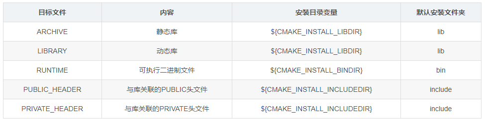
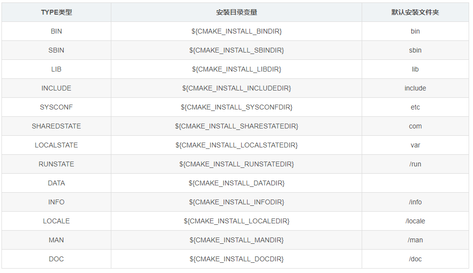

# Cmake

# 项目 CMakeLists 配置

```php
# cmake 版本
cmake_minimum_required(VERSION 2.8)

# 项目名
project(hello)

# 打印信息
message("${PROJECT_SOURCE_DIR}")

# 在源码外部自定义宏
add_definitions(-DDEBUG -DREAL_COOL_ENGINEER)

# 指定编译模式，会自动切换下面两个模式，不要再写 if 语句
set(CMAKE_BUILD_TYPE Debug)

# Debug模式下的编译指令
set(CMAKE_C_FLAGS_DEBUG "${CMAKE_C_FLAGS_DEBUG} -g -O0")
SET(CMAKE_CXX_FLAGS_DEBUG "$ENV{CXXFLAGS} -O0 -Wall -g -ggdb")
# Release模式下的编译指令
set(CMAKE_C_FLAGS_RELEASE "${CMAKE_C_FLAGS_RELEASE} -O2")
SET(CMAKE_CXX_FLAGS_RELEASE "$ENV{CXXFLAGS} -O3 -Wall ")

# 可执行文件路径
set(CMAKE_RUNTIME_OUTPUT_DIRECTORY ${PROJECT_SOURCE_DIR}/bin)
# debug 版的可执行文件路径
#set(CMAKE_RUNTIME_OUTPUT_DIRECTORY_DEBUG ${PROJECT_SOURCE_DIR}/bin)
# release 版的可执行文件路径
#set(CMAKE_RUNTIME_OUTPUT_DIRECTORY_RELEASE ${PROJECT_SOURCE_DIR}/bin) 

# 静态库存放路径，可指定 debug release
set(CMAKE_ARCHIVE_OUTPUT_DIRECTORY_ ${PROJECT_SOURCE_DIR}/bin)
# 动态库存放路径，可指定 debug release
set(CMAKE_LIBRARY_OUTPUT_DIRECTORY_ ${PROJECT_SOURCE_DIR}/bin)

#设置可执行文件的输出目录
#SET(EXECUTABLE_OUTPUT_PATH ${PROJECT_SOURCE_DIR}/bin) 
#设置库文件的输出目录      
SET(LIBRARY_OUTPUT_PATH ${PROJECT_SOURCE_DIR}/bin)           

# 添加头文件，全部都添加
include_directories(${PROJECT_SOURCE_DIR}/inc)

# 自动查找库，只有cmake官方内置与cmake 编译时 install 的库才能找到
find_package(OpenCV REQUIRED)
# 指定第三方库所在路径
link_directories(${PROJECT_SOURCE_DIR}/lib)

# 查找当前目录所有源文件，保存在变量 DIR_LIB_SRCS中
aux_source_directory(. DIR_LIB_SRCS)
set(CPP_FILES ./main.cpp)

# 生成目标可执行文件
add_executable(demo ${CPP_FILES} ${OPENCV_INCLUDES}) 

# 添加子目录文件夹
# add_subdirectory(${PROJECT_SOURCE_DIR}/src)

# 链接库
target_link_libraries(demo ${OpenCV_LIBS})

# 添加头文件，按照作用域进行添加，比 link_directories 更明确一些，同时也更麻烦
target_include_directories(demo ${PROJECT_SOURCE_DIR}/include)
```

# 子目录 CMakeLists 配置

```php
# 创建静态库
add_library(lib_name STATIC ${file_cpp})
# 创建动态库
add_library(lib_name SHARED ${file_cpp})
# 链接第三方库
target_link_libraries(lib_name ${THIRD_LIBS})
```
# 命令行传参

```term
triangle@LEARN:~$ cmake .. -DVAR_NAME=value
```

# install

## 定义

**作用：** 用于指定在安装时运行的规则。它可以用来安装很多内容，可以包括目标二进制、动态库、静态库以及文件、目录、脚本等。

```php
install(
        TARGETS  ...
        [option] 
        )
```

- 文件类型
    - `FILES`：普通文本
    - `PROGRAMS`：非目标文件的可执行程序(如脚本文件)
    <p style="text-align:center;"></p>

- `option`可以指定
  - DESTINATION：指定磁盘上要安装文件的目录
  - PERMISSIONS：指定安装文件的权限。
  - CONFIGURATIONS：指定安装规则适用的构建配置列表(DEBUG或RELEASE等)
  - EXCLUDE_FROM_ALL：指定该文件从完整安装中排除，仅作为特定于组件的安装的一部分进行安装；
  - OPTIONAL：如果要安装的文件不存在，则指定不是错误。

- `dir` 指定安装路径
  - 默认安装根目录由 `CMAKE_INSTALL_PREFIX` 指定
  - 当采用 DESTINATION 可以自定义安装路径

<p style="text-align:center;"></p>

## 案例

**指定安装路径：**

```php
INSTALL(TARGETS myrun mylib mystaticlib
       RUNTIME DESTINATION ${CMAKE_INSTALL_BINDIR}
       LIBRARY DESTINATION ${CMAKE_INSTALL_LIBDIR}
       ARCHIVE DESTINATION ${CMAKE_INSTALL_LIBDIR}
)
```
可执行二进制 myrun 安装到 `${CMAKE_INSTALL_BINDIR}`目录，动态库 libmylib 安装到 `${CMAKE_INSTALL_LIBDIR}` 目录，静态库 libmystaticlib 安装到 `${CMAKE_INSTALL_LIBDIR}` 目录

**区分 debug/release：**
```php
# debug
install(TARGETS target
        CONFIGURATIONS Debug
        RUNTIME DESTINATION Debug/bin)

# release
install(TARGETS target
        CONFIGURATIONS Release
        RUNTIME DESTINATION Release/bin)

```
> [!note]
> `CONFIGURATIONS` 指定的值仅适用于此选项之后列出的选项

## 执行安装

```term
triangle@LEARN:~$ cmake ..
triangle@LEARN:~$ make install
```

# pkg-config

## 配置文件

pkg-config 是一个用来管理库头文件与库文件配置的工具。在编译时，快速生成库的配置。pkg-config 配置文件以 `.pc` 后缀结尾

```config
# 变量，可以在之后的配置中使用
prefix=
libdir=
sharedlibdir=
includedir=

# 库描述，没有实质用处，就是方便查看库信息
Name: 
Description: 

# 库的版本号
Version: 

# 可以依赖其他 .pc 配置
Requires: pc文件名 >= 版本号 
Requires.private: 不对外暴露，私有的

# 有冲突的库
Conficts:

# 库编译配置
Libs: -L${libdir} -L${sharedlibdir} -lz
Libs.private:

# 头文件编译配置 
Cflags: -I${includedir}
```

可以将 pc 文件的所在路径添加到环境变量 `PKG_CONFIG_PATH` 中，这样 pkg-config 就能识别到

```term
triangle@LEARN:~$ export PKG_CONFIG_PATH=$PKG_CONFIG_PATH:/usr/local/lib/pkgconfig/
triangle@LEARN:~$ pkg-config test --Libs // 查看 test.pc 中的库配置
-L/mnt/e/testspace/pkgconfig  -lz
triangle@LEARN:~$ pkg-config test --Cflags // 查看 test.pc 中的头文件配置
-I/mnt/e/testspace/pkgconfig
triangle@LEARN:~$ g++ main.cpp `pkg-config --Libs --Cflags lib` // 编译选项
```

## cmake 生成配置文件


```php
# 自定义变量
set(CMAKE_INSTALL_PREFIX "ok")
set(LIB_DIR ${CMAKE_CURRENT_BINARY_DIR})
set(INC_DIR "/path")

// 指定 pc 文件安装路径
set(INSTALL_PKGCONFIG_DIR "path")

// 指定 pc 文件生成路径
set(ZLIB_PC ${CMAKE_CURRENT_BINARY_DIR}/zlib.pc)

// 将文件从一个位置复制到另外一个位置，并替换调 @var@ 或者 ${var} 的内容
// @ONLY : 只替换 @var@ 
configure_file( ${CMAKE_CURRENT_SOURCE_DIR}/zlib.pc.cmakein 
                ${ZLIB_PC} 
                @ONLY)

// 生成配置文件
install(FILES ${ZLIB_PC} DESTINATION "${INSTALL_PKGCONFIG_DIR}")
```

pc 模版文件

```config
prefix=@CMAKE_INSTALL_PREFIX@
libdir=@LIB_DIR@
includedir=@INC_DIR@

Name: zlib
Description: zlib compression library
Version: @VERSION@

Requires:
Libs: -L${libdir} -L${sharedlibdir} -lz
Cflags: -I${includedir}
```

## cmake 导入配置文件

```php
// 指定 pc 文件所在路径
set(ENV{PKG_CONFIG_PATH} /usr/lib/pkgconfig)
// 添加 pkg config
find_package(PkgConfig)

// 添加包
pkg_search_module(自定义名 REQUIRED pc文件名)

// 库配置
MESSAGE(STATUS ${自定义名_LIBRARIES})

// 头文件配置
MESSAGE(STATUS ${自定义名_INCLUDE_DIRS})
```