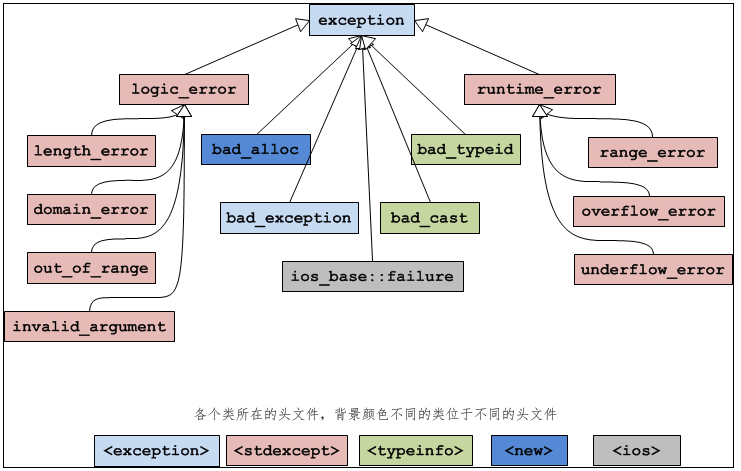

# 异常

# 异常介绍

## 异常机制注意事项

- 性能问题
- 指针和动态分配导致的内存回收问题：动态内存不会自动回收
- 函数的异常抛出列表：如果没有写 `noexcept`，意味着你可以抛出任何异常

## 基本语法

异常捕获
```cpp
try
{
}
catch( ExceptionName e1 )
{
}
catch( ExceptionName e2 )
{
}
// 捕获所有异常
catch( ... )
{

}
```

抛出异常
```cpp
throw "异常";
```

# 异常捕获

```cpp
try{
    // 可能抛出异常的语句
}
// exceptionType：当前 catch 可以处理什么类型的异常。
// variable：捕获到的异常变量
catch(exceptionType variable){
    // 处理异常的语句
}

/**
* 不获取异常数据
*/
try{
    // 可能抛出异常的语句
}
catch(exceptionType){
    // 处理异常的语句
}
```

**catch 进行异常捕获的特点**：
- 异常是在运行阶段产生的，没法提前预测，只能等到程序运行后，真的抛出异常了，再将异常类型和 catch 能处理的类型进行匹配，匹配成功的话就调用当前的 catch，否则就忽略当前的 catch。
- 在多级 catch 中，异常会从上到下按照顺序匹配，且最多只会进入一个 catch
- 异常变量会进行类型转换
  - 算数转换：例如 int 转换为 float，char 转换为 int，double 转换为 int 等
  - 向上转型：也就是派生类向基类的转换
  - const 转换：例如将 char * 转换为 const char *
  - 数组或函数指针转换

# 抛出异常

> [!note]
> 异常必须显式地抛出，即`throw 异常`。如果没有显式的抛出，即使有异常也检测不到。

```cpp
throw 异常数据;
```
异常数据的类型可以是：int、float、bool 等基本类型，也可以是指针、数组、字符串、结构体、类等聚合类型。正规一点就使用`exception`类

> [!note]
> 可以限定函数可以抛出哪些类型的异常，**但是不要使用**。
> ```cpp
> double func (char param) throw (int, char, exception);
> ```

# exception 类

## 定义



C++语言本身或者标准库抛出的异常都是 exception 的子类
```cpp
#include <exception>

class exception{
public:
    exception () throw();  //构造函数
    exception (const exception&) throw();  //拷贝构造函数
    exception& operator= (const exception&) throw();  //运算符重载
    virtual ~exception() throw();  //虚析构函数
    virtual const char* what() const throw();  //虚函数
}
```
可以通过该类捕获所有 `exception` 的子类

```cpp
try{
    //可能抛出异常的语句
}catch(exception &e){
    //处理异常的语句
}
```

## 标准异常

**异常类型**:

| 异常名称          | 含义                                                                                                                                                                                              |
| ----------------- | ------------------------------------------------------------------------------------------------------------------------------------------------------------------------------------------------- |
| logic_error       | 逻辑错误。                                                                                                                                                                                        |
| runtime_error     | 运行时错误。                                                                                                                                                                                      |
| bad_alloc         | 使用 new 或 new[ ] 分配内存失败时抛出的异常。                                                                                                                                                     |
| bad_typeid        | 使用 typeid 操作一个 NULL 指针，而且该指针是带有虚函数的类，这时抛出 bad_typeid 异常。                                                                                                            |
| bad_cast          | 使用 dynamic_cast 转换失败时抛出的异常。                                                                                                                                                          |
| ios_base::failure | io 过程中出现的异常。                                                                                                                                                                             |
| bad_exception     | 这是个特殊的异常，如果函数的异常列表里声明了bad_exception 异常，当函数内部抛出了异常列表中没有的异常时，如果调用的 unexpected() 函数中抛出了异常，不论什么类型，都会被替换为 bad_exception 类型。 |

**逻辑错误异常**：

<div style="margin: 0 auto;padding:1rem;width: 48rem;">

| 异常名称         | 含义                                                                                                      |
| ---------------- | --------------------------------------------------------------------------------------------------------- |
| length_error     | 试图生成一个超出该类型最大长度的对象时抛出该异常，例如 vector 的 resize 操作。                            |
| domain_error     | 参数的值域错误，主要用在数学函数中，例如使用一个负值调用只能操作非负数的函数。                            |
| out_of_range     | 超出有效范围。                                                                                            |
| invalid_argument | 参数不合适。在标准库中，当利用string对象构造 bitset 时，而 string 中的字符不是 0 或1 的时候，抛出该异常。 |
   

</div>


**运行时异常**:

<div style="margin: 0 auto;padding:1rem;width: 32rem;">

| 异常名称        | 含义                             |
| --------------- | -------------------------------- |
| range_error     | 计算结果超出了有意义的值域范围。 |
| overflow_error  | 算术计算上溢。                   |
| underflow_error | 算术计算下溢。                   |
   

</div>


# 构造函数异常

构造函数中抛出异常的特点
- 构造函数抛出异常之后，对象将不被创建
- 对象没有被创建，显然也不会调用析构函数
- 已经创建的成员变量（非`new`、`malloc`创建的）会被部分逆序析构
- 为了防止泄漏，已经完成动态内存分配的需要在`catch`中手动释放

```cpp
class Student
{
public:
    Student()
    {
        a = nullptr;
        try
        {
            a = new int[10]();  
            throw "test";
        }
        catch(...)
        {
            if (a != nullptr)
            {
                delete [] a;
                a = nullptr;
            }
            // 释放完毕后，再抛出异常
            throw "test";
        }
    }
private:
    // 非动态申请的变量，会自动释放
    Teacher tch;

    // 动态创建的需要手动处理一下
    int *a;
}
```

