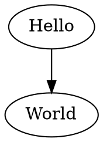
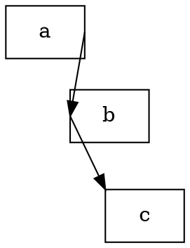

# Graphviz

- [Graphviz](https://graphviz.org/documentation/)
- `vscode`插件： [Graphviz(dot) language supported and preview](https://marketplace.visualstudio.com/items?itemName=qiu.graphviz-language-support-and-preivew)

# Dot语法

- 文档：[DOT Language](https://graphviz.org/doc/info/lang.html)

## 基本规则

首先需要定义一张画布，然后在画布中添加一系列的指令（`statement`）语句， 即`stmt_list`，且每一条语句可以以 `;` 或者 `,` 进行区分。





在画布中的指令 `statement` 语句有：`attr_stmt`、`node_stmt`、`edge_stmt`、`subgraph`


- `attr_stmt` 

    定义 `graph|node|edge` 的属性，属性由 `[]` 包裹

    ```dot
        目标 [
            ID = ID; // 属性
        ]
    ```

    ```dot
    digraph Name {
        // 画布属性
        graph[
            bgcolor=aquamarine;
        ]

        // 全局 node 属性
        node[
            shape=box;
        ]

        // node 属性
        Hello [color=red];

        // edge 属性
        Hello->World [color=blanchedalmond];
    }

    ```

- `edge_stmt` 

    边是连接 `node` 或者 `subgraph` 的线

    ```dot
        // edgeop : 线的形式
        // 对象： node、subgraph
        // attr_list: 修改的是 edgeop 样式
        对象A  edgeop 对象B ... edgeop 对象C [attr_list];
    ```

- `node_stmt`

    ```dot
        // 方向 ：指定 edge 在对象上的启点与终点
        //  n | ne | e | se | s | sw | w | nw | c | _
        对象 : 方向 [attr_list];
    ```

    ```dot
    digraph Name {
        node[
            shape=box
        ]

        // 指定不同方向
        a:e -> b:w -> c:nw
    }
    ```

- `subgraph` : 子图，类似于另外添加了一张图，可以用来分组

## 布局

修改 `layout` 可以整体修改图形样式，支持的样式见 [Layout Engines](https://graphviz.org/docs/layouts/)



# 命令行

安装工具 [graphviz 下载](https://graphviz.org/download/)

```term
triangle@LEARN:~$ dot.exe -Tsvg // 控制台直接编写 -T 导出 dot 语句的形式
// 输入 dot 语句
digraph{a->b;} 
triangle@LEARN:~$ dot.exe -Tsvg  -o demo.svg  demo.dot // 编译 demo.dot 
```

> [!note]
>  `dot.exe` 导出的图片中文乱码，可以在 `.dot` 文件中修改属性 `fontname` 的默认字体，然后再导出


