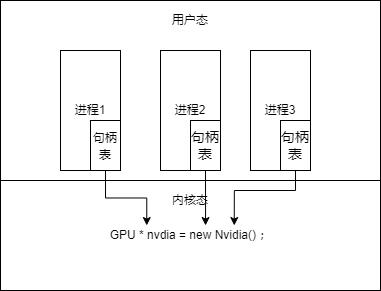
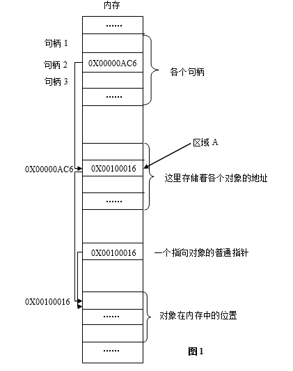
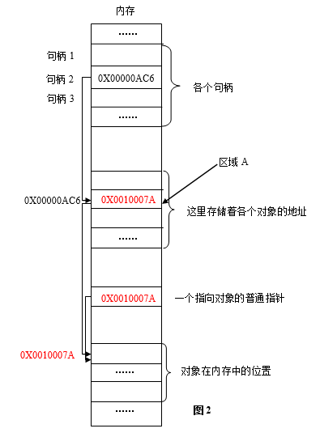

# 句柄

# 内核资源共用

内核管理系统资源，对于系统资源结构描述的数据结构内存占用可能十分大。当进程去使用系统资源时，不可能一个进程就生成一个资源描述数据结构。内核里就放了一个公共点资源数据结构，每个进程要使用这个资源时，就向系统申请使用该结构。

**获取这个数据结构可以通过指针来获取，但是指针存在如下问题：**

1. 暴露了内核对象本身，使得程序（而不是操作系统内核）也可以任意地修改对象地内部状态；
2. 操作系统有定期整理内存的责任，如果一些内存整理过一次后，对象被搬走了怎么办？由于操作系统采用了虚拟内存的机制，当进程空闲时，会被放到磁盘的交换区里，等待下次要使用时，又调回内存。当调回内存时，内存地址就发生了改变，指针引用就完蛋了。

# 句柄机制

1. 每个进程会有一张“句柄表”，用来存储句柄
2. 句柄指向的是地址放入了真实对象的指针
3. 当对象位置发生变化时，就会更新句柄指向的对象指针

