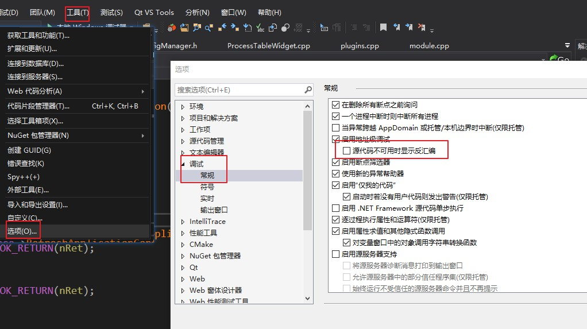
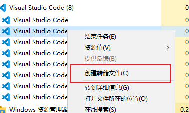

# MSVC

# 运行环境

1. 安装 visual studio
2. 找到 `vcvarsall.bat` 所在的路径，并将该路径添加到环境变量
3. 打开终端，并切换到 cmd 控制台，<span style="color:red;font-weight:bold"> 一定要切换到 cmd ，不能直接用 powershell </span>
    ```term
    triangle@LEARN:~$ cmd.exe
    ```
4. 在 `cmd` 中切换 msvc 运行环境
    ```term
    triangle@LEARN:~$ vcvarsall.bat x64 // 命令不能自动补全，就手敲
    **********************************************************************
    ** Visual Studio 2017 Developer Command Prompt v15.9.50
    ** Copyright (c) 2017 Microsoft Corporation
    **********************************************************************
    [vcvarsall.bat] Environment initialized for: 'x64'
    ```
5. 测试 `cl.exe` 是否正常
    ```term
    triangle@LEARN:~$ cl
    用于 x64 的 Microsoft (R) C/C++ 优化编译器 19.16.27048 版
    版权所有(C) Microsoft Corporation。保留所有权利。

    用法: cl [ 选项... ] 文件名... [ /link 链接选项... ]
    ```
6. 觉得 `cmd` 不好用，上述流程走完，就能切换回 `powershell`
    ```term
    triangle@LEARN:~$ powershell.exe
    版权所有 (C) Microsoft Corporation。保留所有权利。

    尝试新的跨平台 PowerShell https://aka.ms/pscore6

    加载个人及系统配置文件用了 514 毫秒。
    ```

> [!note]
> 上述配置方案在终端关闭后失效，这是官方推荐的做法。也可以直接配置环境变量，但是官方文档不推荐这么干。

# 编译器使用

- [MSVC+命令行编译生成C++程序](https://www.jianshu.com/p/486ee30913b7)
- [MSVC编译参数](https://blog.csdn.net/john_crash/article/details/50127309)

## hello world

```cpp
#include <iostream>
using namespace std;
int main(int argc, char const *argv[])
{
    cout << "hello world" << endl;
    return 0;
}
```

```term
triangle@LEARN:~$ cl main.cpp // 编译
triangle@LEARN:~$ main.exe // 执行
hello world
```

## 基本命令规则

```term
triangle@LEARN:~$ cl /EHsc /nologo /O1 /GF /Feout /std:c++11 main.cpp add.cpp
```
- **/EHsc** : 指定异常处理模型
- **/nologo** : 不显示“Microcoft优化C++编译器”的字样
- **/O** : 指定优化等级
- **/GF** : 合并重复的字符串，并将字符串常量放到只读内存
- **/Fe<filename>** : 输出目标文件的名称 
- **/std** : 指定c++版本

> [!tip]
> 编译参数区分大小写

## 编译流程

- 预处理：
    ```term
    triangle@LEARN:~$ cl /C /P /Fitest main.cpp
    ```
    会生成预处理后的 `test.i` 文件
    - **/C**：保留注释
    - **/P**：预处理输出到文件，不会再进行后续步骤
    - **/Fi<filename|outpath>**：`.i` 文件的文件名或者输出路径

- 汇编：**/Fxx** 类型的指令均是将文件保存下来，编译器会跑完所有的流程
    - **/FA**：程序集的列表 `.asm` 无源码注释
    - **/FAc**：带机器码的程序集 `.cod` 带有指令码
    - **/FAs**：带源待码的程序集 `.asm` 有源码注释
    - **/FAcs**：生成`.cod`与`.asm` 无源码注释
- 编译：
    ```term
    triangle@LEARN:~$ cl /c /Fotest main.cpp
    ```
    生成编译后的二进制文件 `test.obj` 
    - **/c**：生成二进制文件，不会再进行后续步骤
    - **/Fo<filename|outpath>**：二进制文件名或者输出路径
- 链接：
    ```term
    triangle@LEARN:~$ cl /c /EHsc add.cpp main.cpp // 生成 add.obj 与 main.obj 
    triangle@LEARN:~$ link .\add.obj .\main.obj /OUT:test.exe // 将obj链接起来
    ```
    - **cl.exe**：是编译器，对应的是vs项目 `属性 -> c/c++` 选项
    - **link.exe**：是链接器，对应的是vs项目 `属性 -> 链接器` 选项
    - **/OUT:<path>**：目标文件输出路径
    - **/LIBPATH:<path>**：库文件存放目录，类似于 `g++ -L./`

## 文件目录编译

```term
triangle@LEARN:~$ tree
.
├── add
│   ├── add.cpp
│   └── add.h
├── bin
├── build
└── main.cpp
triangle@LEARN:~$ cl /I"./add/" /Fo"./build/" /Fe"./bin/"  main.cpp "./add/add.cpp" 
triangle@LEARN:~$ tree
.
├── add
│   ├── add.cpp
│   └── add.h
├── bin
│   └── main.exe
├── build
│   ├── add.obj
│   └── main.obj
└── main.cpp
```

- **/I** ：指定头文件目录
- 路径最好使用 `""` 包起来，表示一个字符串
- **文件夹要写全 `"./build/"` 而不能写成 `"./build"` ，后者会被识别为文件**

## 动态库与静态库

### 静态库

```term
triangle@LEARN:~$ cl /c add.cpp // 生成 .obj 二进制文件
triangle@LEARN:~$ lib add.obj // 利用 lib.exe 生成 .lib 静态库文件
triangle@LEARN:~$ cl main.cpp add.lib // 编译且链接成目标文件 link 的步骤一起做了
```

### 动态库


```cpp
// ===============add.h===================
// __declspec(dllexport): 到处动态库时，需要使用导出
// __declspec(dllimport): 调用动态库时，需要使用导入
// __stdcall ：函数名导出的规则
#ifdef _WINDLL
#define DLL_API __declspec(dllexport)
#else
#define DLL_API __declspec(dllimport) 
#endif
DLL_API int __stdcall add(int a, int b);

// ===============add.cpp=================
#include "add.h"
DLL_API int __stdcall add(int a, int b) {
    return a + b;
}
```

```term
triangle@LEARN:~$ cl /LD /D_WINDLL add.cpp // 编译动态库
triangle@LEARN:~$ tree 
.
├── add.obj
├── add.lib
└── add.dll
triangle@LEARN:~$ cl main.cpp add.lib // 生成目标文件
```

### lib 的区别

msvc在动态库编译时也会生成一个 `.lib` 文件，用于程序的静态编译，实际代码调用还是用 `.dll`。动态库中的 `.lib` 文件其实主要时存储了一个函数符号表，用于编译链接。

```term
triangle@LEARN:~$ dumpbin /EXPORTS add.lib // 查看静态库的
Dump of file add.lib

File Type: LIBRARY

  Summary

          20 .chks64
          78 .debug$S
          45 .drectve
          15 .text$mn
triangle@LEARN:~$ dumpbin /EXPORTS add.lib // 查看动态库的
Dump of file add.lib

File Type: LIBRARY

     Exports

       ordinal    name

                  ?add@@YAHHH@Z (int __cdecl add(int,int))

  Summary

          B7 .debug$S
          14 .idata$2
          14 .idata$3
           8 .idata$4
           8 .idata$5
           8 .idata$6
```

**查看库或者可执行文件的依赖**
```term
triangle@LEARN:~$ dumpbin /dependents main.exe
Dump of file main.exe

File Type: EXECUTABLE IMAGE

  Image has the following dependencies:

    add.dll
    KERNEL32.dll
```

**查看lib类型：**
```term
triangle@LEARN:~$ lib /list add.lib // 查看静态库
add.obj
triangle@LEARN:~$ lib /list add.lib // 查看动态库
add.dll
```


## 字符集

编译器可以设置「源字符集」与「执行字符集」：
- **源字符集**：cpp、h 等程序文本文件本身的字符集格式
- **执行字符集**：程序中存储符号用的字符集，即程序被加载到内存中所采用的字符集
- [字符集](https://blog.csdn.net/x356982611/article/details/80285930)
    - **IANA_name**：字符集的名称，例如 utf-8
    - **CPID**：字符集的代码号，例如 utf-8 是 65001 ，gb2312 是 936
```term
triangle@LEARN:~$ cl /source-charset:<IANA_name|.CPID> /execution-charset:<IANA_name|.CPID>
triangle@LEARN:~$ chcp <.CPID> // 切换 powershell 的显示字符集
```

> [!note|style:flat]
> - **通过配置字符集，可以实现 utf-8 写代码，但是程序执行是 gb2312**
> - 当源码字符集与执行字符集不统一时，需要将 `/source-charset` 与 `/execution-charset` 全部写明确，不然可能编译不通过


# 标准库（运行库）

## 定义

- **C标准库**： 为了提高C语言的开发效率，C标准定义了一系列常用的函数，称为C库函数，而 C 语言标准只提供定义并没有实现，具体实现则由各个编译器提供。由编译器提供的C标准库函数的实现就是 「C运行时库(C Run Time Libray)」，也被称之为 C 标准库。

- **C++标准库**：包括了C标准库，以及IO流和标准模板库STL

## MT 与 MD

- **MT(multithread static version)**：静态运行时库，直接将标准库整合到目标中
- **MD(multithread and DLL-specific version)**：动态运行时库，由系统加载提前准备好的标准动态库
- **MDd与MTd**：调试版本，**调试版会加强对错误的检测**

VC6.0、VC2005、VC2008和VC2010等 MSVC 编译器均提供了标准库 MT 与 MD 版本的标准库，例如
- libcmt.lib ：上述编译器提供的 MT 版本C运行时库
- msvcrt.lib ：VC6.0 提供的 MD 版本C运行时库
- msvcr80.lib ：VC2005 提供的 MD 版本C运行时库
- msvcr90.lib ：VC2008 提供的 MD 版本C运行时库

## 使用

> [!note |style:flat]
> 在实际项目中，必须保证第三方库与项目工程的运行时库统一，即要么全部是 MT，要么全部是 MD ，不能混合使用。

**MT 特点**：
- 编译时会直接将库函数复制到目标程序中，这就会导致编译存在多模块的程序会产生重定义问题，因为每个模块都有一个库函数
- 程序体积大 

**MD 特点**:
- 跨编译器版本编译时，每个模块都得提供各自的库函数静态库，不然会出现未定义错误，因为谁TM没事干装这么多编译器。
- 程序体积小，但是得依赖 dll


# Debug 与 Release

## 配置

Debug 参数配置

```
/MDd /MLd /MTd      -   使用 Debug runtime library(调试版本的运行时刻函数库)
/Od                 -   关闭优化开关
/D "_DEBUG"         -   相当于 #define _DEBUG,打开编译调试代码开关(主要针对assert函数)
/Z7                 -   生成的对象文件包含调试器会用到的调试信息，若链接器启用了 /DEBUG ，也会从对象文件中抽取出 PDB 文件
/Zi                 -   对象文件只有程序，调试信息全部放到 PDB 文件中
/ZI                 -   创建 Edit and continue(编辑继续)数据库，这样在调试过程中如果修改了源代码不需重新编译，
                        但是会和 __LINE__ 不兼容，且该选项仅适用于面向 x86 和 x64 处理器的编译器
/GZ                 -   可以帮助捕获内存错误
/Gm                 -   打开最小化重链接开关，减少链接时间
```

Release 参数配置

```
/MD /ML /MT         -   使用发布版本的运行时刻函数库
/O1  /O2            -   优化开关，使程序最小或最快
/D "NDEBUG"         -   关闭条件编译调试代码开关(即不编译assert函数)
/GF                 -   合并重复的字符串，并将字符串常量放到只读内存，防止被修改
```

## 优化

### 帧指针

函数调用过程中，会将返回值、参数、局部变量放到栈中，组成一个栈帧，而 Debug 与 Release 对与栈帧的调用不同。
- Debug : 会将函数栈帧放到 EBP 寄存器中，每次进入函数，就会将栈帧的首地址放到该寄存器中，可以规避很多问题
- Release : 栈帧的访问就靠栈进行访问，这样就要保证栈帧的定义完全没问题，即数组绝对不能越界，函数返回必须写正确。通过 `/Oy-` 也可以实现在 Release 版本中使用 EBP 寄存器

### volatile

`/O1 /O2` 编译器会对程序进行优化，且将所有代码都认为是单线程进行优化，然而对于多线程程序，这就会出现大问题，尤其是全局变量的访问，添加 `volatile` 就能避免编译器对全局变量操作的省略，一定程度上避免奇奇怪怪问题的出现，详见操作系统线程章节。

### /GZ 

添加 `/GZ` 选项，编译器会更严谨的处理程序
- 初始化内存和变量。
    - 0xCC : 初始化局部变量
    - 0xCD (Cleared Data): 初始化堆
    - 0xDD (Dead Data): 被释放的堆
    - 0xFD (deFencde Data): 初始化受保护的内存
- 通过函数指针调用函数时，会通过检查栈指针验证函数调用的匹配性
-  函数返回前检查栈指针，确认未被修改

`/GZ` 会更严谨的检测程序，因此在 Debug 模式开启该选项，保证检测出程序隐藏问题。

### 符合模式

设置 `/permissive-` 将启用严格语法检测


## PDB

- 可执行程序的 PDB 生成

cl 生成 obj 与 vc140.pdb 文件。接着在 link 链接 obj 时，添加 `/DEBUG`，才生成 pdb 文件。其中对于一个 cpp 而言，也可以单独生成自己的 obj 与 pdb 文件，但是需要保证 obj 与 pdb 放到同一文件夹，然后通过 link 将所有的 pdb 合并成一个。

```
cl.exe /c /Fo"./build/add.obj" /Fd"./build/add.pdb" /Zi .\add.cpp
```


```term
triangle@LEARN:~$ tree
.
├── add
│   ├── add.cpp
│   └── add.h
├── bin
├── build
└── main.cpp
triangle@LEARN:~$ cl.exe /c /Fo"./build/" /Fd"./build/" /Zi .\main.cpp .\add\add.cpp 
triangle@LEARN:~$ tree
.
├── add
│   ├── add.cpp
│   └── add.h
├── bin
├── build
│   ├── add.obj
│   ├── main.obj
│   └── vc140.pdb
└── main.cpp
triangle@LEARN:~$ link.exe .\build\main.obj .\build\add.obj /OUT:"./bin/test.exe" /DEBUG 
triangle@LEARN:~$ tree
.
├── add
│   ├── add.cpp
│   └── add.h
├── bin
│   ├── test.exe
│   ├── test.ilk
│   └── test.pdb
├── build
│   ├── add.obj
│   ├── main.obj
│   └── vc140.pdb
└── main.cpp
```

- 静态库的 PDB 生成

```term
triangle@LEARN:~$ tree
 .
├── add
│   ├── add.cpp 
│   └── add.h   
├── bin
├── build       
├── lib
└── main.cpp
triangle@LEARN:~$ cl /c /Zi /Fo"./build/" /Fd"./build/add.pdb" .\add\add.cpp // 一定要将 obj 与 pdb 放到同一文件夹
triangle@LEARN:~$ tree
 .
├── add
│   ├── add.cpp 
│   └── add.h   
├── bin
├── build
│   ├── add.obj
│   └── add.pdb       
├── lib
└── main.cpp
triangle@LEARN:~$ lib .\build\add.obj /OUT:"./lib/add.lib" 
triangle@LEARN:~$ tree
 .
├── add
│   ├── add.cpp
│   └── add.h
├── bin
├── build
│   ├── add.obj
│   └── add.pdb
├── lib
│   └── add.lib
└── main.cpp
```

使用 lib 生成静态库时，一定要将 cl 生成的 obj 与 pdb 放在同一文件夹下，这样生成的 lib 库才会正确关联 pdb 文件。之后将 lib 与 pdb 打包给主程序即可。

- 动态库的 PDB 生成

```term
triangle@LEARN:~$ tree
 .
├── add
│   ├── add.cpp 
│   └── add.h   
├── bin
├── build       
├── lib
└── main.cpp
triangle@LEARN:~$ cl /c /LD /D_WINDLL /Zi /Fo"./build/" /Fd"./build/add.pdb" .\add\add.cpp // 一定要将 obj 与 pdb 放到同一文件夹
triangle@LEARN:~$ tree
 .
├── add
│   ├── add.cpp 
│   └── add.h   
├── bin
├── build
│   ├── add.obj
│   └── add.pdb       
├── lib
└── main.cpp
triangle@LEARN:~$ link /DLL /OUT:"./lib/add.dll" /DEBUG .\build\add.obj
triangle@LEARN:~$ tree
 .
├── add
│   ├── add.cpp 
│   └── add.h   
├── bin
├── build
│   ├── add.obj
│   └── add.pdb       
├── lib
│   ├── add.dll
│   ├── add.exp
│   ├── add.ilk
│   ├── add.lib
│   └── add.pdb
└── main.cpp
```

# Devenv 

Devenv 是 visual studio 的可执行程序，所在路径一般为安装路径的 `Microsoft Visual Studio 10.0\Common7\IDE` 下。
- devenv.exe : visual studio 图形界面的启动程序
- devenv.com : 在终端中以命令行的形式运行 visual studio 
- devenv : 默认启动 devenv.com
- [devenv 指令](https://learn.microsoft.com/zh-cn/visualstudio/ide/reference/devenv-command-line-switches?view=vs-2022)

```term
triangle@LEARN:~$ // 以 debug 模式，编译 solutionName.sln 中的 projectName 项目 
triangle@LEARN:~$ devenv solutionName.sln /Project projectName /Build Debug
```
想要在终端中使用 devenv，就需要在环境变量中添加 devenv 所在路径，但直接添加 visual studio 的路径到系统环境变量中又不太合理，因此可以写一个 bat 脚本来调用 devenv 命令

```bat
@echo off 

@REM 配置环境变量，运行 devenv 指令
set PATH=%PATH%;"C:\Program Files (x86)\Microsoft Visual Studio\2017\Enterprise\Common7\IDE"

@REM 运行 sln 进行编译
devenv  solutionName.sln /Project projectName /Build Release 
```

# 调试

## 显示汇编

启用汇编代码，方便对优化后的代码进行调试




## dump

- 从任务管理器获取



- 程序崩溃生成

```cpp

// 添加 dump 生成器
#include "CreateDump.h"

int main()
{
    // 指定 dump 文件生成路径
	CCreateDump::Instance()->DeclarDumpFile("./dump/");

	return 0;
}
```

<details>
<summary><span class="details-title">Dump 生成器</span></summary>
<div class="details-content"> 


**头文件：**
```cpp
#pragma once
#include<string>

// 抓取快照的宏，方便快速取消
#define DumpSnapShot(fileName) Dump::DumpHelper::Snapshot(fileName) 

namespace Dump {
	class  DumpHelper
	{
	public:
		/// <summary>
		/// 设置是否记录崩溃转储
		/// 默认否
		/// </summary>
		/// <param name="value">是否记录崩溃转储</param>
		static void SetIsDumpCrash(bool value);
		/// <summary>
		/// 设置崩溃转储路径
		/// 默认为".\\"
		/// </summary>
		/// <param name="directory">崩溃转储路径</param>
		static void SetDumpDirectory(const std::string& directory);
		/// <summary>
		/// 崩溃转储文件数量
		/// 超过数量自动删除旧文件
		/// </summary>
		/// <param name="count">最大文件数量，默认500</param>
		static void SetDumpMaxFileCount(int count);
		/// <summary>
		/// 获取内存快照转储,可以任意时刻记录（包括非崩溃情况下）。
		/// </summary>
		/// <param name="path">保存文件名</param>
		static void Snapshot(const std::string& strFileName);
	};
}

```

**源文件：**

```cpp
#include "DumpHelper.h"

#include <io.h>
#include <time.h>
#include <vector>
#include <direct.h> 
#include <stdint.h>
#include <Windows.h>
#include <DbgHelp.h>

#pragma comment(lib,"Dbghelp.lib")

#define MAX_PATH_LEN 512
#define ACCESS(fileName,accessMode) _access(fileName,accessMode)
#define MKDIR(path) _mkdir(path)

namespace Dump {
static std::string _directory = ".\\";
static int _fileCount = 500;
//获取文件夹下的所有文件名
static void GetFolderFiles(const std::string& path, std::vector<std::string>& files)
{
	//文件句柄  
	intptr_t hFile = 0;
	//文件信息  
	struct _finddata_t fileinfo;
	std::string p;
	if ((hFile = _findfirst(p.assign(path).append("\\*").c_str(), &fileinfo)) != -1)
		// "\\*"是指读取文件夹下的所有类型的文件，若想读取特定类型的文件，以png为例，则用“\\*.png”
	{
		do
		{
			//如果是目录,迭代之  
			//如果不是,加入列表  
			if ((fileinfo.attrib & _A_SUBDIR))
			{
				if (strcmp(fileinfo.name, ".") != 0 && strcmp(fileinfo.name, "..") != 0)
					GetFolderFiles(p.assign(path).append("\\").append(fileinfo.name), files);
			}
			else
			{
				files.push_back(path + "\\" + fileinfo.name);
			}
		} while (_findnext(hFile, &fileinfo) == 0);
		_findclose(hFile);
	}
}
//生成多级目录，中间目录不存在则自动创建
static bool CreateMultiLevelDirectory(const std::string& directoryPath) {
	uint32_t dirPathLen = directoryPath.length();
	if (dirPathLen > MAX_PATH_LEN)
	{
		return false;
	}
	char tmpDirPath[MAX_PATH_LEN] = { 0 };
	for (uint32_t i = 0; i < dirPathLen; ++i)
	{
		tmpDirPath[i] = directoryPath[i];
		if (tmpDirPath[i] == '\\' || tmpDirPath[i] == '/')
		{
			if (ACCESS(tmpDirPath, 0) != 0)
			{
				int32_t ret = MKDIR(tmpDirPath);
				if (ret != 0)
				{
					return false;
				}
			}
		}
	}
	return true;
}
/// <summary>
/// 生成dmp文件
/// </summary>
/// <param name="exceptionPointers">异常信息</param>
/// <param name="path">文件路径（包括文件名）</param>
/// <returns></returns>
static int GenerateDump(EXCEPTION_POINTERS* exceptionPointers, const std::string& path)
{

// 转换字符
#ifdef UNICODE
	WCHAR wszClassName[1024];
	memset(wszClassName,0,sizeof(wszClassName));
	MultiByteToWideChar(CP_ACP,0,path.c_str(),strlen(path.c_str())+1, wszClassName, sizeof(wszClassName)/sizeof(wszClassName[0]));
	HANDLE hFile = CreateFile(wszClassName, GENERIC_WRITE, FILE_SHARE_WRITE, NULL, CREATE_ALWAYS, FILE_ATTRIBUTE_NORMAL, NULL);
#else
	HANDLE hFile = CreateFile(path.c_str(), GENERIC_WRITE, FILE_SHARE_WRITE, NULL, CREATE_ALWAYS, FILE_ATTRIBUTE_NORMAL, NULL);
#endif

	if (INVALID_HANDLE_VALUE != hFile)
	{
		MINIDUMP_EXCEPTION_INFORMATION minidumpExceptionInformation;
		minidumpExceptionInformation.ThreadId = GetCurrentThreadId();
		minidumpExceptionInformation.ExceptionPointers = exceptionPointers;
		minidumpExceptionInformation.ClientPointers = TRUE;
		bool isMiniDumpGenerated = MiniDumpWriteDump(
			GetCurrentProcess(),
			GetCurrentProcessId(),
			hFile,
			MINIDUMP_TYPE::MiniDumpNormal,
			&minidumpExceptionInformation,
			nullptr,
			nullptr);

		CloseHandle(hFile);
		if (!isMiniDumpGenerated)
		{
			printf("MiniDumpWriteDump failed\n");
		}
	}
	else
	{
		printf("Failed to create dump file\n");
	}
	return EXCEPTION_EXECUTE_HANDLER;
}

std::string GetSystemLocalTime() {
		SYSTEMTIME syt;
		GetLocalTime(&syt);

		char szTime[MAX_PATH];
		sprintf_s(szTime, MAX_PATH, "%04d-%02d-%02dT%02d-%02d-%02d", syt.wYear, syt.wMonth, syt.wDay, syt.wHour, syt.wMinute, syt.wSecond);

		return std::string(szTime);
}

//全局异常捕获回调
static LONG WINAPI ExceptionFilter(LPEXCEPTION_POINTERS lpExceptionInfo)
{
	char ext[MAX_PATH] = { 0 };

	//创建目录
	if (!CreateMultiLevelDirectory(_directory))
	{
		printf("Failed to create directory %s\n", _directory.c_str());
		return EXCEPTION_EXECUTE_HANDLER;
	}	
	//清除多出的文件
	std::vector<std::string> files;
	std::vector<std::string> dmpFiles;
	GetFolderFiles(_directory, files);
	for (auto i : files)
	{
		_splitpath(i.c_str(), NULL, NULL, NULL, ext);
		if (strcmp(ext, "dmp")==0)
		{
			dmpFiles.push_back(i);
		}
	}
	if (dmpFiles.size() >= _fileCount)
	{	
		if (strcmp(ext, "dmp") == 0 && !DeleteFileA(dmpFiles.front().c_str()))
		{
			printf("Failed to delete old file %s\n", dmpFiles.front().c_str());
		}
	}
	//生成文件名
	std::string strPath = _directory + "crash_" + GetSystemLocalTime() + ".dmp";
	if (strPath.size() > MAX_PATH)
	{
		printf("File path was too long! %s\n", strPath.c_str());
		return EXCEPTION_EXECUTE_HANDLER;
	}

	//生成dmp文件
	return GenerateDump(lpExceptionInfo, strPath);
}
void DumpHelper::SetIsDumpCrash(bool value)
{
	if (value)
		SetUnhandledExceptionFilter(ExceptionFilter);
	else
	{
		SetUnhandledExceptionFilter(NULL);
	}
}
void DumpHelper::SetDumpDirectory(const std::string& directory)
{
	_directory = directory;
	if (_directory.size() < 1)
	{
		_directory = ".\\";
	}
	else if (_directory.back() != '\\')
	{
		_directory.push_back('\\');
	}
}

void DumpHelper::SetDumpMaxFileCount(int count)
{
	_fileCount = count;
}

void CreateSnapshot(const std::string& strPath)
{
	__try
	{
		//通过触发异常获取堆栈
		RaiseException(0xE0000001, 0, 0, 0);
	}
	__except (GenerateDump(GetExceptionInformation(), strPath)) {}
}

void DumpHelper::Snapshot(const std::string& strName)
{
	std::string strPath = _directory + strName + "_" + GetSystemLocalTime() + std::string(".dmp");
	CreateSnapshot(strPath);
}

}

```

</div>
</details>

# 进程单例

```cpp
int main(int argn, cha* argv[]){

    // 显示已经存在的，然后关闭自己
	HWND hwnd = FindWindow(0, L"界面标题");
	if (hwnd && IsWindowVisible(hwnd))
	{
		::ShowWindow(hwnd, SW_SHOWNORMAL);
		::SetForegroundWindow(hwnd);
		return 0;
	}

    // 发现已经存在，就关闭当前进程
    HWND hwnd_home = FindWindow(0, L"界面标题");
    if (hwnd_home)
    {
        ::PostMessage(hwnd_home, WM_USER + 0x804, NULL, NULL);
        return 0;
    }
}	

```