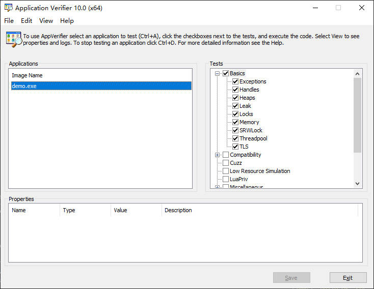

# Application Verifier

# 介绍

[应用程序验证工具 (Application Verifier)](https://learn.microsoft.com/zh-cn/windows-hardware/drivers/devtest/application-verifier) : 旨在检测并帮助调试内存损坏、严重安全漏洞和受限用户帐户特权问题。 AppVerifier 通过监视应用程序与 Microsoft Windows 操作系统的交互，分析其对象、注册表、文件系统和 Win32 API (（包括堆、句柄和锁) ）的使用，从而帮助创建可靠且安全的应用程序。

- **工作流程：** 首先在目标进程的注册表中设置待验证项目。当进程启动时，操作系统会检查注册表，并启动对应的验证设置，初始化 `ntdll` 中验证支持。当检测到异常时，会对异常进行报告。
- **工作原理：** hook 非托管 DLL 的函数表，以便在执行实际函数之前执行所需的检查。 例如，Win32 API CreateFileA 方法的地址被替换为内部 AppVerifier 方法，该方法将触发一系列测试，如果异常，则会记录这些测试。


# 堆溢出

> [!note]
> **只能检测动态库**

```cpp
/* leak.dll */
#include "leak.h"

#include <stdio.h>
#include <Windows.h>

void leak()
{
    int len = 2048;
    char * buffer = nullptr;

    for (size_t i = 0; i < 10; i++)
    {
        buffer = new char[len]();
        buffer[len] = 'w';
        printf("%ld\n",i);
        Sleep(200);
    }
}
```



```term
triangle@LEARN:~$ !gflag // AppVerifier 开启了 vrf 与 hpa
Current NtGlobalFlag contents: 0x02000100
    vrf - Enable application verifier
    hpa - Place heap allocations at ends of pages
triangle@LEARN:~$ g // 运行实时检测，并在异常位置停住
...
(4ef4.4eac): Access violation - code c0000005 (first chance)
First chance exceptions are reported before any exception handling.
This exception may be expected and handled.
*** WARNING: Unable to verify checksum for E:\testspace\cpp\bin\leak.dll
*** WARNING: Unable to verify checksum for demo.exe
leak!leak+0x8f:
00007ffb`1931718f c6040177        mov     byte ptr [rcx+rax],77h ds:0000026c`29f46000=??
```

# 内存泄漏

> [!tip]
> `WIN10` 没有生成检测报告，估计不支持。


