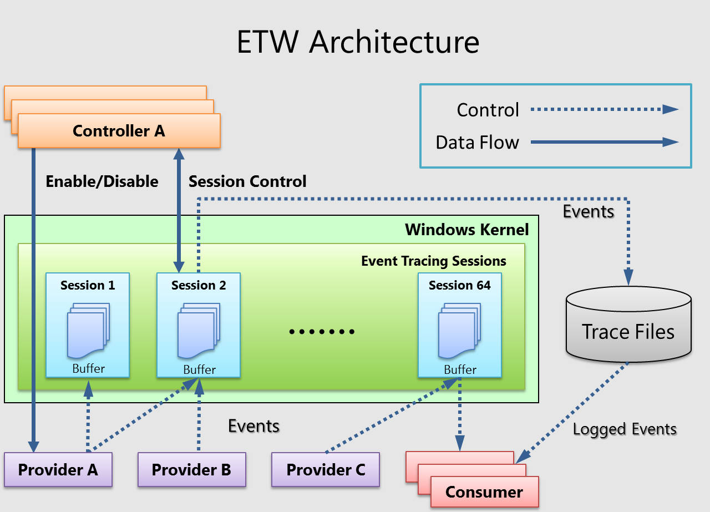
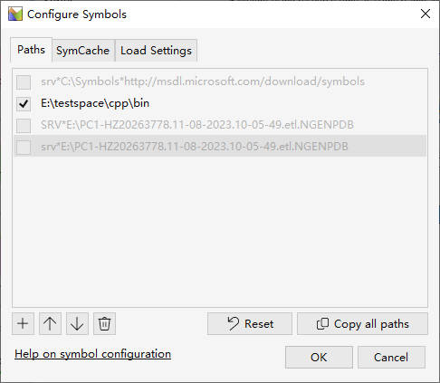

# 可调试性

# 典型技术


# 日志

## 常用方案
- `printf` : 具有隐藏锁，性能不咋地，最原始

- `CLFS` : windows 系统支持的日志系统

- `ETW (Event Tracing for Windows)`: 是Windows提供的原生的事件跟踪日志系统。由于采用内核（Kernel）层面的缓冲和日志记录机制，所以ETW提供了一种非常高效的事件跟踪日志解决方案。

## ETW

[事件追踪](https://learn.microsoft.com/zh-cn/windows/win32/etw/event-tracing-portal)



- `Provider` : 事件提供者，会提前在 ETW 框架中进行注册。提供者程序在某个时刻触发事件，并将标准化定义的事件提供给ETW框架。
- `Consumer` : 解析跟踪文件（ETL 文件）或者实时捕获活动跟踪会话中的事件，并处理事件。**官方推荐软件 `Windows Performance Analyzer (WPA)`**
- `Event Tracing Session` : ETW 框架的核心，作为 Provider 与 Consumer 的中介，负责事件的转发。
- `Controller` : 控制 ETW 框架的启动和停止。**官方推荐 `Windows Performance Recorder (WPR)`**

## Windows Performance

**命令行工具：**
- xperf : 捕捉和预处理数据
- xperfview: 可视化结果
- xbootmgr: 捕捉启动过程
- wpr: 代替 xperf 的新工具

**界面工具：**
- wprui: `Windows Performance Recorder (WPR)`
- wpa : `Windows Performance Analyzer (WPA)`


**使用:**
1. 使用 `WPR` 生成事件报告 `.etl`


2. 使用 `WPA` 打开 `.etl` 文件。[Windows SDK](https://developer.microsoft.com/zh-cn/windows/downloads/windows-sdk/) 版无法使用，则需要下载微软商店的 `preview` 版


1. 配置 `pdb`。**只配置目标进程的，不然会下载全部的符号文件。**



4. 点击 `Load Symbols` 就能查看结果了


# 转储

- 对象转储：将问题对象序列化到本地
- 生成 `dmp` 文件

# 轨迹记录

- 数据追溯：设置硬件断点
- 栈追溯：打印堆栈

```cpp
#include <windows.h>
#include <dbghelp.h>
#include <stdio.h>

void ShowTraceStack(char* szBriefInfo)
{
    static const int MAX_STACK_FRAMES = 12;
    void *pStack[MAX_STACK_FRAMES];
    static char szStackInfo[STACK_INFO_LEN * MAX_STACK_FRAMES];
    static char szFrameInfo[STACK_INFO_LEN];

    HANDLE process = GetCurrentProcess();
    SymInitialize(process, NULL, TRUE);
    WORD frames = CaptureStackBackTrace(0, MAX_STACK_FRAMES, pStack, NULL);
    strcpy(szStackInfo, szBriefInfo == NULL ? "stack traceback:\n" : szBriefInfo);

    for (WORD i = 0; i < frames; ++i) {
        DWORD64 address = (DWORD64)(pStack[i]);

        DWORD64 displacementSym = 0;
        char buffer[sizeof(SYMBOL_INFO)+MAX_SYM_NAME * sizeof(TCHAR)];
        PSYMBOL_INFO pSymbol = (PSYMBOL_INFO)buffer;
        pSymbol->SizeOfStruct = sizeof(SYMBOL_INFO);
        pSymbol->MaxNameLen = MAX_SYM_NAME;

        DWORD displacementLine = 0;
        IMAGEHLP_LINE64 line;
        line.SizeOfStruct = sizeof(IMAGEHLP_LINE64);

        if (SymFromAddr(process, address, &displacementSym, pSymbol) && 
        	SymGetLineFromAddr64(process, address, &displacementLine, &line))
        {
            snprintf(szFrameInfo, sizeof(szFrameInfo), "\t%s() at %s:%d(0x%x)\n", 
            	pSymbol->Name, line.FileName, line.LineNumber, pSymbol->Address);
        }
        else
        {
            snprintf(szFrameInfo, sizeof(szFrameInfo), "\terror: %d\n", GetLastError());
        }
        strcat(szStackInfo, szFrameInfo);
    }

    printf("%s", szStackInfo); // 输出到控制台，也可以打印到日志文件中
}
```
