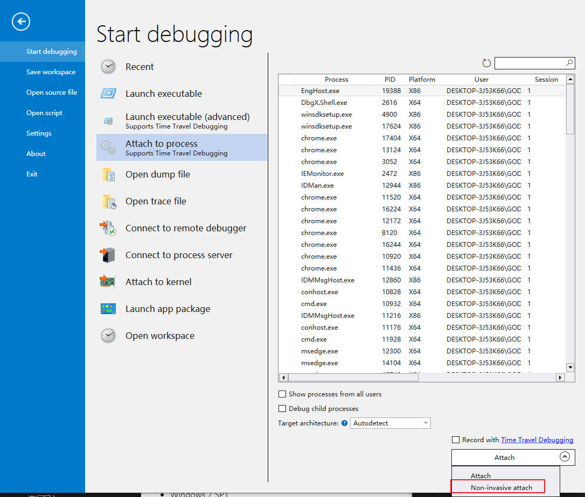
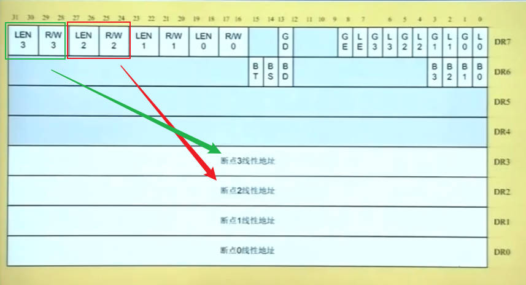
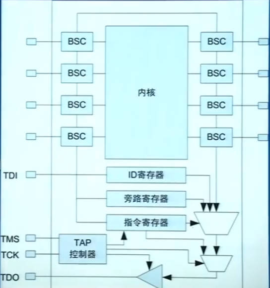
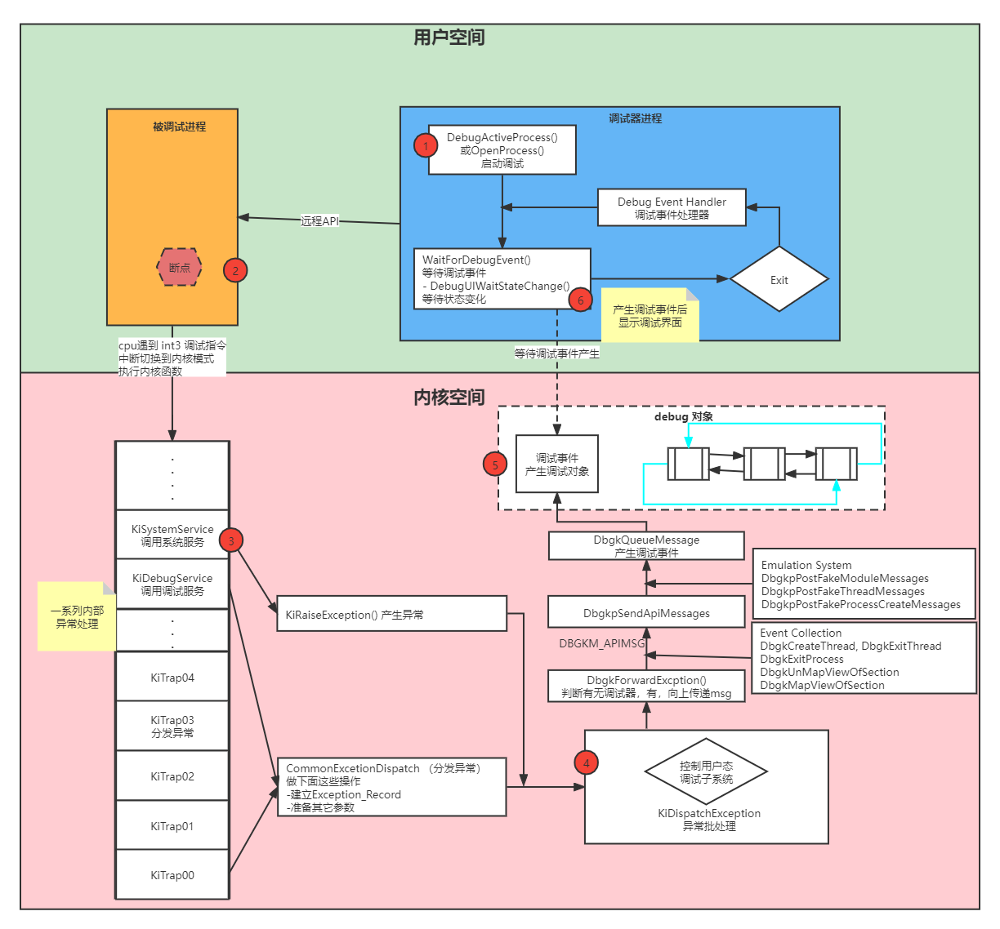
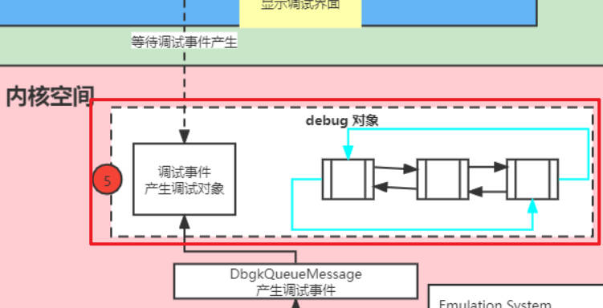
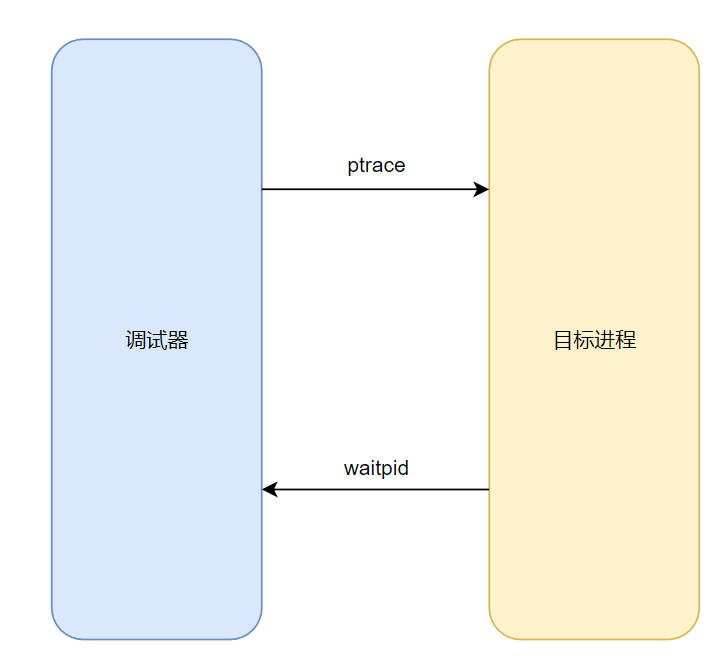
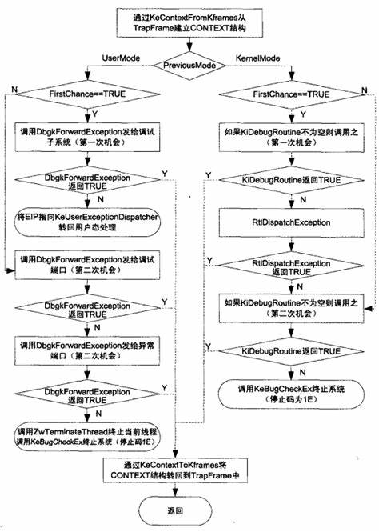
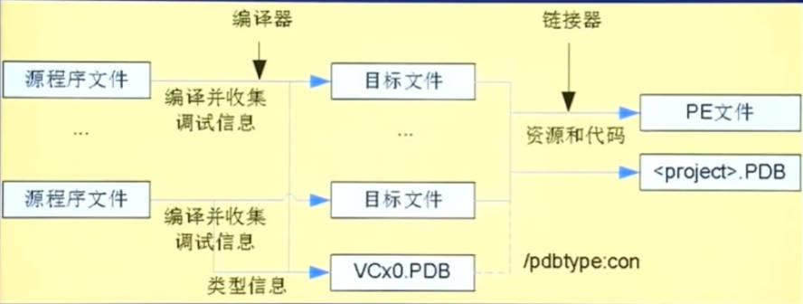
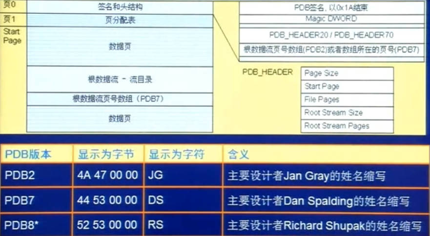

# 理论基础


[windbg](http://download.microsoft.com/download/A/6/A/A6AC035D-DA3F-4F0C-ADA4-37C8E5D34E3D/setup/WinSDKDebuggingTools_amd64/dbg_amd64.msi)

# x86调试支持

## 软件断点 

软件断点指令 `INT 3` 的机器码为 `0xCC`，通过该指令可以让 CPU 在代码段上停止下来，但不适用于数据段以及 ROM 中的代码调试。

**工作原理: 设置断点后，直接修改执行的程序，在想要暂停的地方添加 `0xCC` 指令**。

> [!tip]
> `ntdll` 是 window 操作系统提供给用户态的内核接口库，即「系统调用」

```term
triangle@LEARN:~$ u ntdll!NtReadFile // 查看 ntdll 中的 NtReadFile 函数
ntdll!NtReadFile:
778c2be0 b806001a00      mov     eax,1A0006h
778c2be5 ba408a8d77      mov     edx,offset ntdll!Wow64SystemServiceCall (778d8a40)
778c2bea ffd2            call    edx
778c2bec c22400          ret     24h
778c2bef 90              nop
...
triangle@LEARN:~$ bp 778c2bf0 // 设置断点
triangle@LEARN:~$ bl // 列出断点
  0 e Disable Clear  778c2bf0     0001 (0001)  0:**** ntdll!NtDeviceIoControlFile
triangle@LEARN:~$ g // 运行
ModLoad: 77800000 77825000   C:\Windows\SysWOW64\IMM32.DLL
Breakpoint 0 hit
eax=000001f0 ebx=00aff2f4 ecx=00000000 edx=00000000 esi=00000000 edi=00aff324
eip=778c2bf0 esp=00aff29c ebp=00aff304 iopl=0         nv up ei pl zr na pe nc
cs=0023  ss=002b  ds=002b  es=002b  fs=0053  gs=002b             efl=00000246
ntdll!NtDeviceIoControlFile:
778c2bf0 b807001b00      mov     eax,1B0007h
triangle@LEARN:~$ u 778c2bf0 // 用另外一个 windbg 以 non-invasive attach 形式调试
ntdll!NtReadFile:
778c2be0 cc              int     3 // 软件断点
778c2be1 06              push    es
778c2be2 001a            add     byte ptr [edx],bl
778c2be4 00ba408a8d77    add     byte ptr ntdll!Wow64SystemServiceCall (778d8a40)[edx],bh
778c2bea ffd2            call    edx
triangle@LEARN:~$ bc 0 // 清除断点
```
> [!tip]
> 通过 `non-invasive` 的方式，可以用多个 windbg 调试同一程序



## 硬件断点



硬件断点则是通过CPU的「寄存器」实现
- `DR0 ~ DR3` : 设置需要监视的地址
- `DR7` : 设置需要监视的状态
- `DR6` : 监视内存的命中状态，检测到地址命中，CPU就抛出断点异常

硬件断点是直接检测「地址」，因此就能对数据访问、IO操作设置断点，且不会修改代码。**受物理硬件限制，能设置的硬件断点数量有限。**

## 陷阱标志

```term
triangle@LEARN:~$  r // 查看寄存器
eax=003ff3bc ebx=0000022c ecx=00000000 edx=00002f6f esi=003ff584 edi=00000000
eip=778c2be1 esp=003ff37c ebp=003ff3dc iopl=0         nv up ei pl zr na pe nc
cs=0023  ss=002b  ds=002b  es=002b  fs=0053  gs=002b             efl=00200246 
```
单步断点调试就是靠 `efl` 实现，一次断点调试会将 `efl` 的第 8 位设置为 1，当 CPU 检测到就会抛出单步异常，并将第 8 位恢复为 0。

## JTAG

`JTAG (Joint Test Action Group)`: 在芯片上增加调试接口，然后通过 TAP 控制器采集芯片运行信号，传输给上位机进行调试。**主要用于硬件开发**



# 用户态调试

## windows 调试



windows 的调试器是基于事件的，调试器会等待内核返回的调试事件。

```cpp
// 判断目标进程是否存在
if(bTargetProcess){
    // 创建一个调试进程
    CreateProcess(,DEBUG_PROCESS,);
}else{
    // 附加进程
    DebugActiveProcess(PID);
}

// 等待调试事件
while(WaitForDebugEvent(&Event, INFINITE)){
    // 事件处理
    switch(Event.dwDebugEventCode){
        case EXIT_PROCESS_DEBUG_EVENT: ...
        ...
    }

    ContinueDebugEvent(...);
}
```


# 调试事件

```term
triangle@LEARN:~$ x nt!Dbgk* // x 展示符号。nt!Dbgk* 为内核中用于支持用户态调试的函数
triangle@LEARN:~$ x nt!kd* // nt!kd* 内核相关的调试函数
triangle@LEARN:~$ dt _EPROCESS // dt 查看数据结构内容，_EPROCESS 操作系统管理进程的主要结构体
ntdll!_EPROCESS
   +0x000 Pcb              : _KPROCESS
   +0x438 ProcessLock      : _EX_PUSH_LOCK
   +0x440 UniqueProcessId  : Ptr64 Void
   +0x448 ActiveProcessLinks : _LIST_ENTRY
   +0x458 RundownProtect   : _EX_RUNDOWN_REF
   +0x460 Flags2           : Uint4B
   ...
   +0x578 DebugPort        : Ptr64 Void # 用于给用户态访问 debug 对象
   +0x580 WoW64Process     : Ptr64 _EWOW64PROCESS
   ....
```

内核产生调试事件，并将调试事件封装成 debug 对象，存放在内核的一个队列中。用户态的调试器可以通过系统 API 从 debug 对象队列中，获取 debug 对象，并解析调试事件。




事件类型:

```cpp
typedef struct _DEBUG_EVENT {
    DWORD dwDebugEventCode;
    DWORD dwProcessId;
    DWORD dwThreadId;
    union {
        EXCEPTION_DEBUG_INFO Exception;// 异常debug事件
        CREATE_THREAD_DEBUG_INFO CreateThread; //创建线程debug事件
        CREATE_PROCESS_DEBUG_INFO CreateProcessInfo;// 创建进程debug事件
        EXIT_THREAD_DEBUG_INFO ExitThread;// 退出线程debug事件
        EXIT_PROCESS_DEBUG_INFO ExitProcess; // 退出进程debug事件
        LOAD_DLL_DEBUG_INFO LoadDll;// 加载动态链接库debug事件
        UNLOAD_DLL_DEBUG_INFO UnloadDll;// 卸载动态链接库debug事件
        OUTPUT_DEBUG_STRING_INFO DebugString;// 输出debug内容事件
        RIP_INFO RipInfo;
    } u;
} DEBUG_EVENT, *LPDEBUG_EVENT;
```

> [!note]
> 只有异常调试事件 `EXCEPTION_DEBUG_INFO` 才存在两轮处理

```term
triangle@LEARN:~$ sx // 显示 debuger 的异常和事件
# 事件
  ct - Create thread - ignore
  et - Exit thread - ignore
 cpr - Create process - ignore
 epr - Exit process - break
  ld - Load module - output // 加载动态库
  ud - Unload module - ignore
 ser - System error - ignore
 ibp - Initial breakpoint - break
 iml - Initial module load - break
 out - Debuggee output - output

# 异常
  av - Access violation - break - not handled
asrt - Assertion failure - break - not handled
 aph - Application hang - break - not handled
 bpe - Break instruction exception - break
bpec - Break instruction exception continue - handled
  eh - C++ EH exception - second-chance break - not handled
 clr - CLR exception - second-chance break - not handled
clrn - CLR notification exception - second-chance break - handled
 cce - Control-Break exception - break
 ...
triangle@LEARN:~$ sxe ld // 修改 ld 事件状态，事件发生就会在 first chance handling 中断程序
triangle@LEARN:~$ sx 
  ...
  ld - Load module - break // ld 事件的处理由 output 改为 break
  ...
triangle@LEARN:~$ g
# 捕获到 comdlg32.dll 加载
ModLoad: 00007fff-be9d0000 00007fff-beaaa000   C:\Windows\System32\comdlg32.dll
ntdll!NtMapViewOfSection+0x14:
00007fff-bfc8d4e4 c3              ret
triangle@LEARN:~$ sxn ld // 将 ld 事件状态改为 output

```

修改事件或异常的状态：

| Command | Status name                   | Description                                                                                                                                                                                                                                                                      |
| :------ | :---------------------------- | :------------------------------------------------------------------------------------------------------------------------------------------------------------------------------------------------------------------------------------------------------------------------------- |
| sxe     | Break(Enabled)                | When this exception occurs, the target immediately breaks into the debugger before any other error handlers are activated. This kind of handling is called first chance handling.                                                                                                |
| sxd     | Second chance break(Disabled) | The debugger does not break for a first-chance exception of this type (although a message is displayed). If other error handlers do not address this exception, execution stops and the target breaks into the debugger. This kind of handling is called second chance handling. |
| sxn     | Output(Notify)                | When this exception occurs, the target application does not break into the debugger at all. However, a message is displayed that notifies the user of this exception.                                                                                                            |
| sxi     | Ignore                        | When this exception occurs, the target application does not break into the debugger at all, and no message is displayed.                                                                                                                                                         |

不同状态对事件状态的处理：

| Command     | Status name | Description                                                 |
| :---------- | :---------- | :---------------------------------------------------------- |
| sxe         | Handled     | The event is considered handled when execution resumes.     |
| sxd,sxn,sxi | Not Handled | The event is considered not handled when execution resumes. |


## linux 调试

linux 调试通过 `ptrace (process trace)` 实现。在 linux 中，父进程能访问子进程的内存信息、监视子进程以及控制子进程等，这就可以使得利用 `ptrace` 接口将调试进程伪装成目标进程的父进程，实现调试器: 当使用了 `ptrace` 跟踪后，所有发送给被跟踪的子进程的信号 (除了SIGKILL)，都会被转发给父进程，而子进程则会被阻塞，这时子进程的状态就会被系统标注为 `TASK_TRACED`；而父进程收到信号后，就可以对停止下来的子进程进行检查和修改，然后让子进程继续运行。



```txt
PTRACE(2)                                     Linux Programmer's Manual                                     PTRACE(2)

NAME
       ptrace - process trace

SYNOPSIS
       #include <sys/ptrace.h>

       long ptrace(enum __ptrace_request request, pid_t pid,
                   void *addr, void *data);

DESCRIPTION
       The ptrace() system call provides a means by which one process (the "tracer") may observe and control the exe‐
       cution of another process (the "tracee"), and examine and change the tracee's memory  and  registers.   It  is
       primarily used to implement breakpoint debugging and system call tracing.
```

```txt
WAIT(2)                                       Linux Programmer's Manual                                       WAIT(2)

NAME
       wait, waitpid, waitid - wait for process to change state

SYNOPSIS
       #include <sys/types.h>
       #include <sys/wait.h>

       pid_t wait(int *wstatus);

       pid_t waitpid(pid_t pid, int *wstatus, int options);

       int waitid(idtype_t idtype, id_t id, siginfo_t *infop, int options);
                       /* This is the glibc and POSIX interface; see
                          NOTES for information on the raw system call. */

   Feature Test Macro Requirements for glibc (see feature_test_macros(7)):

       waitid():
           Since glibc 2.26: _XOPEN_SOURCE >= 500 ||
               _POSIX_C_SOURCE >= 200809L
           Glibc 2.25 and earlier:
               _XOPEN_SOURCE
                   || /* Since glibc 2.12: */ _POSIX_C_SOURCE >= 200809L
                   || /* Glibc versions <= 2.19: */ _BSD_SOURCE

DESCRIPTION
       All of these system calls are used to wait for state changes in a child of the calling process, and obtain in‐
       formation about the child whose state has changed.  A state change is considered to be: the child  terminated;
       the  child  was stopped by a signal; or the child was resumed by a signal.  In the case of a terminated child,
       performing a wait allows the system to release the resources associated with the child; if a wait is not  per‐
       formed, then the terminated child remains in a "zombie" state (see NOTES below).
```


## 实操

随便附加一个进程

```term
triangle@LEARN:~$  ~* // 查看所有线程
   0  Id: 47fc.27d8 Suspend: 1 Teb: 000000e0-736eb000 Unfrozen
      Start: powershell!wmainCRTStartup (00007ff7-9af74710)
      Priority: 0  Priority class: 32  Affinity: fff
   1  Id: 47fc.21d8 Suspend: 1 Teb: 000000e0-736ed000 Unfrozen
      Start: ntdll!TppWorkerThread (00007fff-bfc42b30)
      Priority: 0  Priority class: 32  Affinity: fff
   2  Id: 193c.1aa8 Suspend: 1 Teb: 010d4000 Unfrozen
      Start: ntdll!DbgUiRemoteBreakin (778fdb90) // 调试线程
      Priority: 0  Priority class: 32  Affinity: fff
triangle@LEARN:~$ ~1 k // 查看 1 号线程堆栈
 # ChildEBP RetAddr      
00 0150f5cc 77885be0     ntdll!NtWaitForWorkViaWorkerFactory+0xc
01 0150f78c 75b9fcc9     ntdll!TppWorkerThread+0x2a0
02 0150f79c 778b7c6e     KERNEL32!BaseThreadInitThunk+0x19
03 0150f7f8 778b7c3e     ntdll!__RtlUserThreadStart+0x2f
04 0150f808 00000000     ntdll!_RtlUserThreadStart+0x1b
triangle@LEARN:~$ ~2 k // 调试器创建的调试线程
 # ChildEBP RetAddr      
00 0462faf4 778fdbc9     ntdll!DbgBreakPoint // 断点接口
01 0462fb24 75b9fcc9     ntdll!DbgUiRemoteBreakin+0x39
02 0462fb34 778b7c6e     KERNEL32!BaseThreadInitThunk+0x19
03 0462fb90 778b7c3e     ntdll!__RtlUserThreadStart+0x2f
04 0462fba0 00000000     ntdll!_RtlUserThreadStart+0x1b
triangle@LEARN:~$ k // windbg 当前线程堆栈，就是 2 号线程
 # ChildEBP RetAddr      
00 0462faf4 778fdbc9     ntdll!DbgBreakPoint
01 0462fb24 75b9fcc9     ntdll!DbgUiRemoteBreakin+0x39
02 0462fb34 778b7c6e     KERNEL32!BaseThreadInitThunk+0x19
03 0462fb90 778b7c3e     ntdll!__RtlUserThreadStart+0x2f
04 0462fba0 00000000     ntdll!_RtlUserThreadStart+0x1b
triangle@LEARN:~$ u // ntdll!DbgBreakPoint 函数二进制
ntdll!DbgBreakPoint+0x8:
778c4f28 cc              int     3
778c4f29 cc              int     3
778c4f2a cc              int     3
triangle@LEARN:~$ bp ntdll!NtReadFile ".echo fuck;k;" // 为断点设置命中后执行的脚本
triangle@LEARN:~$ .restart /f // 重启进程
```


# 异常

## 介绍

### 来源

**CPU 异常：** 
- 执行指令时产生的异常，例如除0
- Machine Check Exceptions
- `Int 3` 断点异常

**程序异常：**
- `RaiseRxception` 系统 API 用于抛出异常
- `throw`

### 异常类型

- SEH 异常类型

```cpp
#define STILL_ACTIVE                        STATUS_PENDING
#define EXCEPTION_ACCESS_VIOLATION          STATUS_ACCESS_VIOLATION
#define EXCEPTION_DATATYPE_MISALIGNMENT     STATUS_DATATYPE_MISALIGNMENT
#define EXCEPTION_BREAKPOINT                STATUS_BREAKPOINT // 断点异常
#define EXCEPTION_SINGLE_STEP               STATUS_SINGLE_STEP // 单步异常
#define EXCEPTION_ARRAY_BOUNDS_EXCEEDED     STATUS_ARRAY_BOUNDS_EXCEEDED
#define EXCEPTION_FLT_DENORMAL_OPERAND      STATUS_FLOAT_DENORMAL_OPERAND
#define EXCEPTION_FLT_DIVIDE_BY_ZERO        STATUS_FLOAT_DIVIDE_BY_ZERO
#define EXCEPTION_FLT_INEXACT_RESULT        STATUS_FLOAT_INEXACT_RESULT
#define EXCEPTION_FLT_INVALID_OPERATION     STATUS_FLOAT_INVALID_OPERATION
#define EXCEPTION_FLT_OVERFLOW              STATUS_FLOAT_OVERFLOW
#define EXCEPTION_FLT_STACK_CHECK           STATUS_FLOAT_STACK_CHECK
#define EXCEPTION_FLT_UNDERFLOW             STATUS_FLOAT_UNDERFLOW
#define EXCEPTION_INT_DIVIDE_BY_ZERO        STATUS_INTEGER_DIVIDE_BY_ZERO
#define EXCEPTION_INT_OVERFLOW              STATUS_INTEGER_OVERFLOW
#define EXCEPTION_PRIV_INSTRUCTION          STATUS_PRIVILEGED_INSTRUCTION
#define EXCEPTION_IN_PAGE_ERROR             STATUS_IN_PAGE_ERROR
#define EXCEPTION_ILLEGAL_INSTRUCTION       STATUS_ILLEGAL_INSTRUCTION
#define EXCEPTION_NONCONTINUABLE_EXCEPTION  STATUS_NONCONTINUABLE_EXCEPTION
#define EXCEPTION_STACK_OVERFLOW            STATUS_STACK_OVERFLOW
#define EXCEPTION_INVALID_DISPOSITION       STATUS_INVALID_DISPOSITION
#define EXCEPTION_GUARD_PAGE                STATUS_GUARD_PAGE_VIOLATION
#define EXCEPTION_INVALID_HANDLE            STATUS_INVALID_HANDLE
#define EXCEPTION_POSSIBLE_DEADLOCK         STATUS_POSSIBLE_DEADLOCK
#define CONTROL_C_EXIT                      STATUS_CONTROL_C_EXIT
```

- CLR 异常：异常代码 `0xe0434f4d` ，即 `.COM`

- C++ 异常：异常代码 `0xe06d7363`，即 `.msc`

## SEH 处理机制

[SEH (struct exception handling)](https://spite-triangle.github.io/cpp_notes/#/effective/chapter/exception), 即结构化异常处理机，是微软为 `c` 定义的一套异常处理机制，语法为 `__try - __except` 


## 异常分发

异常分发由内核中的 `ntoskrnl!KiDispatchException` 实现

<!-- panels:start -->
<!-- div:left-panel -->

```cpp
// first chance handling. 第一轮异常分发
if(FirstChance){
    // 1. 检测有没有用户态调试器，没有的话又检测要不分发给内核态调试器
    if(PsGetCurrentProcess()->DebugPort == 0 ||
       KdlsTHisAKdTrap(Tf, &Context)){
          // 内核态调试器接收异常，则退出分发
          if(KiDebugRoutine && KiDebugRoutine(Tf, Reserved, Er, &Context, PreviousMode, FirstChane) != 0) return;
    }

    // 2. 分发给用户态调试器，主要处理断点异常，但是其他异常不处理，还有第二轮
    if(DbgkForwardException(TrapFrame, DebugEvent, FistChanece) != 0) return;

    // 3. 将异常传递给用户态，让用户态的 try-catch __try-__except 进行处理
    if(valid_user_mode_stack_with_enough_space){
        // copy context and exception record to user_stack

        // 从内核态跳转到用户态的 KeUserExceptionDispatcher 异常分发函数
        TrapFrame->Eip = KeUserExceptionDispatcher;
        return;
    }
}

// second chance handling. 第二轮分发给调试器
if(DbgForwardException(Tf, True, LastChanece) != 0) return;

// 让目标进程崩溃退出，没人处理异常
if(DbgForwardException(Tf, FALSE, LastChanece) != 0) return;

// 目标进程连崩溃退出都没办法，内核来直接杀死进程
ZwTerminateProcess(NtCurrentThread(), Er->ExceptionCode);
```

<!-- div:right-panel -->



<!-- panels:end -->


## 实操

```cpp
#include <iostream>
#include <stdio.h>
#include <Windows.h>

/* 过滤器 */
int filter(LPEXCEPTION_POINTERS pInfo, DWORD nCode){
    int nRes = EXCEPTION_CONTINUE_SEARCH;

    printf("code %x\n", nCode);

    if(pInfo->ExceptionRecord->ExceptionCode == EXCEPTION_INT_DIVIDE_BY_ZERO){
        nRes = EXCEPTION_EXECUTE_HANDLER;
    }

    return nRes;
}

int main(int argc, char const *argv[])
{
    int a = 10;
    int c = 0;

    __try{
        int b = a/ c;
    }
    __except(filter(GetExceptionInformation(), GetExceptionCode())){
        // 修复除0异常
        c = 1;
    }

    return 0;
}
```

```term
triangle@LEARN:~$ k // 查看程序异常堆栈程序
Child-SP          RetAddr               Call Site
000000720bcfe6c8 00007fff8dd7c90b     demo!main$filt$0 [E:\testspace\cpp\src\main.cpp  74]
000000720bcfe6d0 00007fffbfc923af     VCRUNTIME140D!_C_specific_handler+0x16b
000000720bcfe780 00007fffbfc414b4     ntdll!RtlpExecuteHandlerForException+0xf
000000720bcfe7b0 00007fffbfc90ebe     ntdll!RtlDispatchException+0x244 
000000720bcfeec0 00007ff74ff219c2     ntdll!KiUserExceptionDispatch+0x2e // 异常分发
000000720bcff5d0 00007ff74ff23ab9     demo!main+0x22 [E:\testspace\cpp\src\main.cpp  72]
000000720bcff620 00007ff74ff2395e     demo!invoke_main+
triangle@LEARN:~$ bu demo!filter // 在 filter 函数设置断点，u 是符号，p 是地址
triangle@LEARN:~$ g // 继续运行
Breakpoint 0 hit
demo!filter:
00007ff7-4ff217d0 89542410        mov     dword ptr [rsp+10h],edx ss:000000a0-7aafe868=bfc21040
triangle@LEARN:~$ t // 单步运行
triangle@LEARN:~$ dv // 展示局部变量
          pInfo = 0x000000a0-7aafe920
          nCode = 0xc0000094
           nRes = 0n0
triangle@LEARN:~$ dd 0x000000a07aafe920 // 查看内存地址
000000a0-7aafe920  7aaff570 000000a0 7aaff080 000000a0
000000a0-7aafe930  7aafe940 000000a0 bfc923af 00007fff
000000a0-7aafe940  7aaff570 000000a0 7aaff780 000000a0
000000a0-7aafe950  7aaff080 000000a0 7aafef00 000000a0
000000a0-7aafe960  7aafef00 000000a0 bfc414b4 00007fff
000000a0-7aafe970  00000000 00000000 7aafeeb0 000000a0
triangle@LEARN:~$ dx -r1 ((demo!_EXCEPTION_POINTERS *)0xa07aafe920) // 查看结构体
    [+0x000] ExceptionRecord  : 0xa07aaff570 [Type: _EXCEPTION_RECORD *]
    [+0x008] ContextRecord    : 0xa07aaff080 [Type: _CONTEXT *]
```

# 编译器的调试支持

## pdb 文件

windows 通过 `pdb` 文件储存调试信息，格式保密，但是能通过API访问。编译器会为每一个 `.c .cpp` 源文件生成一个 `pdb` 文件，并通过连接器，将所有的 `pdb` 文件进行合并。



> [!note]
> `pdb` 即 `program database` ，其本质就是存储调试信息的数据库



```term
triangle@LEARN:~$  dumpbin.exe /PDBPATH:VERBOSE .\bin\demo.exe // 查看 demo.exe 的 pdb 文件。在 demo.exe 中会存储 pdb 文件信息

Dump of file .\bin\demo.exe

File Type: EXECUTABLE IMAGE
 找到 PDB 文件(在“E:\testspace\cpp\bin\demo.pdb”中)
    ...
triangle@LEARN:~$ llvm-pdbutil.exe pretty  -include-compilands='main.cpp*'    -module-syms  -include-symbols='filter|main'   .\bin\demo.pdb

# 工具文档：https://llvm.org/docs/CommandGuide/llvm-pdbutil.html
# llvm-pdbutil.exe : llvm 提供查看 pdb 的工具，需要安装 clang
# pretty : 可视化 pdb 内容，偏向于人的可读性
# -include-compilands='main.cpp*': 过滤文件，只查询 main.cpp 文件的
# NOTE - -module-syms 与 -include-symbols 的顺序不能反
# -module-syms : Display symbols (variables, functions, etc) 
# -include-symbols='filter|main' : 过滤 -module-syms 的结果，只展示 filter 或者 main 符号相关的

Summary for E:\testspace\cpp\bin\demo.pdb
  Size: 1208320 bytes
  Guid: {3AA05B20-8DAB-44B1-85F8-B28FDE9B8920}
  Age: 1
  Attributes: HasPrivateSymbols
---SYMBOLS---
  E:\testspace\cpp\build\.objs\demo\windows\x64\debug\src\main.cpp.obj
    func [0x000017d0+13 - 0x00001816- 5 | sizeof= 70] (FPO) int __cdecl filter(_EXCEPTION_POINTERS* pInfo, unsigned long nCode)
    func [0x000019a0+13 - 0x000019db- 5 | sizeof= 59] (FPO) int __cdecl main(int argc, const char** argv)
    func [0x00008358+ 6 - 0x00008387- 7 | sizeof= 47] (FPO) main$filt$0
triangle@LEARN:~$ llvm-pdbutil.exe pretty  -include-compilands='main.cpp*'  -lines  .\bin\demo.pdb  // -lines 查询行号与符号对应关系
    E:\testspace\cpp\src\main.cpp (SHA256: 430E5069E195E134B525B78C209C50F9A0B3A3B4CBFB62D4737AF9C6EFBFDDC1)
      Line 9, Address: [0x000017d0 - 0x000017dc] (13 bytes) // 对应 int __cdecl filter
      Line 11, Address: [0x000017dd - 0x000017e4] (8 bytes)
      Line 13, Address: [0x000017e5 - 0x000017f4] (16 bytes)
      Line 15, Address: [0x000017f5 - 0x00001804] (16 bytes)
        ....
      Line 62, Address: [0x00001974 - 0x00001978] (5 bytes)
      Line 63, Address: [0x00001979 - 0x0000198a] (18 bytes)
      Line 67, Address: [0x000019a0 - 0x000019ac] (13 bytes) // 对应 int __cdecl main
      Line 69, Address: [0x000019ad - 0x000019b4] (8 bytes)
      Line 70, Address: [0x000019b5 - 0x000019bc] (8 bytes)
        ....
      Line 74, Address: [0x00008358 - 0x00008386] (47 bytes) // 对应 main$filt$0 ，即 __expect 的过滤表达式
```

调试器实现断点定位，就是在二进制代码执行时，会对代码的汇编地址与 pdb 里面存储的行地址区间进行比对，就能知道当前汇编代码所对应的源码行号。当汇编地址超出行地址区间时，就能判断当前二进制代码执行完成了该行。

## 符号服务器


[Windows 调试器的符号路径](https://learn.microsoft.com/zh-cn/windows-hardware/drivers/debugger/symbol-path)

符号文件具有日期和时间戳。调试器始终查找与它所调试的二进制文件上的时间戳匹配的符号。若时间戳对应不上，就会导致符号文件加载失效（就算什么源码都没修改的情况下，重新编译二进制）。微软三天两头修复 bug ，会重新编译操作系统部分组件并发布，这就导致 `pdb` 文件会经常变动。为了方便对符号文件管理，微软就为 windows 操作系统提供了「符号服务器」，可以下载不同版本的 `pdb` 文件。

```term
triangle@LEARN:~$ .sympath C:\Dir1;C:\Dir2\DirA;C:\Dir2\DirB // 指定符号文件查询路径
triangle@LEARN:~$ .sympath cache*localsymbolcache;\\internetShare //cache* 表示缓存：将 \\internetShare 上的符号文件下载到本地目录 localsymbolcache（不填，则下载到默认地址）
triangle@LEARN:~$ .sympath srv* // 将从符号服务器的默认符号存储中获取符号，本地不缓存
triangle@LEARN:~$ .sympath srv*https://msdl.microsoft.com/download/symbols // 指定符号服务器
triangle@LEARN:~$ .sympath srv*C:\MyServerSymbols*https://msdl.microsoft.com/download/symbols // 指定本地缓存路径 C:\MyServerSymbols
triangle@LEARN:~$ .reload // 重新加载符号文件
```

## linux 符号支持

linux 的符号支持是靠 [DWARF 标准](https://zhuanlan.zhihu.com/p/419908664) 实现，会直接存储到 `ELF` 文件，即直接保存到 linux 目标程序，并不会另外生成一个符号文件。


```term
triangle@LEARN:~$ vim test.cpp
int main(int argc, char const *argv[])
{
    int a = 1;
    int b = 2;
    return 0;
}
triangle@LEARN:~$ g++ test.cpp -g -O0
triangle@LEARN:~$ readelf --debug-dump=decodedline  a.out // 查看存储的源码行号
Contents of the .debug_line section:

CU: test.cpp:
File name                            Line number    Starting address    View    Stmt
test.cpp                                       2              0x1129               x
test.cpp                                       3              0x1138               x
test.cpp                                       4              0x113f               x
test.cpp                                       5              0x1146               x
test.cpp                                       6              0x114b               x
test.cpp                                       6              0x114d               x
```

## 错误检查

- **编译期间**
    - 语法错误
    - 静态分析
- **运行期间** Run-Time Error Check (RTC) : **往编译的程序添加额外的检查逻辑**
    - 栈指针被破坏
    - 局部缓冲区越界
    - 栈被破坏
    - 依赖未初始化的局部变量
