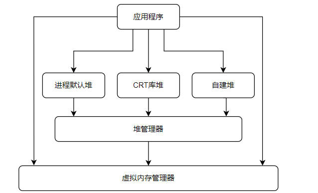

# 堆调试

# window 内存管理


# 堆概述

## 堆管理

堆的用途可以理解为一个内存池。堆管理器会持有很大一片内存，其负责接管应用程序中内存的申请释放等请求。管理器的表现形式就是生成的具体堆对象。

## 堆分类



- `进程默认堆` : 在 `ntdll.dll` 中实现的堆管理器，系统为每个进程创建的默认堆。如`LocalAlloc`或者`GlobalAlloc`是从进程默认堆上分配内存。可以使用`GetProcessHeap`获取进程默认堆的句柄，然后根据用这个句柄去调用`HeapAlloc`达到在系统默认堆上分配内存的效果。

- `CRT库堆` : 标准库创建的堆，如 `malloc` 与 `new` 从堆上获取内存。`vs2010` 之前 CRT库通过`HeapCreate` 创建堆；`vs2015` 之后则使用进程默认堆。

- `自建堆` : 进程自己创建的堆。泛指程序通过`HeapCreate`去创建的堆，然后利用`HeapAlloc`等API去操作堆


## API

- **堆对象创建**

```cpp
// 创建一个堆对象，虚拟地址空间中保留空间，物理内存则初始化部分
HANDLE HeapCreate(
  [in] DWORD  flOptions,
  [in] SIZE_T dwInitialSize,
  [in] SIZE_T dwMaximumSize
);

// 创建可由进程使用的堆对象，由 HeapCreate 调用。
NTSYSAPI PVOID RtlCreateHeap(
  [in]           ULONG                Flags,
  [in, optional] PVOID                HeapBase,
  [in, optional] SIZE_T               ReserveSize,
  [in, optional] SIZE_T               CommitSize,
  [in, optional] PVOID                Lock,
  [in, optional] PRTL_HEAP_PARAMETERS Parameters
);

```

- **堆内存申请**

```cpp
// 从堆中分配内存块。 分配的内存不可移动。
DECLSPEC_ALLOCATOR LPVOID HeapAlloc(
  [in] HANDLE hHeap,
  [in] DWORD  dwFlags,
  [in] SIZE_T dwBytes
);

// 分配堆中的内存块
NTSYSAPI PVOID RtlAllocateHeap(
  [in]           PVOID  HeapHandle,
  [in, optional] ULONG  Flags,
  [in]           SIZE_T Size
);


// 创建虚拟内存，由 RtlCreateHeap 与 RtlAllocateHeap 调用。
NTSYSAPI NTSTATUS ZwAllocateVirtualMemory(
  [in]      HANDLE    ProcessHandle,
  [in, out] PVOID     *BaseAddress,
  [in]      ULONG_PTR ZeroBits,
  [in, out] PSIZE_T   RegionSize,
  [in]      ULONG     AllocationType,
  [in]      ULONG     Protect
);
```

- **内存释放**

```cpp
// 释放由 HeapAlloc 或 HeapReAlloc 函数从堆分配的内存块。
BOOL HeapFree(
  [in] HANDLE                 hHeap,
  [in] DWORD                  dwFlags,
  [in] _Frees_ptr_opt_ LPVOID lpMem
);

// 释放由 RtlAllocateHeap 从堆分配的内存块。
BOOLEAN RtlFreeHeap(
  _In_     PVOID HeapHandle,
  _In_opt_ ULONG Flags,
  _In_     PVOID HeapBase
);

// 取消提交指定进程的虚拟地址空间中的页面区域。只有当空闲空间达到一定的量才会还给操作系统
NTSYSAPI NTSTATUS ZwFreeVirtualMemory(
  [in]      HANDLE  ProcessHandle,
  [in, out] PVOID   *BaseAddress,
  [in, out] PSIZE_T RegionSize,
  [in]      ULONG   FreeType
);
```

- **销毁堆对象**

```cpp
BOOL HeapDestroy(
  [in] HANDLE hHeap
);

NTSYSAPI PVOID RtlDestroyHeap(
  [in] PVOID HeapHandle
);

```


## 查看堆

```term
triangle@LEARN:~$ !heap // 查看存在哪些堆管理器
        Heap Address      NT/Segment Heap

              8d0000              NT Heap
triangle@LEARN:~$ !gflag // 支持哪些堆的操作
Current NtGlobalFlag contents: 0x00000070
    htc - Enable heap tail checking 
    hfc - Enable heap free checking
    hpc - Enable heap parameter checking
triangle@LEARN:~$ !peb // 查看进程控制块
PEB at 007d0000
    InheritedAddressSpace:    No
    ReadImageFileExecOptions: No
    BeingDebugged:            Yes
    ImageBaseAddress:         004d0000
    NtGlobalFlag:             70
    ...
    SubSystemData:     00000000
    ProcessHeap:       008d0000 // 默认堆的句柄
    ProcessParameters: 008d1fc0
    CurrentDirectory:  'C:\Windows\System32\'
    ....
triangle@LEARN:~$ !heap 8d0000 // 具体堆的使用情况
Index   Address  Name      Debugging options enabled
  1:   008d0000 
    Segment at 008d0000 to 009cf000 (0000b000 bytes committed)
```

# 堆结构

## 概况


堆管理器被创建时，会从虚拟内存管理器中获取一片内存。管理器将这片内存按照「堆段 `heap segment`」 的结构进行内存管理，每一个堆段内部又会划分为一个个「堆块」。并且「堆段」数量会随着使用量的增加而增长
- **堆段初始化**：会对虚拟内存低地址一部分进行初始化，并标记为 `commit` 状态。剩余的虚拟内存则标记为 `reserve` 状态。
- **内存申请**：`commit` 状态的用户数据内存够用，就把 `commit` 状态的内存给用户；若不够用了，则把 `reserve` 状态的内存变成 `commit` 状态给用户使用
- **堆段内存用完**：堆管理器将创建一个新的堆段 `heap segment`，默认创建新堆段大小是之前的2倍（详细要看算法）；会用一个链表统一记录相关的堆段 `heap segment`

> [!note]
> 堆管理器不会主动将内存释放，还给虚拟内存管理器。只有当 `reserve` 状态的内存达到一定程序，才会被虚拟内存管理收回。因此 `HeapFree` 的作用不是真正的内存释放。

堆对象主要包含三个重要的结构体：
- `HEAP`: 描述堆对象 
- `HEAP_SEGMENT`: 描述堆段
- `HEAP_ENTRY`: 描述堆块

每个堆至少拥有一个`00`号段，最多可拥有64个段；堆管理器在创建堆时会建立一个段，如果堆是可以增长的话，用完一个段后堆会自动增长；`00` 号段开始处存放着一个`HEAP`结构的头部信息，每个段都有一个`HEAP_SEGMENT` 结构（在每个段的起始处）

```term
triangle@LEARN:~$ !heap
        Heap Address      NT/Segment Heap

             1070000              NT Heap
triangle@LEARN:~$ dt _HEAP 1070000 -r2 // 将 1070000 地址的数据转化为 _HEAP 结构体进行展示
ntdll!_HEAP # heap 结构体
   +0x000 Segment          : _HEAP_SEGMENT # 堆段
      +0x000 Entry            : _HEAP_ENTRY # 堆块
         +0x000 UnpackedEntry    : _HEAP_UNPACKED_ENTRY
         +0x000 Size             : 0x7237
         +0x002 Flags            : 0x55 'U'
         +0x003 SmallTagIndex    : 0x78 'x'
         +0x000 SubSegmentCode   : 0x78557237
         +0x004 PreviousSize     : 0x300c
         +0x006 SegmentOffset    : 0 ''
         +0x006 LFHFlags         : 0 ''
         +0x007 UnusedBytes      : 0x1 ''
         +0x000 ExtendedEntry    : _HEAP_EXTENDED_ENTRY
         +0x000 FunctionIndex    : 0x7237
         +0x002 ContextValue     : 0x7855
         +0x000 InterceptorValue : 0x78557237
         +0x004 UnusedBytesLength : 0x300c
         +0x006 EntryOffset      : 0 ''
         +0x007 ExtendedBlockSignature : 0x1 ''
         +0x000 Code1            : 0x78557237
         +0x004 Code2            : 0x300c
         +0x006 Code3            : 0 ''
         +0x007 Code4            : 0x1 ''
         +0x004 Code234          : 0x100300c
         +0x000 AgregateCode     : 0x0100300c`78557237
      +0x008 SegmentSignature : 0xffeeffee
      +0x00c SegmentFlags     : 2
      +0x010 SegmentListEntry : _LIST_ENTRY [ 0x10700a4 - 0x10700a4 ]
      。。。
```

## HEAP

堆管理器使用 `HEAP` 结构记录和维护每个堆的管理信息，位于每个堆的开始处，即存放在第一个堆段的起始位置。`HeapCreate` 返回的句柄是创建堆的起始地址，即 `HEAP` 结构体的指针。


```term
triangle@LEARN:~$ dt _HEAP 1070000 
ntdll!_HEAP
   +0x000 Segment          : _HEAP_SEGMENT
   +0x000 Entry            : _HEAP_ENTRY
   +0x008 SegmentSignature : 0xffeeffee               # 标记是堆，还是堆段
   +0x00c SegmentFlags     : 2
   +0x010 SegmentListEntry : _LIST_ENTRY [ 0x10700a4 - 0x10700a4 ] # 段链表入口
   +0x018 Heap             : 0x01070000 _HEAP
   +0x01c BaseAddress      : 0x01070000 Void
   +0x020 NumberOfPages    : 0xff
   +0x024 FirstEntry       : 0x010704a8 _HEAP_ENTRY
   +0x028 LastValidEntry   : 0x0116f000 _HEAP_ENTRY
   +0x02c NumberOfUnCommittedPages : 0xf8
   +0x030 NumberOfUnCommittedRanges : 1
   +0x034 SegmentAllocatorBackTraceIndex : 0
   +0x036 Reserved         : 0
   +0x038 UCRSegmentList   : _LIST_ENTRY [ 0x1076ff0 - 0x1076ff0 ]
   +0x040 Flags            : 0x40000062
   +0x044 ForceFlags       : 0x40000060
   +0x048 CompatibilityFlags : 0
   +0x04c EncodeFlagMask   : 0x100000
   +0x050 Encoding         : _HEAP_ENTRY
   +0x058 Interceptor      : 0
   +0x05c VirtualMemoryThreshold : 0xfe00                 #最大堆块大小（单位是分配粒度）
   +0x060 Signature        : 0xeeffeeff
   +0x064 SegmentReserve   : 0x100000                     #段的保留空间大小
   +0x068 SegmentCommit    : 0x2000                       #段的每次提交的大小
   +0x06c DeCommitFreeBlockThreshold : 0x200              #解除提交的单块阈值（以分配粒度为单位）
   +0x070 DeCommitTotalFreeThreshold : 0x2000
   +0x074 TotalFreeSize    : 0x195                        #空闲块总大小（以分配粒度为单位）
   +0x078 MaximumAllocationSize : 0x7ffdefff
   +0x07c ProcessHeapsListIndex : 1
   +0x07e HeaderValidateLength : 0x258
   +0x080 HeaderValidateCopy : (null) 
   +0x084 NextAvailableTagIndex : 0
   +0x086 MaximumTagIndex  : 0
   +0x088 TagEntries       : (null) 
   +0x08c UCRList          : _LIST_ENTRY [ 0x1076fe8 - 0x1076fe8 ]
   +0x094 AlignRound       : 0x17
   +0x098 AlignMask        : 0xfffffff8
   +0x09c VirtualAllocdBlocks : _LIST_ENTRY [ 0x107009c - 0x107009c ]
   +0x0a4 SegmentList      : _LIST_ENTRY [ 0x1070010 - 0x1070010 ]
   +0x0ac AllocatorBackTraceIndex : 0
   +0x0b0 NonDedicatedListLength : 0
   +0x0b4 BlocksIndex      : 0x01070270 Void
   +0x0b8 UCRIndex         : (null) 
   +0x0bc PseudoTagEntries : (null) 
   +0x0c0 FreeLists        : _LIST_ENTRY [ 0x1073e18 - 0x10766d0 ]    #记录空闲堆块链表的表头
   +0x0c8 LockVariable     : 0x01070258 _HEAP_LOCK
   +0x0cc CommitRoutine    : 0x1d5bd820     long  +1d5bd820
   +0x0d0 StackTraceInitVar : _RTL_RUN_ONCE
   +0x0d4 CommitLimitData  : _RTL_HEAP_MEMORY_LIMIT_DATA
   +0x0e4 FrontEndHeap     : (null) 
   +0x0e8 FrontHeapLockCount : 0
   +0x0ea FrontEndHeapType : 0 ''
   +0x0eb RequestedFrontEndHeapType : 0 ''
   +0x0ec FrontEndHeapUsageData : 0x010704b0  ""
   +0x0f0 FrontEndHeapMaximumIndex : 0x80
   +0x0f2 FrontEndHeapStatusBitmap : [257]  ""
   +0x1f4 Counters         : _HEAP_COUNTERS
   +0x250 TuningParameters : _HEAP_TUNING_PARAMETERS
```
- **分配粒度**： 一粒度一般指 8bytes 长度。

- `VirtualMemoryThreshold : 0xfe00` : 在段中，堆块的用户数据区的最大值，单位是分配粒度。`0xfe00*8=0x7f000=508KB=504+4` ，意味着堆中最大的普通堆块的用户数据区是 508K，超过 508K，直接调用 `ZwAllocateVirtualMemory` 分配内存；如果堆可以增长，可以直接分配 512K。

- `FreeLists`: 当有新的分配内存请求时，堆管理器会先在 `FreeLists` 链表里寻找最接近且满足要求的堆块；找到便分配出去；没有找到，提交新的内存也并建立新的堆块；用户释放时负责回收。

- `VirtualAllocdBlocks`: 如果申请内存大于虚拟内存的阈值，则直接从虚拟内存管理器中进行分配

## HEAP_SEGMENT

> [!note]
> `00` 堆段的结构体 `HEAP_SEGMENT` 与 `HEAP` 结构体的首地址其实是一样的

```term
triangle@LEARN:~$ dt _HEAP_SEGMENT 1070000 
ntdll!_HEAP_SEGMENT
   +0x000 Entry            : _HEAP_ENTRY
   +0x008 SegmentSignature : 0xffeeffee
   +0x00c SegmentFlags     : 2
   +0x010 SegmentListEntry : _LIST_ENTRY [ 0x10700a4 - 0x10700a4 ]
   +0x018 Heap             : 0x01070000 _HEAP                       #属于的堆
   +0x01c BaseAddress      : 0x01070000 Void                        #段的基地址
   +0x020 NumberOfPages    : 0xff                                   #段的内存页数
   +0x024 FirstEntry       : 0x010704a8 _HEAP_ENTRY                 #第一个堆块，最有用的信息
   +0x028 LastValidEntry   : 0x0116f000 _HEAP_ENTRY                 #堆块的边界
   +0x02c NumberOfUnCommittedPages : 0xf8
   +0x030 NumberOfUnCommittedRanges : 1
   +0x034 SegmentAllocatorBackTraceIndex : 0

```

## HEAP_ENTRY

> [!note]
> 堆段划分为堆块，因此第一个堆块的首地址其实和堆段的一样

```term
triangle@LEARN:~$  dt _HEAP_ENTRY 0x010704a8 
ntdll!_HEAP_ENTRY
   +0x000 UnpackedEntry    : _HEAP_UNPACKED_ENTRY
   +0x000 Size             : 0x7281                 #堆块的大小（以分配粒度为单位）
   +0x002 Flags            : 0x5b '['               #堆块的状态
   +0x003 SmallTagIndex    : 0xc0 ''                #用于检查栈溢出的cookie
   +0x000 SubSegmentCode   : 0xc05b7281
   +0x004 PreviousSize     : 0x3099                 #前一个堆块的大小
   +0x006 SegmentOffset    : 0 ''
   +0x006 LFHFlags         : 0 ''
   +0x007 UnusedBytes      : 0x1 ''
   +0x000 ExtendedEntry    : _HEAP_EXTENDED_ENTRY
   +0x000 FunctionIndex    : 0x7281
   +0x002 ContextValue     : 0xc05b
   +0x000 InterceptorValue : 0xc05b7281
   +0x004 UnusedBytesLength : 0x3099
   +0x006 EntryOffset      : 0 ''
   +0x007 ExtendedBlockSignature : 0x1 ''
   +0x000 Code1            : 0xc05b7281
   +0x004 Code2            : 0x3099
   +0x006 Code3            : 0 ''
   +0x007 Code4            : 0x1 ''
   +0x004 Code234          : 0x1003099
   +0x000 AgregateCode     : 0x01003099`c05b7281
triangle@LEARN:~$ !heap -x 01070000 // 第一个堆块
Entry     User      Heap      Segment       Size  PrevSize  Unused    Flags
-----------------------------------------------------------------------------
01070000  01070008  01070000  01070000       4a8         0         1  busy 
triangle@LEARN:~$ !heap -x 01070000+4a8 // 第二个堆块，可以通过 Size 与 PrevSize 进行段块的前后索引
Entry     User      Heap      Segment       Size  PrevSize  Unused    Flags
-----------------------------------------------------------------------------
010704a8  010704b0  01070000  01070000       118       4a8         1  busy extra fill  internal
```
