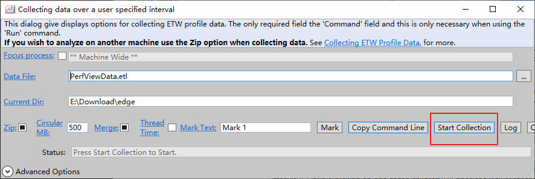
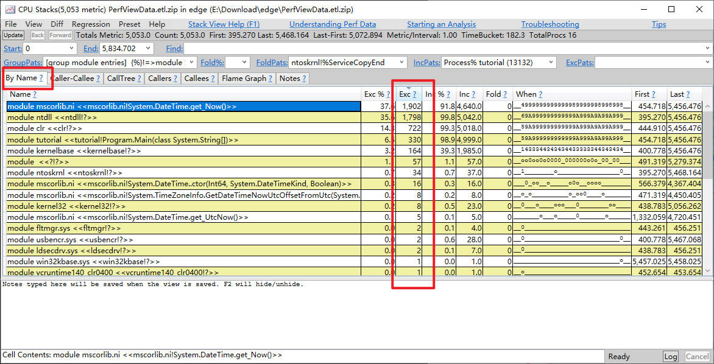

# 性能分析

# 介绍

[微软推荐性能分析工具](https://learn.microsoft.com/zh-cn/windows/apps/performance/choose-between-tools) 有三个：
- visual studio 性能探测器 : visual studio 集成工具，主要用于单个项目工程的分析

- Windows Performance Toolkit : 立刻从整个计算机收集大量信息，因此这些工具非常适用于多进程问题、处理硬件或驱动程序方面的问题以及复杂方案。

- [PerfView](https://github.com/microsoft/perfview/releases): 可以同时从整个计算机收集大量信息。 它的区别在于它能够显示有关 .NET 运行时服务（例如垃圾回收、实时编译和托管线程池）的非常详细的信息。


# PerfView

## 捕获数据


- `Run` : `Command` 指定可以运行的任何东西，例如脚本、程序等。点击 `Run Command` ，会将指定的内容运行起来并开始记录系统 ETW 日志，当运行内容结束则会停止日志记录。


- `Collect` : 日志捕获的开始和结束，由使用者自己决定



```term
triangle@LEARN:~$ prefview /? // 帮助手册
triangle@LEARN:~$ prefview collect  /nogui // 开始收集，并不展示界面。默认收集缓存最大为 500 m
```

## 数据查看


1. 指定`.etl` 或者 `.etl.zip` 文件所在路径
2. 双击 `.etl` 或者 `.etl.zip` 文件


3. 选择需要查看的表格

## CPU Stack

### 基本概念

> [!note]
> `CPU Stack` 只统计了程序使用 CPU 的情况，因此只能用于排查 CPU 造成的性能问题。`Metric/Interval` 值越高，说明 CPU 引起的性能瓶颈概率越大。


- `samples`：CPU 的采样点数。**CPU Stack 的工作原理是CPU每运行1毫秒，就会去遍历正在运行的进程的栈帧**。进程运行时，存在上下文切换，因此每个进程被采样到概率是随机的。**要想结果准确，得多采样一段时间**
- `inclusive metric` : 函数只要在栈上就记录一次采样
- `exclusive metric` : 被采样时，这个函数刚好正在运行
- `Interval` : 进程被采集的时间
- `when` ： 除了首先得明确是否是由于 CPU 导致的性能问题外，还得明确是要排查哪个时间段内性能问题。

### 自上而下


通过调用树，根据 `Inc` 值就能找到 CPU 占用最高的函数和线程，即**自上而下分析法** (`Top-Down analyses`)

### 自下而上



调用树根据栈结构将所有函数分级展示，但是存在性能问题的函数可能在多个地方被调用，这样通过树状图便不能很好分析。`by name` 标签页会将同一个函数都集中在一行进行展示，这样就能明确找到哪个函数性能消耗最高，即**自下而上分析法**(`Bottom-Up analyses`)

### 调用者


选中要查看的函数，然后按照上图操作，就能展示出该函数在哪儿被调用了

