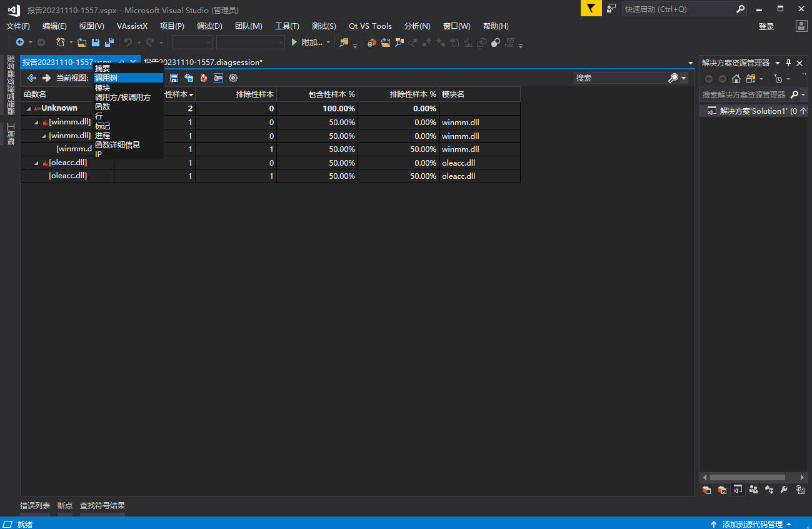

# 性能分析

# 工具集

[微软推荐性能分析工具](https://learn.microsoft.com/zh-cn/windows/apps/performance/choose-between-tools) ：
- visual studio 性能探测器 : visual studio 集成工具，主要用于单个项目工程的分析

- Windows Performance Toolkit : 立刻从整个计算机收集大量信息，因此这些工具非常适用于多进程问题、处理硬件或驱动程序方面的问题以及复杂方案。

- [PerfView](https://github.com/microsoft/perfview/releases): 可以同时从整个计算机收集大量信息。 它的区别在于它能够显示有关 .NET 运行时服务（例如垃圾回收、实时编译和托管线程池）的非常详细的信息。

# ETW

[事件追踪](https://learn.microsoft.com/zh-cn/windows/win32/etw/event-tracing-portal)


- `Provider` : 事件提供者，会提前在 ETW 框架中进行注册。提供者程序在某个时刻触发事件，并将标准化定义的事件提供给ETW框架。
- `Consumer` : 解析跟踪文件（ETL 文件）或者实时捕获活动跟踪会话中的事件，并处理事件。**官方推荐软件 `Windows Performance Analyzer (WPA)`**
- `Event Tracing Session` : ETW 框架的核心，作为 Provider 与 Consumer 的中介，负责事件的转发。
- `Controller` : 控制 ETW 框架的启动和停止。**官方推荐 `Windows Performance Recorder (WPR)`**


# PerfView

## 捕获数据


- `Run` : `Command` 指定可以运行的任何东西，例如脚本、程序等。点击 `Run Command` ，会将指定的内容运行起来并开始记录系统 ETW 日志，当运行内容结束则会停止日志记录。


- `Collect` : 日志捕获的开始和结束，由使用者自己决定


```term
triangle@LEARN:~$ prefview /? // 帮助手册
triangle@LEARN:~$ prefview collect  /nogui // 开始收集，并不展示界面。默认收集缓存最大为 500 m
```

## 数据查看


1. 指定`.etl` 或者 `.etl.zip` 文件所在路径
2. 双击 `.etl` 或者 `.etl.zip` 文件


3. 选择需要查看的表格

## CPU Stack

### 基本概念

> [!note]
> `CPU Stack` 只统计了程序使用 CPU 的情况，因此只能用于排查 CPU 造成的性能问题。`Metric/Interval` 值越高，说明 CPU 引起的性能瓶颈概率越大。


- `samples`：CPU 的采样点数。**CPU Stack 的工作原理是CPU每运行1毫秒，就会去遍历正在运行的进程的栈帧**。进程运行时，存在上下文切换，因此每个进程被采样到概率是随机的。**要想结果准确，得多采样一段时间**
- `inclusive metric` : 函数只要在栈上就记录一次采样
- `exclusive metric` : 被采样时，这个函数刚好正在运行
- `Interval` : 进程被采集的时间
- `when` ： 除了首先得明确是否是由于 CPU 导致的性能问题外，还得明确是要排查哪个时间段内性能问题。

### 自上而下


通过调用树，根据 `Inc` 值就能找到 CPU 占用最高的函数和线程，即**自上而下分析法** (`Top-Down analyses`)

### 自下而上


调用树根据栈结构将所有函数分级展示，但是存在性能问题的函数可能在多个地方被调用，这样通过树状图便不能很好分析。`by name` 标签页会将同一个函数都集中在一行进行展示，这样就能明确找到哪个函数性能消耗最高，即**自下而上分析法**(`Bottom-Up analyses`)

### 调用者


选中要查看的函数，然后按照上图操作，就能展示出该函数在哪儿被调用了


### 分组


- `Fold%` : 函数的 `Inc %` 小于指定值，展示上就会被隐藏，用于杂音过滤
- `GroupPats` : 类似于筛选器的东西，会对所有的符号和函数进行筛选。


- `Drill into` : 将某一个分组在另外的窗口单独展示

## Events

`Events` 列表展示的是原始的 `ETW` 事件信息，左侧列表展示的都是收集到的事件名。事件的命名规则为 `提供者\任务\子事件`。


- `Filter` : 左侧事件列的事件过滤
- `Process Filter` : 右侧事件过滤，只展示目标进程
- `Cols` : 对事件内容列表的列进行过滤，**按照先后顺序选择需要的列，然后回车确认**
- `Text Filter` : 对文本进行过滤

## 时间轴


x 轴为事件采样时间；y 轴为当前时间有多少事件的数字。选中数字后，在左下角会展示当前数字对应的时间

## 阻塞时间分析

- `Thread Time View`: 会对线程阻塞时间进行统计。当 `CPU Stack` 分析走不通后，就需要分析阻塞时间
  - `BLOCKED_TIME` : 阻塞时间。包含所有阻塞等待的时间，网络请求、上下文切换、I/O阻塞等
  - `HARD_FAULT` : 故障时间，例如操作系统处理页中断的时间
  - `DISK_TIME`： 操作磁盘的时间。但是等待的时间都被算到了 「阻塞」时间上
  - `CPU_TIME` : cpu 运行时间。选中该项，然后执行 `include item` 就能把界面变成 CPU Stack view 的形式
- `wall clock time` : 每个线程在某个栈上的消耗时间。不管线程在运行还是阻塞，都会和一个栈相关，`wall clock time` 就是用来度量这个时间的。


当启用 `thread time` 时，PerfView 会收集的内容有：
1. 每毫秒正在 CPU 上运行的栈
2. 线程上下文切换
3. 线程创建和销毁的时间

首先观察 `CallTree` 面板，会列出所有的线程，并且新增 `cpu=xxxms` 展示，通过该参数就能区分出哪些线程在调用 CPU 干活。其次重点观察 `inc` 指标，可以大致定位哪个函数调用耗时最长，就能找到需要着重优化分析的函数。


## 线程池

整体分析方法和 「阻塞时间分析」一样，唯一区别是线程关注区间不好确认。这个就需要分析 `Thread Time Stack (with task)`。

 `Thread Time Stack (with task)` 的整体界面和 `Thread Time Stack` 一样，唯一区别是将工作线程的 `Inc` 指标全部算到了任务发起线程的头上，例如线程池中的线程都是在处理任务，而这些任务确实其他线程发起的，因此 prefview 就把这些工作线程的 `Inc` 全算到了发起任务的线程头上。

好处就是将子线程的性能消耗都归纳到了主线程中，这样就能像单线程一样分析性能消耗。

> [!note]
> 但仅在使用 System.Diagnostics.Threading.Tasks.Task 类生成并发活动时才有效。c++ 就别指望用上了


# Windows Performance Toolkit

## 工具集

**命令行工具：**
- xperf : 捕捉和预处理数据
- xperfview: 可视化结果
- xbootmgr: 捕捉启动过程
- wpr: 代替 xperf 的新工具

**界面工具：**
- wprui: `Windows Performance Recorder (WPR)`
- wpa : `Windows Performance Analyzer (WPA)`


## 使用

1. 使用 `WPR` 生成事件报告 `.etl`


2. 使用 `WPA` 打开 `.etl` 文件。[Windows SDK](https://developer.microsoft.com/zh-cn/windows/downloads/windows-sdk/) 版无法使用，则需要下载微软商店的 `preview` 版


3. 配置 `pdb`。**只配置目标进程的，不然会下载全部的符号文件。**


4. 点击 `Load Symbols` 就能查看结果了


# visual studio

1. 打开界面


2. 指定进程


3. 生成报告


4. 分析报告，分析方法见 `Perfview`


