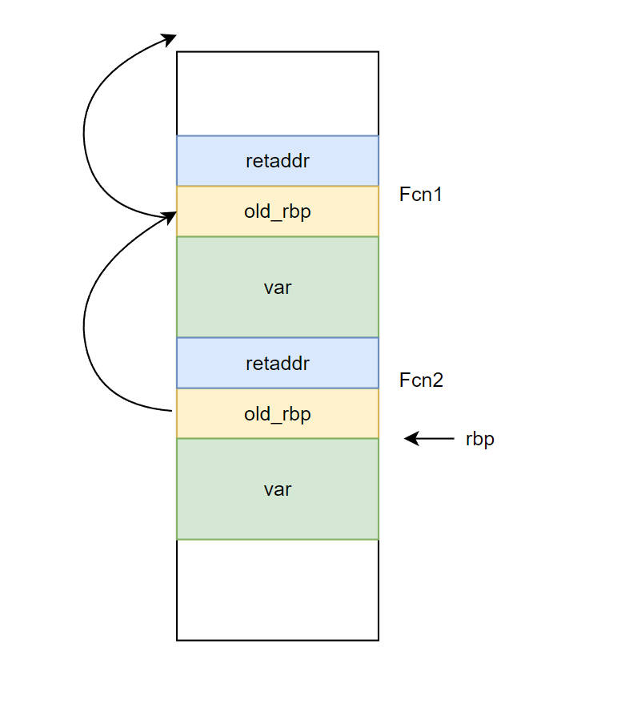

# 栈调试

# 栈结构


操作系统会为每一个线程预留一部分地址作为栈区（而非真是内存），例如`0x130000 ~ 0x30000`。在栈的底部会设置一块保护区（即图中的`0x33000~0x32000`），当栈增长到保护区内，就会产生`page fault`让操作系统来分配真正的物理内存。当栈保护区到达了栈的最底部，则会产生 `stack overflow` 异常，告诉操作系统线程没有预览内存了。

```term
triangle@LEARN:~$ !teb // 查看当前线程的信息
TEB at 000000f2e1e3d000
    ExceptionList:        0000000000000000
    StackBase:            000000f2e1d30000 // 栈的基地址
    StackLimit:           000000f2e1d2d000 // 栈底
    SubSystemTib:         0000000000000000
    FiberData:            0000000000001e00
    ArbitraryUserPointer: 0000000000000000
    Self:                 000000f2e1e3d000
    EnvironmentPointer:   0000000000000000
    ClientId:             000000000000409c . 0000000000004018
    ...
triangle@LEARN:~$ dd 000000f2e1d2d000 - 10
000000f2`e1d2cff0  ???????? ???????? ???????? ???????? // ? 代表了保护页
000000f2`e1d2d000  00000000 00000000 00000000 00000000
000000f2`e1d2d010  00000000 00000000 00000000 00000000
000000f2`e1d2d020  00000000 00000000 00000000 00000000
000000f2`e1d2d030  00000000 00000000 00000000 00000000
000000f2`e1d2d040  00000000 00000000 00000000 00000000
000000f2`e1d2d050  00000000 00000000 00000000 00000000
000000f2`e1d2d060  00000000 00000000 00000000 00000000
triangle@LEARN:~$ !address 000000f2`e1d2cff0 // 查看地址的状态

Usage:                  Stack
Base Address:           000000f2`e1d2a000
End Address:            000000f2`e1d2d000
Region Size:            00000000`00003000 (  12.000 kB)
State:                  00001000          MEM_COMMIT
Protect:                00000104          PAGE_READWRITE | PAGE_GUARD
Type:                   00020000          MEM_PRIVATE
Allocation Base:        000000f2`e1c30000
Allocation Protect:     00000004          PAGE_READWRITE
More info:              ~0k
```

# 栈帧



- `RBP` : 当前函数在栈中的基地址，即栈帧指针

```nasm
fcn:
    push    rbp  ; 将上一个函数的基地址 rbp 入栈
    mov     rbp, rsp ; 将栈顶 rsp 给 rbp，当作当前函数的基地址
    mov     DWORD PTR [rbp-4], edi
    mov     eax, DWORD PTR [rbp-4]
    imul    eax, eax
    ...
```

- `FPO` : 优化技术，在汇编中会把 `RBP` 给省略掉。**不推荐使用**

